# 시스템 아키텍처 (2026-08-18 기준 — `main` 실제 코드 실측)

이 문서는 **지금 배포되는 코드가 실제로 어떻게 생겼는지**를 그림과 표로 정리한 것이다.
기술 선택의 *근거*와 미결정 항목은 `docs/기술스택.md`, 제품 결정은 `docs/영웅키움_기획_통합문서_v2.md`,
기능별 구현 규칙은 각 기능 폴더의 `SPEC.md`가 단일 원본이다. 충돌하면 그쪽을 따른다.

실측 기준: `web/app/api`의 `route.ts` **21개**, 사용자 화면 라우트 **7종**, Supabase 마이그레이션 **17개**.

---

## 1. 한눈에 보는 전체 구조

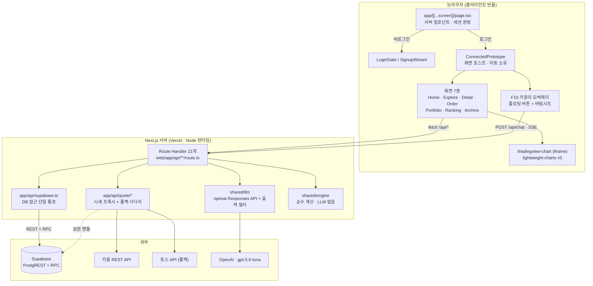

**핵심 성질 3가지**

1. **단일 배포 단위다.** 별도 백엔드 서버가 없다. 프론트와 백엔드는 같은 Next.js 앱의 서버/클라이언트 경계로만 나뉜다.
2. **모든 외부 키는 서버에만 있다.** OpenAI·키움·토스·Supabase 키는 Route Handler 안에서만 읽고 `NEXT_PUBLIC_*`로 나가지 않는다.
3. **모든 실패 경로에 폴백이 있다.** 시세는 제공자 → 보관 캔들 → 픽스처, LLM은 실패 시 승인된 고정 응답으로 내려간다.

---

## 2. 배포·실행 단위

| 단위 | 내용 |
|---|---|
| 실행 가능한 앱 | **`web/` 하나뿐이다.** Next.js 16 (App Router) + React 19 + TypeScript 5.9 + Tailwind v4 |
| 배포 | Vercel. 로컬 시연 백업은 세션 명령 `serve`(포트는 세션이 배정) |
| DB | Supabase (관리형 PostgreSQL). 앱은 PostgREST HTTP로만 접근한다 |
| 정기 작업 | GitHub Actions `candles.yml` — 평일 16:00 KST 일봉·주봉 적재. **앱 프로세스 안의 스케줄러는 없다** |
| 앱이 아닌 것 | `behavior-demo/`(Vite 행동수집 실험) · `web/design-system/`(claude.ai/design 반입 원본, 빌드 밖) · `scripts/git-session-manager.mjs`(개발 하네스) |

---

## 3. 프론트엔드 아키텍처

### 3.1 라우팅 — 주소가 곧 화면

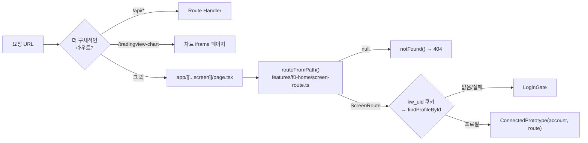

화면 목록의 **단일 원본은 `screen-route.ts`의 `ScreenRoute` 타입**이다. 여기 없는 주소는 404다 —
오타가 조용히 홈으로 넘어가면 "주소가 화면을 가리킨다"는 약속이 깨지기 때문이다.

| 주소 | 화면 | 비고 |
|---|---|---|
| `/` | 홈 | |
| `/explore` · `/explore/{sector}` | 탐색 | `sector`는 `rank`(기본)·`watch`·유니버스 섹터 id. 챗봇 섹터 점프가 쓴다 |
| `/ranking` | 랭킹 | |
| `/archive` · `/archive/{view}` | 아카이브 | `view` = `report`(기본)·`return`·`cards`·`family`·`last` |
| `/stock/{6자리코드}` | 종목 상세 | |
| `/buy/{코드}` · `/sell/{코드}` | 주문 | `side`가 주소에 들어간다 |

### 3.2 화면 계층

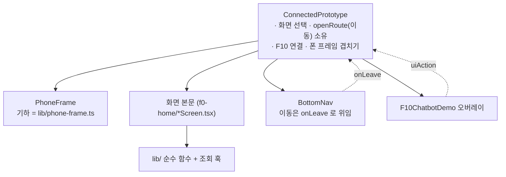

- **화면은 표시만 한다.** 계산은 전부 `features/f0-home/lib/`의 순수 함수(+테스트)로 빠져 있다 —
  `home-view` · `explore-cards` · `order-view` · `portfolio-view` · `ranking-data` ·
  `archive-profile-view` · `archive-season` · `archive-feed` · `stock-news` · `detail-chart` ·
  `chart-trade-legend` · `pending-orders` · `tab-views` · `sheet-drag` · `rail-drag` · `phone-frame` 등.
- **조회는 훅으로 모은다** — `use-account` · `use-wallet` · `use-universe` · `use-archive-data` · `use-watchlist`.
- 폰 기하 상수의 원본은 `f10-chatbot/lib/bottom-sheet`의 `PROTOTYPE_PHONE` 하나이며 챗봇 시트·`PhoneFrame`·오버레이 자르기가 같은 값을 쓴다.

### 3.3 상태 관리 — 서버가 원본이다

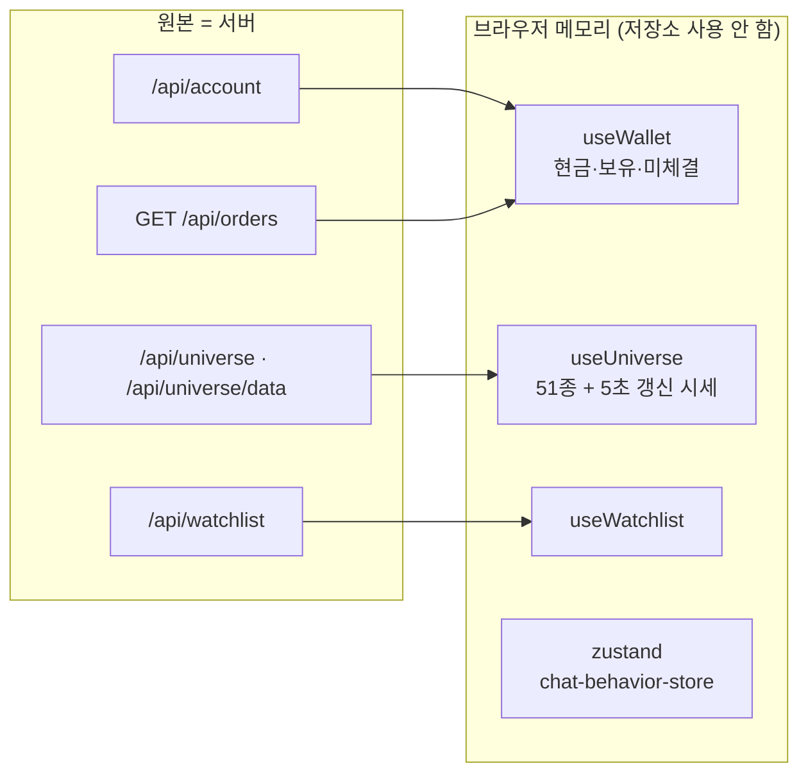

| 항목 | 결정 |
|---|---|
| 브라우저 저장소 | **쓰지 않는다.** `localStorage`·`sessionStorage`에 앱 데이터를 두지 않는다(`kw_proto_v1` 철거) |
| 전역 스토어 | zustand **한 개**(`chat-behavior-store`)뿐. 나머지는 훅 로컬 상태 |
| 지갑 | 마운트마다 서버로 세우고 화면을 떠나면 사라진다. `update()`는 완료 화면이 잔액을 즉시 보여 주기 위한 메모리 전용 갱신이며 곧 `refresh()`가 덮는다 |
| 수치·스코어링 | **`shared/engine`에만 둔다.** 화면은 표시만 한다 |

### 3.4 클라이언트 → API 호출 지도 (실측)

| 호출자 | 엔드포인트 |
|---|---|
| `LoginGate` / `HomeScreen` 메뉴 | `POST` / `DELETE /api/auth/login` |
| `lib/use-account` | `GET /api/account` |
| `lib/use-wallet` | `GET /api/account` + `GET /api/orders` |
| `lib/use-universe` | `<script src="/api/universe">`(→ `window.KW_UNIVERSE`) + `GET /api/universe/data` |
| `lib/use-watchlist` | `GET` / `POST /api/watchlist` |
| `lib/use-archive-data` | `/api/comments` · `/api/likes` · `/api/family` · `/api/feed` · `/api/profile/season-cards` |
| `OrderScreen` | `POST /api/trade` · `POST` / `DELETE /api/orders` · `GET /api/trades` |
| `DetailScreen` | `GET /api/trades` · `GET /api/news?stockId=KRX:{code}` |
| `NewsScreen` | `GET /api/news/{newsId}` |
| `ChartScreen` · `TradingViewChart` | `GET /api/quote/{symbol}` · `/api/quote/{symbol}/chart` · `GET /api/trades` |
| `lib/tab-views` | `POST /api/tab-view` |
| `F10ChatbotDemo` | `POST /api/chat` (SSE 수신) |

### 3.5 남아 있는 iframe 한 갈래

`ChartScreen` → `/tradingview-chart` iframe으로 `kiwoom:chart-options` / `kiwoom:chart-ready`
`postMessage`만 오간다. 옛 화면 iframe(`public/ui/app.html`)과 조립기(`ui-src`·`ui-build.mjs`)는
철거됐고 되살리지 않는다.

---

## 4. 백엔드 아키텍처

### 4.1 계층

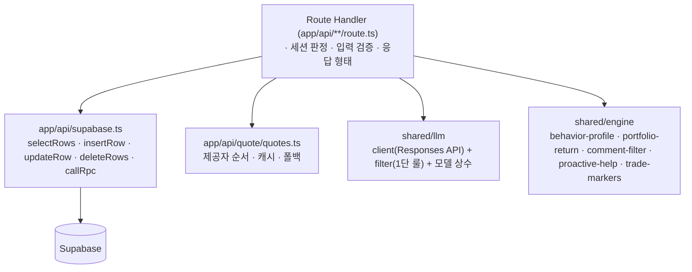

**규칙**

- Route Handler는 **오케스트레이션만** 한다. DB는 `supabase.ts`를 반드시 경유하고, `api/chat`은 OpenAI SDK를 직접 호출하지 않는다.
- `shared/engine`은 LLM·부수효과 없이 `shared/types`만 import한다.
- 조회 대상 사용자는 **서버가 쿠키에서 정한다.** 요청 본문이 지정할 수 없다.

### 4.2 API 표 (`route.ts` 21개 — 2026-08-18 실측)

| 경로 | 메서드 | 역할 | 주 소비자 |
|---|---|---|---|
| `auth/login` | POST · DELETE | 로그인 / 로그아웃(쿠키 삭제) | `LoginGate` · `HomeScreen` |
| `account` | GET | 세션 사용자의 현금·보유. 잠긴 금액과 쓸 수 있는 금액을 나눠 준다 | `use-account` |
| `universe` | GET | 51종·섹터 초기 데이터를 **스크립트로** 내려 `window.KW_UNIVERSE`에 심는다 | `use-universe` |
| `universe/data` | GET | 5초 주기 갱신 시세 | `use-universe` |
| `quote/[symbol]` | GET | 종목 현재가 프록시 | `ChartScreen` · `TradingViewChart` |
| `quote/[symbol]/chart` | GET | 기간별(분·일·주) 차트 시세 | `TradingViewChart` |
| `quote/daily-closes` | GET | 보관 일봉 종가 묶음(키움 호출 없음) | **현재 React 화면 연결 없음** (§9) |
| `trade` | POST · PATCH | POST = 시장가 즉시 체결(`apply_trade` RPC 한 트랜잭션) / PATCH = 매도 완료 메모(`set_trade_memo`) | `OrderScreen` |
| `orders` | GET · POST · DELETE | **미체결 주문의 원본.** GET = 목록 조회 + 만기 예약 정산 트리거(멱등 `settle_order`), POST = 예약 접수(`reserve_order`), DELETE = 취소(`cancel_order`) | `use-wallet` · `OrderScreen` |
| `trades` | GET | **매매 기록의 원본.** 종목별 가족 체결(타인 수량 마스킹, `mine` 플래그) | 차트 마커 · 매도 회고 판정 |
| `watchlist` | GET · POST | **관심 종목의 원본.** 토글 응답으로 목록 전체를 돌려준다 — 화면이 자기 배열을 직접 고치지 않는다 | `use-watchlist` |
| `family` | GET | 같은 `family_tag` 구성원·누적 성향·구성원별 수익률·전체 체결 | `ArchiveScreen` |
| `feed` | GET · POST · DELETE | 가족 피드(포트폴리오 메모) | `use-archive-data` |
| `comments` | GET · POST · DELETE | 거래 코멘트. 저장 전 문구 게이트(`shared/engine/comment-filter`) | `ArchiveScreen` 수익률 탭 |
| `likes` | GET · POST | 좋아요 배치 조회·토글 | `ArchiveScreen` 수익률 탭 |
| `tab-view` | POST | 종목 상세 탭 열람 카운트 적재(행동 신호) | `DetailScreen` |
| `profile/season-cards` | GET | 매수를 KST 주 단위로 묶은 주차 카드 + 누적 카드. **아카이브 성향 값의 유일한 원본** | `ArchiveScreen` |
| `news` · `news/[newsId]` | GET | 검수 통과 어린이 뉴스 목록·상세 | `DetailScreen` · `NewsScreen` |
| `chat` | POST | F10 SSE 전송 전용. 검증·필터 통과분만 보낸다 | F10 오버레이 |
| `health/candles` | GET | 보관 캔들 적재 상태 점검(운영용) | 앱 내 소비자 없음 |

`comments`·`likes`·`trades`·`feed`는 `app/api/feed/access.ts`의 가족 범위 검사를 공유한다.

### 4.3 트랜잭션 경계 — DB가 소유한다

잔액·보유수량·거래기록을 앱이 여러 번 나눠 쓰지 않는다. 한 트랜잭션 = 한 `SECURITY DEFINER` RPC다.

| RPC | 하는 일 | 호출 라우트 |
|---|---|---|
| `apply_trade` | 시장가 체결 — 잔액 차감·보유 갱신·`transactions` 기록 | `POST /api/trade` |
| `reserve_order` | 지정가·장외 예약 접수 + 자원(현금·수량) 잠금 | `POST /api/orders` |
| `settle_order` | 만기 지난 예약 정산. **멱등** — 이미 끝난 주문엔 `settled:false` | `GET /api/orders` |
| `cancel_order` | 예약 취소. 안에서 `user_id`를 대조해 남의 주문을 막는다 | `DELETE /api/orders` |
| `set_trade_memo` | 체결 후 매도 메모. `user_id` 대조로 남의 기록 수정 차단 | `PATCH /api/trade` |
| `rebuild_holdings` | `transactions`에서 `holdings` 재구성(보정용) | 마이그레이션·운영 |

### 4.4 시세 프록시 — 폴백 사다리

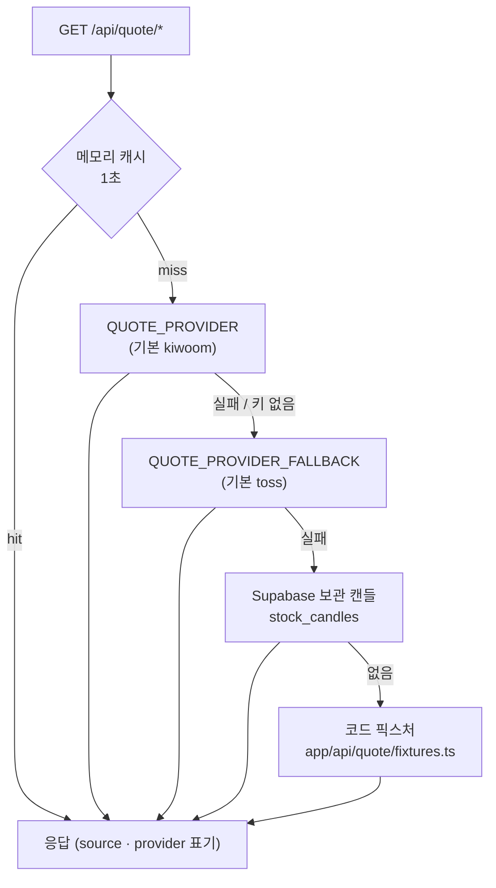

- 제공자 어댑터는 `app/api/quote/providers/{kiwoom,toss}.ts`이고 인터페이스는 `providers/types.ts`다.
- 캐시 키에 **제공자를 포함**한다 — 그러지 않으면 주 제공자가 복구된 뒤에도 폴백 값이 캐시 수명 내내 남는다.
- 응답에 `source`·`provider`를 실어 "실시간인지 대체 값인지"를 화면이 알 수 있게 한다.
- 제공자 전환은 `.env` 재기동이 경계다(`.env`는 프로세스당 한 번만 읽는다).

### 4.5 F10 챗봇 — 한 번 통과하는 파이프라인

에이전트 루프(모델이 스스로 툴을 반복 선택)를 만들지 않는다. 한 요청의 LLM 호출은 **최대 4회**다.

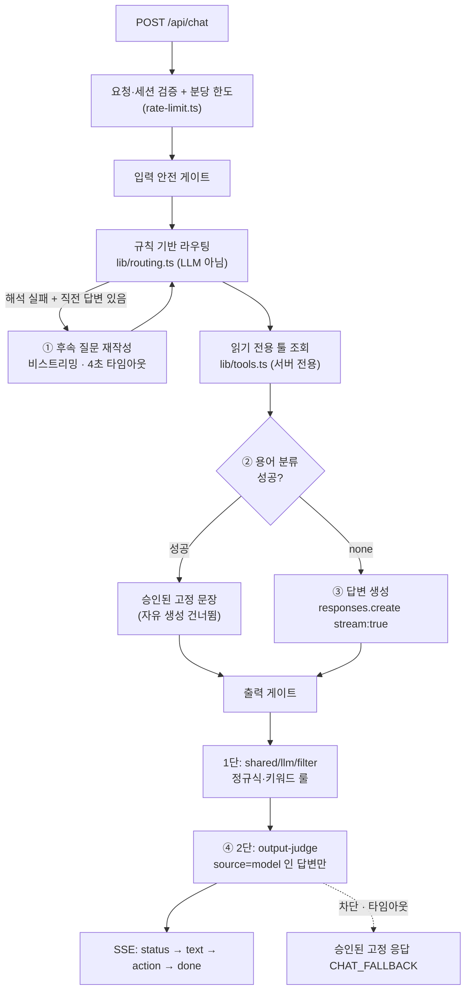

- **모델 스트림을 그대로 흘리지 않는다.** 서버가 델타를 최대 4,000자까지 모아 완성 답변을 만든 뒤
  3문장·출처·권한·수치·금지 표현을 검증하고 **통과분만 단일 `text` 이벤트로** 보낸다.
- 고정 응답·사전·FAQ·툴 응답은 승인된 텍스트라 2단 판정을 호출하지 않는다.
- 어느 단계가 실패해도 **닫힌 실패**로 처리해 고정 응답으로 내려간다.
- 화면 이동은 모델이 만든 URL이 아니라 허용 목록의 `uiAction`으로 돌려주고 사용자가 탭한 뒤 실행한다.
- 툴은 전부 **서버 전용·읽기 전용**이며 사용자·가족 식별자는 세션에서 서버가 주입한다.
- 성공·실패 모두 `X-Request-Id`를 실어 화면 문구와 서버 로그를 같은 ID로 잇는다.

---

## 5. 데이터 계층 (Supabase)

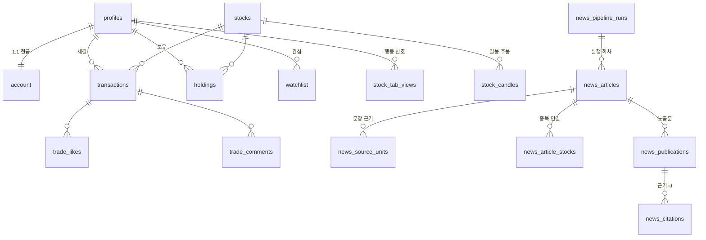

| 그룹 | 테이블 | 소유하는 것 |
|---|---|---|
| 계정 | `profiles`(이름·로그인·`parent_child`·`family_tag`) · `account`(잔액, 기본 1,000만) | 사용자와 지갑 |
| 거래 | `transactions`(체결 · `side` · `trade_reason` · `realized_profit`) · `holdings`(수량·평단, PK `user_id+stock_id`) | 매매 기록·보유 |
| 종목 | `stocks`(51종) · `stock_candles`(`daily`/`weekly`, OHLC 정합성 제약) | 유니버스·보관 시세 |
| 관심 | `watchlist` | 관심 종목 |
| 반응 | `trade_likes` · `trade_comments` | 가족 피드 반응 |
| 행동 | `stock_tab_views`(`duration_seconds`는 생성 컬럼) | 탭 열람 신호 |
| 뉴스 | `news_pipeline_runs` · `news_articles` · `news_source_units` · `news_article_stocks` · `news_publications` · `news_citations` | 어린이 뉴스 파이프라인 산출물 |

**뉴스 저장의 불변성은 DB가 지킨다.** `news_private` 스키마의 트리거 함수들이 게시 완료된
기사·노출문·근거의 수정을 막고(`prevent_published_*`), 노출문 무결성과 용어 처리 계약도
DB가 검증한다(`assert_news_publication_integrity` · `valid_term_treatments_v2`) — 앱 코드만 믿지 않는다.

---

## 6. 핵심 흐름 시퀀스

### 6.1 로그인 → 첫 화면

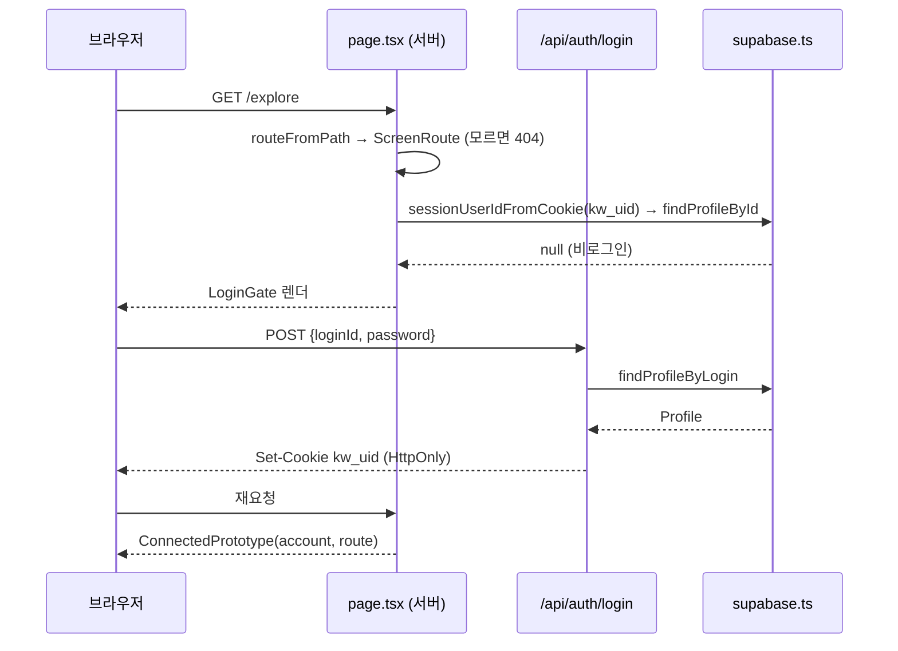

첫 렌더부터 `account`(parent/child)를 넘기는 이유: `/api/account` 응답을 기다리면
그동안 시드 지갑이 한 프레임 보였다 바뀐다.

### 6.2 시장가 매수 체결

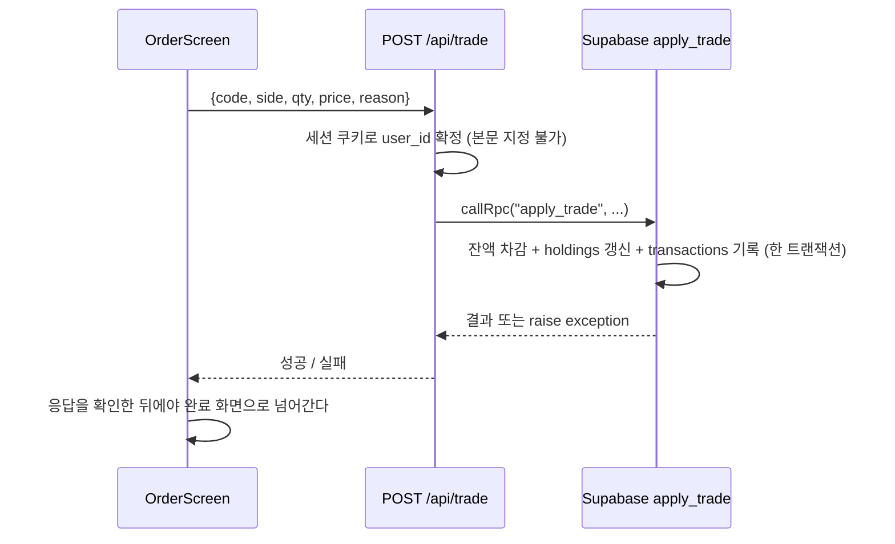

### 6.3 예약 주문과 멱등 정산

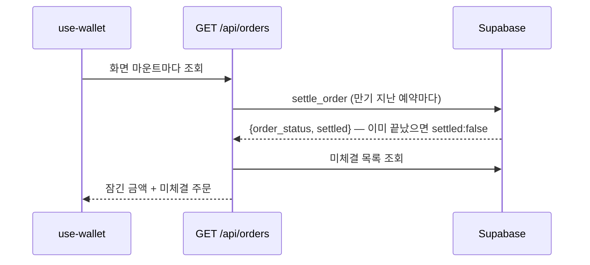

정산 트리거를 클라이언트가 들고 있지 않아도 되는 이유: `settle_order`가 멱등이라
동시에 두 번 불려도 중복 체결되지 않는다.

---

## 7. 신뢰 경계와 보안

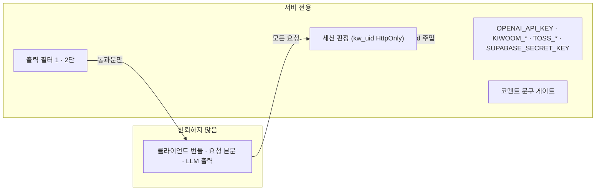

| 경계 | 규칙 |
|---|---|
| 세션 | HttpOnly 쿠키 `kw_uid`. **조회 대상은 서버가 정하고 클라이언트·모델이 지정할 수 없다.** 화면 진입은 쿠키만 본다(env 자동 로그인 폴백 없음) |
| 비밀키 | 전부 서버 코드에서만. 클라이언트 번들·`NEXT_PUBLIC_*` 반입 금지 |
| 가족 범위 | `app/api/feed/access.ts`가 좋아요·코멘트·체결 조회의 접근 검사를 공유한다. 타인 수량은 마스킹 |
| DB 권한 | 자원 변경은 `SECURITY DEFINER` RPC 안에서 `user_id`를 대조한다 — 앱이 실수해도 남의 행을 못 고친다 |
| LLM 출력 | 종목 추천·매매 시점·목표가·수익률 전망·훈계 금지. 1단 결정적 룰 + 2단 모델 판정, 실패는 전부 닫힌 실패 |
| 사용자 문구 | 코멘트는 저장 전에 `shared/engine/comment-filter`를 통과해야 한다 |
| 요청 한도 | `/api/chat`은 분당 한도가 있고 초과 시 `Retry-After`와 `X-Request-Id`를 준다 |

---

## 8. 앱 밖 파이프라인

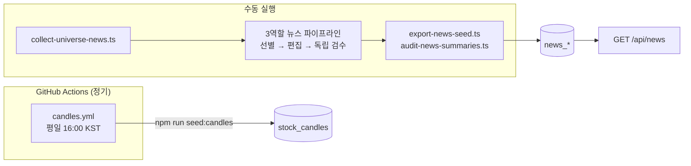

- **정기 실행되는 데이터 워크플로는 `candles.yml` 하나뿐이다.** 뉴스 수집은 아직 수동이다.
- 뉴스 3역할(관련성 선별 → 어린이용 편집 → 독립 출고 검수)은
  `web/features/f2-trade/prototypes/child-news-role-pipeline/`에 격리돼 있고,
  `ready_for_storage` 결과만 DB 저장으로 넘어간다. 통과 기사가 목표 개수보다 적어도 일상 기사로 채우지 않는다.
- 나머지 워크플로 `web-ci.yml`·`session-policy.yml`은 검사용이다(빌드·테스트, PR 본문 6개 섹션 검사).

---

## 9. 알려진 미연결·잔재 [실측]

이 문서를 읽고 코드를 찾을 다음 사람이 헛돌지 않도록 남긴다.

| 항목 | 상태 |
|---|---|
| `GET /api/quote/daily-closes` | 라우트는 살아 있으나 **React 화면 소비자가 없다**. 호출처는 `design-system/`의 참조용 프로토타입 HTML뿐 |
| `GET /api/health/candles` | 운영 점검용. 앱 내 소비자 없음 |
| `shared/ui/` | 비어 있다(`.gitkeep`). 소비자였던 F11 `FeedScreen` 삭제와 함께 비었다 |
| `shared/engine/archive-profile.js` | 0~100 구버전 산식. **화면 연결이 끊긴 채 자체 테스트만 남아 있다.** 아카이브 값의 원본은 `behavior-profile.ts`(0~10, 5가 중립) 한 벌 |
| `SignupWizard` | 부모 4단계·자녀 3단계 화면만 있고 **서버 저장 호출이 없다** |
| `prototype-account.js` · `archive-profile.js` | `.ts`가 아닌 것은 옛 조립 시절 잔재다. 새 코드는 `.ts`로 쓴다 |
| 디자인 토큰 | Tailwind v4 `@theme` 토큰을 실제로 쓰는 것은 F10 챗봇 UI뿐이다. 옮겨 온 화면은 인라인 스타일을 그대로 들고 있다 — 토큰화는 별도 작업 |
| F3 · F11 | `features/f3-reason` · `features/f11-feed`에는 가드와 `SPEC.md`만 있다. 화면 본문은 각각 f2 주문 폼과 아카이브 수익률 탭이 소유한다 |

---

## 10. 관련 문서

| 문서 | 다루는 것 |
|---|---|
| `docs/기술스택.md` | 기술 선택의 **근거**, LLM 모델·호출 패턴 표, 미결정 항목 |
| `docs/영웅키움_기획_통합문서_v2.md` | 제품 목표·법무·레드라인 (전역 제품 결정의 단일 원본) |
| `docs/기능명세.md` | 기능 지도 (F0 · F2 · F3 · F9 · F10 · F11) |
| `docs/디자인시스템.md` | UI 토큰·컴포넌트 |
| `web/features/*/SPEC.md` | 기능별 구현 상세의 단일 원본 |
| `CLAUDE.md` · `AGENTS.md` | 소유권 경계와 병렬 작업 하네스 |
