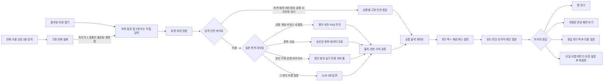

# 영웅 키움 — 기획 통합 문서 v2 (단일 마스터)

> **2차 팀 프로젝트 · 주제: 증권 · 심사: 키움증권 현직자 (인사이트랩팀 / 플랫폼전략팀 / AIX팀)**
> 최종 갱신: 2026-08-12 (v2.7 — 허용된 정보성 챗봇 답변에 DAPIE 상호작용 프레임 적용) · **이 문서가 제품 결정의 유일한 마스터다.**
>
> **대체 후 삭제한 구 문서**:
> `기획서.md`(v7) · `전체기획서.md` · `키움_가족모의투자_팀공유_정리_v2.md` · `펫서비스기획.md`(v5 폐기안) · `영웅키움_기획_통합문서_v1.md`
> `기능명세.md`·`디자인시스템.md`·`기술스택.md`와 기능 폴더의 `SPEC.md`는 실행 문서다. 제품 목표·법무·레드라인이 충돌하면 본 문서를 따르고, 기능 구현 상세는 해당 `SPEC.md`를 단일 원본으로 관리한다.
>
> **표기 원칙** (v7 승계): **[사실]** 출처 있음 / **[추론]** / **[가정]** 내부 확인 필요 / **[잠정]** 팀 재검토 전제로 채택 / **[확인 필요]** 검증 후 기재. 요약·발췌 시 표기를 떼지 말 것.

---

## 목차

1. [프로젝트 개요](#1-프로젝트-개요)
2. [문제 정의 & 페인포인트](#2-문제-정의--페인포인트)
3. [타겟 & 페르소나](#3-타겟--페르소나)
4. [Why 키움, Why Now](#4-why-키움-why-now)
5. [경쟁 구도](#5-경쟁-구도)
6. [서비스 구조 개요](#6-서비스-구조-개요)
7. [참가 조건 & KPI 퍼널](#7-참가-조건--kpi-퍼널)
8. [시즌 운영 설계](#8-시즌-운영-설계)
9. [전체 프로세스 (STEP 0~3)](#9-전체-프로세스-step-03)
10. [핵심기능 ① 모의투자 & 질문식 매매](#10-핵심기능--모의투자--질문식-매매)
11. [핵심기능 ② 가족 아카이브 — 매매지점 차트 · 성향 분석 · 거래내역 피드](#11-핵심기능--가족-아카이브--매매지점-차트--성향-분석--거래내역-피드)
12. [핵심기능 ③ 플로팅 AI 챗봇 "키웅이"](#12-핵심기능--플로팅-ai-챗봇-키웅이)
13. [AI 분리 구조 & 출력 필터](#13-ai-분리-구조--출력-필터)
14. [리워드 & 게임화 리스크 방어](#14-리워드--게임화-리스크-방어)
15. [법적·규제 검토 (컴플라이언스 쟁점)](#15-법적규제-검토-컴플라이언스-쟁점)
16. [UI/UX & 브랜딩](#16-uiux--브랜딩)
17. [기술 구현 & 데모](#17-기술-구현--데모)
18. [KPI](#18-kpi)
19. [검증 계획 (PoC)](#19-검증-계획-poc)
20. [평가 기준 매핑](#20-평가-기준-매핑)
21. [레드라인 (하지 않는 것)](#21-레드라인-하지-않는-것)
22. [미결정 사항 & 백로그](#22-미결정-사항--백로그)
23. [예상 질문 대응](#23-예상-질문-대응)
24. [출처](#24-출처)

---

## 1. 프로젝트 개요

| 항목 | 내용 |
|---|---|
| 서비스명 | **영웅 키움** (단독 표기 확정) — 키움증권이 투자자를 '영웅'이라 부르는 데서 착안, 미래의 영웅(자녀)을 '키운다'는 중의적 의미 |
| 한 줄 소개 | **성장 발자취가 남는 가족 단위 모의투자 플랫폼** (어린이 눈높이) |
| 형태 | 신규 앱이 아니라 **기존 영웅문S#(키움 MTS) 내 신규 메뉴로 이식.** 메뉴 진입 시 전용 화면 세트로 전환 |
| 궁극적 목표 | 키움 계좌 보유 부모의 자녀를 잠재고객으로 보고 ① 미성년 계좌 개설을 유도하고 ② 투자 습관을 길러주며 ③ 잠재고객을 키움의 **장기고객으로 전환** |
| 사용자가 얻는 것 | 자녀의 투자 습관 형성, 주식 투자에 대한 친숙함 · 부모의 교육 부담 해소와 가족 금융 대화 |
| 핵심 구조 | 한 가족 = 한 팀. 부모·자녀가 **각자의 가상 지갑**으로 모의투자하고, AI가 행동을 읽어 성장 기록으로 돌려준다 |

### 핵심 카피 재정의 [2026-08-12 확정]

> **'좋은 투자습관을 길러준다' → '안전한 투자 경험을 제공한다'**

"좋은 습관"은 교육적 훈계 프레임이라 아이도 부모도 부담스럽고, 서비스의 성공 여부를 판단할 기준도 모호해진다. "안전한 경험"은 훨씬 구체적이다 — **화이트리스트 · 부모 참여 · 아이친화적 챗봇이 전부 "안전장치"라는 하나의 목적으로 재해석**된다. 문서·화면·발표의 모든 카피는 이 축으로 통일한다.

이 재정의는 §21 레드라인의 "훈계 금지"와 같은 뿌리다. 훈계를 금지하는 이유가 교육 철학이 아니라 **제품 포지셔닝 그 자체**임을 분명히 한다.

### 핵심 AI Loop

```
각자 투자 (탐색·주문 + 질문식 기록: 근거 태깅·확신도·보유기간)
→ 행동 데이터 축적 (거래 로그 + 탐색 이벤트 + 근거·확신도)
→ 스코어링 엔진: 판단근거·포트폴리오 폭 2축 계산 (룰·통계, LLM 아님)
→ 아카이브: 가족 매매 차트 + 4유형 분류 + 가족 비교 → 시즌 기록
막히는 순간 언제든 → 플로팅 챗봇 키웅이 (묻면 답하고, 헤매면 먼저 돕는다 — 추천·예측 금지)
```

---

## 2. 문제 정의 & 페인포인트

### 사용자 페인포인트 (2겹 병합) [잠정]

> **메인:** 부모는 자녀가 비교적 안전한 환경에서 주식 투자를 경험하고 투자 습관을 기르게 해주고 싶은데 — **마땅한 플랫폼이 없다.**
> **서브:** 부모도 투자 전문가라는 보장이 없어 **직접 가르치기 어렵다.** ← 챗봇 '키웅이'가 존재하는 이유

- 기존 MTS·모의투자는 성인 기준의 용어·화면·정보량이라 아이가 쓸 수 없다
- 기존 모의투자는 개인 수익률 경쟁 중심이라 가족 간 대화 요소가 약하다
- 아이들은 경제·투자를 직접 경험하며 배울 기회가 부족하다

### 문제 정의의 레이어 분리

| 층위 | 주체 | 내용 |
|---|---|---|
| 사업 배경 | 키움 | 초중등 자녀 세대는 미래 잠재고객이나 접점·브랜드 경험이 없음 |
| 🔴 사용자 페인 | 부모 | 안전한 투자 경험을 시켜줄 플랫폼이 없고, 직접 가르치기도 어렵다 |
| 서비스 목표 | — | 자녀가 안전한 환경에서 투자 습관을 기르고 주식·키움에 친숙해진다 |
| 비즈니스 목표 | 키움 | 미성년 계좌 개설·활성화 → 가족 단위 이용 → 장기고객 전환 |

### 핵심 문제 재정의 (발표용)

> **"부모가 투자 전문가가 아니어도, 아이가 안전한 무대에서 스스로 투자해보고 AI의 도움을 받아 배우면서, 부모와 자연스럽게 투자 이야기를 나눌 수 없을까?"**

---

## 3. 타겟 & 페르소나

| 구분 | 대상 |
|---|---|
| 핵심 타겟 | **키움증권 계좌를 보유한 초·중등 자녀의 부모** 중 자녀에게 주식투자 경험을 시켜주고 싶은 부모 — 그리고 그 자녀들 |
| 사용 주체 | 자녀(모의투자 플레이어) + 부모(같이 참여하는 투자 파트너이자 법정대리인) |

**페르소나 ① 부모 (43세)** — 키움 계좌 보유, 종종 매매. 자녀가 안전한 플랫폼에서 주식을 경험하고 투자 습관·경제 관념을 갖길 바란다.
**페르소나 ② 자녀 (2014년생, 13세, 초6)** — 부모와 함께 체험하는 것을 좋아한다. 경제·투자·주식을 아직 잘 모르고 어려워한다.

> 역할 원칙: **부모 = 선생님이 아니라 같이 참여하는 투자 파트너.** 가르치는 역할은 챗봇, 읽어주는 역할은 아카이브가 맡는다.

---

## 4. Why 키움, Why Now

### 시장 신호 [사실 — 출처 §23]

- 미성년 주식계좌 급증: 0~9세 신규계좌 +119%, 10대 +100% 이상, 20세 미만 ETF 투자자 30만 명(2026-04) — 관심은 이미 행동으로 증명됨
- 신한투자증권이 미성년 vs 부모 성향차 통계를 발표하고 '우리아이 자산관리' 구축 추진 중(미출시) — **아직 아무도 가족 단위로 제품화하지 못했다**

### 키움 인프라 [사실 — 출처 §23]

- **상시·그룹 모의투자** 운영(개설·초대·그룹 내 비교) — 가족 리그는 그 관계 특화 변형
- **미성년자 비대면 계좌 개설**: 2023년 4월부터 영웅문S#에서 지원 — 부모가 정부24 발급 가족관계증명서·기본증명서 발급번호 진위확인으로 앱 안에서 개설 완료
- 영웅문S# AI 전면 배치(로보마켓 등)와 방향 일치
- **[가정]** 키움 고객층 2030 편중 → 가족 접점 약함. 내부 데이터 확인 필요

> 발표 프레임: **모의→실계좌→성인 전환의 전 퍼널이 키움 앱 하나에서 끊기지 않는다.** 세대 승계의 인프라가 이미 있다.

---

## 5. 경쟁 구도 (2026-08-09 검증 [사실] — 발표 방어 자산)

| 영역 | 대표 사례 | 우리의 기회 |
|---|---|---|
| 가족·청소년 금융 | 퍼핀, 아이부자, Greenlight, Fidelity Youth, Schwab Teen, Step, Goalsetter | 부모·자녀 **투자 스타일 비교·이해**가 없음 |
| 개인·그룹 모의투자 | 키움 상시·그룹, StockTrak, KB 모투의마블 | 가족 관계·세대 간 분석 없음 |
| AI 투자정보·자문 | DB증권 스윙스타, 우리투자 AI리포트, Robinhood Cortex | 전부 **개인 단위·성인용** — 아이 눈높이 AI 없음 |
| **가족 투자 AI 연결** | **미발견** (국내 9건+영어권 4쿼리 재탐색 — 부재 증명은 아님) | **선점 가능 공백** |

- **퍼핀 [사실]**: 가입자 33만, 주간 가족 모의투자 대회 운영 — 대회 포맷 선례. 그러나 가족 간 **순위 비교만** 제공. **우리 차별 = 대회 위에 얹는 AI 레이어**(눈높이 챗봇 + 성향·성장 아카이브)
- **DB 스윙스타 [사실]**: 행동 분석까지는 같은 재료, 출력이 종목 추천·손절가(자문형). 우리는 교육·이해형 — 자문업 규제 부담 회피 **[추론]**
- 부모 권한 선례 [사실]: Greenlight(건별 승인) ↔ Step(한도 내 자율) ↔ Fidelity Youth(전면 자율). **우리는 건별 승인도 단일종목 한도도 없음** — Fidelity Youth형에 가깝다. 가상 자산이라 금전 손실이 없고, 몰빵은 차단 대신 F9 성향 리포트로 되돌려 준다 **[확정 2026-08-13]**

---

### 5.1 미성년 계좌 시장 — 지금이 유일한 구간인 이유 [2026-08-12 보강]

**시장은 이미 열풍 수준이다** [사실]

- 한국투자·미래에셋·신한투자증권 3사 기준 미성년 계좌 수가 1년 사이 **약 3배 증가** (1월 11,873좌 → 12월 34,590좌). 증여세 비과세 한도(10년 합산 2천만원)와 증시 호황이 맞물린 결과
- 예탁결제원 기준 시총 상위 200개사 중 88개사의 미성년 주주가 **72만 8,344명**, 보유주식 가치 약 **2조 9,761억원**

**경쟁사는 이미 들어와 있다** [사실]

| 증권사 | 미성년 대응 |
|---|---|
| 토스증권 | 부모 화면에서 자녀 계좌 함께 관리, 만 14세 이상 본인 명의 직접 거래, 개설 유도 이벤트 상시 |
| 미래에셋증권 | 미성년 신규고객 현금·수수료 우대 이벤트 |
| 신한투자증권 | '우리아이 자산관리 서비스' 추진 |
| 한국투자·NH·퍼핀 | 각자 미성년 특화 상품·이벤트 운영 |

**그런데 증권계좌는 좀처럼 옮기지 않는다** — 앱만 새로 까는 것이 아니라 **보유 주식과 현금을 실제로 이동**시켜야 한다(타사 대체출고·계좌 이관). 절차적 번거로움과 심리적 부담이 겹쳐, 수수료 파격 이벤트 같은 큰 계기가 없으면 쓰던 증권사를 계속 쓴다. 은행·카드와 달리 병행보다 **하나를 주계좌로 오래 유지**하는 성향이 강하다.

> **그래서 이 시장의 승부처는 "쓰던 고객을 빼앗아 오기"가 아니라 "처음 선택될 때 선택받기"다.**
> 아직 주거래 증권사가 없는 미성년·청소년기는 **전환 비용이 사실상 0인 유일한 구간**이다. 이 시기를 놓치면 이후에는 이미 다른 증권사에 자산이 들어간 고객을 훨씬 비싼 비용(현금성 이벤트·수수료 면제)으로 끌어와야 한다.

---

## 6. 서비스 구조 개요

```
영웅문S# (키움 MTS)
 └─ [영웅 키움] 메뉴 (신규)
     ├─ 튜토리얼 모드      ← 계좌 없이 개방 (전환 퍼널의 입구)
     ├─ 시즌 모의투자      ← 참가 조건: 자녀 명의 실계좌 (§7)
     │    ├─ 가족 팀 (부모+자녀, 개인별 가상 지갑)
     │    ├─ 질문식 매매 · 유니버스 51종 [확정]
     │    └─ 리그 단위 가족 경쟁 (수익률 기준)
     ├─ 가족 아카이브      ← 매매지점 차트 + 4유형 분류 + 거래내역 피드
     └─ 플로팅 챗봇 키웅이 ← 전 화면 상시 대기
```

- **한 가족 = 한 팀**, 가족별 경쟁. **분기별 연 4회, 회당 4주** 시즌제
- 시즌이 반복될수록 아카이브에 가족·자녀의 성장 기록이 쌓인다 — 서비스명의 정체성

---

## 7. 참가 조건 & KPI 퍼널

### 참가 조건 (확정)

> **키움 계좌를 보유한 부모 중, 미성년 자녀 실계좌를 신규 개설했거나 이미 보유한 가족만 시즌 정식 참가 가능.**

### 2단 퍼널

| 단계 | 요구 조건 | 목적 |
|---|---|---|
| 튜토리얼·구경 모드 | 없음 (부모 로그인만) | 체험 전 이탈 방지 — "재밌어 보여서 계좌를 만든다"는 순서를 만든다 |
| 시즌 정식 참가 | **자녀 명의 미성년 실계좌** | 계좌 개설이 자연스러운 전환 이벤트 → 전환율 측정 가능 |

### KPI 이원화 (확정)

| KPI | 정의 | 계측 지점 |
|---|---|---|
| **① 신규 미성년 계좌 개설 수** | 참가를 위해 새로 개설된 자녀 계좌 | 온보딩 내 개설 플로우 완료 |
| **② 기존 미성년 계좌 활성화율** | 방치 상태이던 자녀 계좌의 첫 서비스 연결 | 기존 계좌 첫 팀 연결 |

> 이원화 이유: 이미 계좌를 만들어둔 가족은 '개설 수'에 잡히지 않지만, 방치 계좌를 깨우는 것 역시 키움에 동등하게 가치 있는 성과다.

**북극성 지표 병기 [잠정]**: 부모·자녀가 모두 주 1회 이상 활동한 **동반 활성 가족 수** — 계좌를 열게 만드는 힘의 원천은 가족의 지속 사용이므로, 개설 KPI의 선행 지표로 함께 관리한다.

---

## 8. 시즌 운영 설계

### 확정 규칙

| 항목 | 내용 |
|---|---|
| 시즌 | **4주 × 연 4회 (분기)** — 본 경쟁 4주를 어닝시즌에 걸치도록 배치 |
| 캘린더 | 모집·연습 1주 → 본 경쟁 4주 → 결산 1주. 시즌 오프에도 튜토리얼·연습 모드 상시 개방 |
| 시드 | **구성원 1인당 가상 100만원** 동일 지급 (용돈 스케일 — 아이 돈 감각 유지) |
| 지갑 | **개인별 가상 지갑** — 부모·자녀 각자 운용. 공동 통장 아님 |
| 가족 성적 | **구성원 수익률 평균** (전원 시드 동일 → 가족 총자산 수익률과 수학적으로 동일) |
| 실잔액 연동 | **하지 않음** — 자산 격차 노출·프라이버시·구현 복잡도. 현실감은 금액이 아니라 시세·체결 경험에서 나온다 |
| 시즌 종료 | 가상 자산 전액 리셋. 남는 것은 아카이브의 기록 |

### 왜 4주 × 연 4회인가

- 분기 개최 → 매 시즌 **실적 발표(어닝시즌)가 주가를 움직이는 실제 이벤트**를 한 번씩 경험
- 4주 = 최소 한 번의 등락 사이클을 견디는 "기다리는 경험"이면서 아이 집중력이 유지되는 길이, 용돈 주기(월)와 일치
- 회차가 끊겨야 신규 가족의 리셋 진입 시점이 생기고, 아카이브에 분기 단위 비교 기록이 쌓인다

### 공정성 설계

- 비교는 금액이 아니라 **수익률** — 가족 인원이 달라도 공정
- [잠정] **참가 인원 상한: 부모 1 + 자녀 1 필수, 최대 4인** (대가족일수록 평균이 중간으로 수렴하는 통계적 특성 완화)
- [잠정] **리그 분할: 30~50가족** 단위 — "우리 리그 4위"라는 체감 가능한 경쟁 단위
- [잠정] 순위 노출: **홈에 상시 표시**(리그 몰입감) + **알림·푸시는 주간만**(일희일비 단타 습관 방지) — 노출과 푸시를 분리

### 개인별 지갑이어야 하는 결정적 이유

공동 통장이면 사실상 부모가 주도하게 되고, 자녀 행동 데이터가 부모와 섞여 **질문식 매매 분석과 4유형 산출이 전부 불가능**해진다. 데이터 기능이 이 구조를 강제한다.

---

## 9. 전체 프로세스 (STEP 0~3)

### STEP 0. 진입 & 가족 팀 결성 (모집 주간)

1. 부모가 영웅문S# 로그인 → **[영웅 키움]** 메뉴 진입 (부모 계좌 보유는 로그인으로 자동 충족)
2. **[가족 팀 만들기]** → 부모 명의에 연결된 미성년 자녀 계좌 존재 여부 조회
   - 자녀 계좌 **있음** → 바로 연결 *(KPI ② 활성화 카운트)*
   - 자녀 계좌 **없음** → 키움 기존 미성년 비대면 개설 플로우로 안내, 완료 후 복귀 *(KPI ① 신규 개설 카운트)*
3. 자녀는 자기 기기의 영웅문S#에서 자녀 계정 로그인 → **가족 초대 코드**로 팀 합류. 자녀의 서비스 가입·개인정보 수집 동의는 **부모 화면 안에서 법정대리인 동의로 처리** (§15)
4. 시즌 개막 대기. 계좌 없이도 튜토리얼·구경 모드 개방. **한도 프리셋 선택 단계는 없다 — 단일종목 한도를 폐기했다(§10 거래 규칙) [확정 2026-08-13]**

### STEP 1. 시즌 개막 — 시드 지급

- 시즌 시작일, 구성원 1인당 가상 100만원 일괄 지급 (개인별 지갑). 이전 시즌 자산 전액 리셋

### STEP 2. 매매 진행 (본 경쟁 4주)

1. **종목 탐색** — 유니버스 51종 [확정], 종목명 옆 "이 회사는 ○○를 만들어요" 한 줄 설명
2. **질문식 매매** — 주문 플로우 내장, 근거 태깅 + 확신도 + 보유기간 (§10)
3. **주문** — 금액 단위 입력 지원("10만원어치" → 수량 자동 계산), 시장가+지정가, 수수료·세금 실제 수준 안내
4. **체결** — 장 운영시간에만 체결(장외 예약주문), 15~20분 지연시세 [잠정], 동일 종목 매도 후 30분 재매수 제한 [잠정]
5. 전 과정에서 키웅이 상시 대기, 헤매는 신호 감지 시 선제 발화 (§12)
6. 주간: 리그 순위 알림(월요일) + 아카이브 갱신 알림 ("이번 주 성향 리포트가 나왔어요!")

### STEP 3. 시즌 결산 (결산 주간)

1. 마지막 거래일 종가로 수익률 확정 → 가족 성적(구성원 평균) 산출
2. **시상 다각화** — 수익률 1등만 상 받는 구조 금지: 🏆 가족 종합(리그별 1위) / 🧒 개인 부문 / 🧭 행동 부문 [잠정: 분산투자상·진득이상·질문왕]
3. 리워드 지급 (§14)
4. **시즌 아카이브 발행** — 유형 이동 궤적 + 가족 매매 차트 + 수익률 결산 (§11)
5. 다음 시즌 예고 + "지난 시즌의 나" 회고 카드 → 재참여 루프

---

## 10. 핵심기능 ① 모의투자 & 질문식 매매

> 구현 단일 원본: `web/features/f2-trade/SPEC.md` — F2와 F3가 함께 사용한다.

### 튜토리얼 모드

- 매수·매도·시장가·현재가·차트 등 **기본 버튼·용어를 화면 위에서 직접 설명** (코치마크 방식)
- 계좌 없이 개방 — 전환 퍼널의 입구

### 투자 유니버스 — 재현 가능한 산출 파이프라인 [2026-08-12 15:30 확정]

> **49종은 사람이 손으로 고르지 않는다.** 아래 절차를 다시 돌리면 언제 실행해도 같은 결과가 나오고, **여기서 벗어난 수기 편입 2종목만 표에 따로 표시**한다.
> v2.7의 "흥미 1차 → 안정성 필터 2차" 2단 구조는 **폐기**한다. 안정성은 별도 필터가 아니라 지표 A의 항목 중 하나이며, 흥미와 안정성이 **같은 점수판 위에서 겨룬다**.

#### 산출 절차

| 단계 | 수 | 처리 |
|---|---:|---|
| KRX 전체 거래 종목 | 2,710 | 모집단 |
| 시가총액 상위 | 300 | 우선주·스팩·리츠 제외 |
| 13개 섹터 편입분 | 173 | 전수 라벨링 |
| 채점 대상 | 172 | 지표 A·B로 전부 채점 |
| **최종 확정** | **51** | **섹터별 균등 선발 49 + 수기 편입 2** |

- **종합점수 = (지표 A + 지표 B) ÷ 2**
- 파이프라인을 다시 돌리면 같은 결과가 나오며, **여기서 벗어난 수기 편입 2종목만 따로 표시**한다.

#### 지표 A — 대표성·우량주 (0~1)

**100% 시장 데이터. 사람의 판단이 들어가지 않는다.**

| 항목 | 측정 |
|---|---|
| 규모 | 시가총액 |
| 섹터 대표성 | **섹터 내** 시총 순위 |
| 유동성 | 120일 평균 거래대금 |
| 수익성 | ROE + 배당수익률 |
| **안정성** | **변동성 + 최대낙폭** |

#### 지표 B — 접점등급: 11개 접점유형

**접점등급은 회사가 아니라 유형에 부여한다.** 회사는 유형에 배정만 되므로 **같은 유형이면 반드시 같은 점수**가 나오고, 논쟁이 *"이 회사 점수가 왜 이래?"*가 아니라 **"이 회사를 이 유형에 넣은 게 맞나?"**로 좁혀진다.

| 등급 | 접점유형 | 판정 문구 | 지표 B | 예시 |
|---:|---|---|---:|---|
| 5 | **아동식음료** | 아이가 용돈으로 직접 산다 | 1.00 | 삼양식품 · 오리온 · 농심 |
| 5 | **게임·콘텐츠** | 아이가 직접 플레이하거나 본다 | 1.00 | 크래프톤 · 하이브 · NC |
| 4 | **가정용품** | 집에서 아이가 매일 손댄다 | 0.75 | 삼성전자 · LG전자 · 코웨이 |
| 4 | **완성차** | 아이가 매일 탄다 | 0.75 | 기아 · 현대차 |
| 3 | **방문시설** | 아이가 보호자와 함께 간다 | 0.50 | 신세계 · BGF리테일 |
| 3 | **여객운송** | 아이가 직접 탄다 | 0.50 | 대한항공 · 현대로템 |
| 3 | **배송·방문** | 아이가 집에서 받는다 | 0.50 | CJ대한통운 |
| 2 | **성인소비재** | 집·동네에 있지만 아이는 쓸 수 없다 | 0.25 | KT&G · 하이트진로 *(최종 미포함)* |
| 2 | **금융·공공요금** | 부모만 거래하고 매달 청구된다 | 0.25 | KB금융 · 한국전력 · 키움증권 |
| 2 | **주유·지주** | 간판은 보이지만 거래는 없다 | 0.25 | S-Oil · GS · 한진칼 |
| 1 | **B2B산업재** | 아이 생활에 등장하지 않는다 | 0.00 | SK하이닉스 · HD현대중공업 |

**안정성(지표 A)과 흥미(지표 B)가 같은 점수판에서 함께 반영된다.** 마지막에 13개 섹터에서 한 종목씩 돌아가며 뽑아 채우며, **섹터 개입은 이 단계에서 딱 한 번만** 일어나고 모든 섹터가 3~5종목을 갖는다. 이 강제가 없으면 은행·금융이 12종목, 조선·물류가 0종목이 된다.

#### 최종 화이트리스트 51종

> 종합점수 순. 지표 A/B는 172개 후보 내 상대 점수.
> **[사실]** 원본은 `docs/(8월12일 오후 4시 50분 기준)영웅키움 서비스 개요.html`.

**섹터별**: 식품 4 · 게임 4 · 엔터 4 · 자동차 3 · 반도체·전자 4 · 화장품 4 · 유통 4 · 항공 3 · 방산 4 · **은행·금융 5** · 에너지 4 · 물류 4 · 조선 4

| # | 종목 | 코드 | 섹터 | 접점유형 | 등급 | 종합 | 편입 |
|---:|---|---|---|---|---:|---:|---|
| 1 | 삼양식품 | 003230 | 식품 | 아동식음료 | 5 | 0.864 | 자동 |
| 2 | 크래프톤 | 259960 | 게임 | 게임·콘텐츠 | 5 | 0.854 | 자동 |
| 3 | 오리온 | 271560 | 식품 | 아동식음료 | 5 | 0.835 | 자동 |
| 4 | NC | 036570 | 게임 | 게임·콘텐츠 | 5 | 0.813 | 자동 |
| 5 | 하이브 | 352820 | 엔터 | 게임·콘텐츠 | 5 | 0.806 | 자동 |
| 6 | 기아 | 000270 | 자동차 | 완성차 | 4 | 0.805 | 자동 |
| 7 | 삼성전자 | 005930 | 반도체·전자 | 가정용품 | 4 | 0.789 | 자동 |
| 8 | 현대차 | 005380 | 자동차 | 완성차 | 4 | 0.781 | 자동 |
| 9 | 에이피알 | 278470 | 화장품 | 가정용품 | 4 | 0.760 | 자동 |
| 10 | CJ제일제당 | 097950 | 식품 | 아동식음료 | 5 | 0.753 | 자동 |
| 11 | 넷마블 | 251270 | 게임 | 게임·콘텐츠 | 5 | 0.748 | 자동 |
| 12 | 코웨이 | 021240 | 유통 | 가정용품 | 4 | 0.745 | 자동 |
| 13 | 농심 | 004370 | 식품 | 아동식음료 | 5 | 0.736 | 자동 |
| 14 | LG전자 | 066570 | 반도체·전자 | 가정용품 | 4 | 0.717 | 자동 |
| 15 | 에스엠 | 041510 | 엔터 | 게임·콘텐츠 | 5 | 0.709 | 자동 |
| 16 | JYP Ent. | 035900 | 엔터 | 게임·콘텐츠 | 5 | 0.694 | 자동 |
| 17 | 더블유게임즈 | 192080 | 게임 | 게임·콘텐츠 | 5 | 0.688 | 자동 |
| 18 | 아모레퍼시픽 | 090430 | 화장품 | 가정용품 | 4 | 0.684 | 자동 |
| 19 | 달바글로벌 | 483650 | 화장품 | 가정용품 | 4 | 0.652 | 자동 |
| 20 | LG생활건강 | 051900 | 화장품 | 가정용품 | 4 | 0.646 | 자동 |
| 21 | 대한항공 | 003490 | 항공 | 여객운송 | 3 | 0.646 | 자동 |
| 22 | **와이지엔터테인먼트** | 122870 | 엔터 | 게임·콘텐츠 | 5 | 0.610 | **수기** |
| 23 | 현대로템 | 064350 | 방산 | 여객운송 | 3 | 0.600 | 자동 |
| 24 | 롯데렌탈 | 089860 | 유통 | 가정용품 | 4 | 0.560 | 자동 |
| 25 | KB금융 | 105560 | 은행·금융 | 금융·공공요금 | 2 | 0.557 | 자동 |
| 26 | 신한지주 | 055550 | 은행·금융 | 금융·공공요금 | 2 | 0.547 | 자동 |
| 27 | 하나금융지주 | 086790 | 은행·금융 | 금융·공공요금 | 2 | 0.544 | 자동 |
| 28 | 한국전력 | 015760 | 에너지 | 금융·공공요금 | 2 | 0.538 | 자동 |
| 29 | 신세계 | 004170 | 유통 | 방문시설 | 3 | 0.536 | 자동 |
| 30 | 우리금융지주 | 316140 | 은행·금융 | 금융·공공요금 | 2 | 0.530 | 자동 |
| 31 | BGF리테일 | 282330 | 유통 | 방문시설 | 3 | 0.530 | 자동 |
| 32 | S-Oil | 010950 | 에너지 | 주유·지주 | 2 | 0.457 | 자동 |
| 33 | GS | 078930 | 에너지 | 주유·지주 | 2 | 0.454 | 자동 |
| 34 | **키움증권** | 039490 | 은행·금융 | 금융·공공요금 | 2 | 0.449 | **수기** |
| 35 | SK이노베이션 | 096770 | 에너지 | 주유·지주 | 2 | 0.448 | 자동 |
| 36 | CJ대한통운 | 000120 | 물류 | 배송·방문 | 3 | 0.420 | 자동 |
| 37 | HD현대중공업 | 329180 | 조선 | B2B산업재 | 1 | 0.414 | 자동 |
| 38 | HD한국조선해양 | 009540 | 조선 | B2B산업재 | 1 | 0.402 | 자동 |
| 39 | 한화에어로스페이스 | 012450 | 방산 | B2B산업재 | 1 | 0.397 | 자동 |
| 40 | SK하이닉스 | 000660 | 반도체·전자 | B2B산업재 | 1 | 0.394 | 자동 |
| 41 | 현대모비스 | 012330 | 자동차 | B2B산업재 | 1 | 0.386 | 자동 |
| 42 | HMM | 011200 | 물류 | B2B산업재 | 1 | 0.386 | 자동 |
| 43 | 현대글로비스 | 086280 | 물류 | B2B산업재 | 1 | 0.384 | 자동 |
| 44 | 아시아나항공 | 020560 | 항공 | 여객운송 | 3 | 0.372 | 자동 |
| 45 | 한진칼 | 180640 | 항공 | 주유·지주 | 2 | 0.371 | 자동 |
| 46 | LIG디펜스앤에어로스페이스 | 079550 | 방산 | B2B산업재 | 1 | 0.371 | 자동 |
| 47 | SK스퀘어 | 402340 | 반도체·전자 | B2B산업재 | 1 | 0.367 | 자동 |
| 48 | 한화오션 | 042660 | 조선 | B2B산업재 | 1 | 0.362 | 자동 |
| 49 | 삼성중공업 | 010140 | 조선 | B2B산업재 | 1 | 0.346 | 자동 |
| 50 | 포스코인터내셔널 | 047050 | 물류 | B2B산업재 | 1 | 0.328 | 자동 |
| 51 | 한국항공우주 | 047810 | 방산 | B2B산업재 | 1 | 0.324 | 자동 |

- **등급 5~4가 22종목(43%)** — "아이가 아는 회사"가 절반 가까이를 차지하면서도, 조선·방산·물류처럼 **아이가 모르지만 한국 경제를 설명하는 데 빠질 수 없는 산업**이 함께 들어온다.
- **수기 편입 2종목** — 파이프라인 밖에서 기획 판단으로 추가했고, 표에 `수기`로 명시해 자동 산출과 구분한다.
  - **와이지엔터테인먼트**: 접점등급 5(블랙핑크·베이비몬스터)로 아이 인지도는 최상위지만 지표 A가 0.221로 낮아 자동 선발에서 밀렸다
  - **키움증권**: 서비스 제공사이므로 수기 추가
- 제외: 레버리지·인버스 ETF, ETN, 선물·옵션, 신용·미수, 공매도, 가상자산, 초저유동성 — "안전한 무대"의 실체
- 최종 목록·섹터의 제품 결정은 이 절이 소유하고, 구현 데이터는 `web/shared/data/stocks.ts`가 따른다.
- 종목별 아이 눈높이 설명 수작성 ("이 회사는 무슨 일을 해요?" / "어디에서 만날 수 있어요?")

> ⚠ **종목 구성이 v2.8(50종)에서 바뀌었다.** 펄어비스·강원랜드가 빠지고 더블유게임즈·와이지엔터테인먼트·키움증권이 들어왔다. `모의투자_종목유니버스_데이터셋_설계.md`와 `stocks.ts`를 **이 51종으로 교체**해야 한다 (§22 백로그).

### 기존 키움 모의투자와의 차별점

기존 서비스는 **만 14세 미만 참여가 원천적으로 불가능**하고 개인 단위 경쟁이었다. 이 서비스는 연령 제한을 없애고 **가족 단위**로 설계해, 기존 서비스가 다루지 못하던 세그먼트(초중등 자녀)를 겨냥한다.

### 거래 규칙

| 규칙 | 내용 | 근거 |
|---|---|---|
| 주문 | 시장가 + 지정가 (데모는 시장가 즉시 체결, 지정가는 설계) | |
| 수수료·세금 | 실제 수준 안내 표시 | 현실 감각 교육 |
| 시세 | 15~20분 지연시세 [잠정] | 실서비스 현실성 |
| 재매수 제한 | 동일 종목 매도 후 30분 [잠정] | 단타 억제 |
| 단일종목 한도 | **없음 [확정 2026-08-13]** — 부모·자녀 모두 한 종목에 지갑 전액을 넣을 수 있다. 입문형 30%·성장형 40% 프리셋은 폐기했다 | 가상 자산 데모에서 한도가 탐색을 막고, 집중↔분산은 차단이 아니라 F9 성향 리포트로 되돌려 주는 편이 서비스 취지에 맞다 |
| 승인 | **건별 부모 승인 없음.** 잔액 초과 주문만 차단+안내 | Step형 자율 구조 (§5) |
| 거래 가능 시간 | 장 운영시간(09:00~15:30)에는 **자녀 거래 불가** — 챗봇·종목 탐색만 가능 | 학교 수업 시간과 겹친다 |
| 예약 주문 | **24시간 예약 가능.** 학교에서 살펴본 종목을 다음 거래일 시가로 체결되도록 예약 | 모의투자이므로 제약 없음. 거래 불가 시간대가 곧 '탐색·학습 시간'이 된다 |
| 위험행동 | 손실 직후 거래금액 급증 등 감지 시 부모 코칭 알림: "차단하기보다 투자 이유를 먼저 물어보시겠습니까?" | |

### 종목 차트 — 가족 매매 지점 표시 [2026-08-12 신규 확정]

종목 상세 차트에 **부모와 자녀의 매수·매도 지점을 함께 표시**한다.

| 항목 | 규칙 |
|---|---|
| 표시 대상 | 같은 가족 팀 구성원 전원의 **해당 종목 체결 지점** |
| 마커 | 매수 ▲ / 매도 ▼, 사람별 색 구분 (`디자인시스템.md` 토큰만 사용) |
| 툴팁 | 누가·언제·매수/매도·**근거 태그**까지. **수량·금액은 본인 마커에만** 표시 |
| 연결 | 마커를 탭하면 §11.4 가족 거래 피드의 해당 카드로 이동 |
| 범위 | 현재 시즌 체결만. 지난 시즌은 아카이브에서 본다 |
| 미표시 | 미체결 예약주문·보유 수량·평가손익 — **실시간 따라하기 방지** |

**왜 필요한가.** 유형 분류(§11.2)가 **추상 축**의 비교라면, 이 차트는 **같은 종목·같은 가격대 위에서의 판단 차이**를 보여준다. "엄마는 여기서 샀는데 나는 여기서 팔았네"는 수익률 숫자보다 훨씬 구체적인 대화 소재이며, 부모의 페인포인트인 *"자녀가 실제로 스스로 판단하며 배우고 있는지 확인할 도구가 없음"*(§2)에 직접 답한다.

**왜 수량·금액은 가리는가.** 마커 위치가 곧 가격이므로 단가는 숨길 수 없고 숨길 이유도 없다. 그러나 **수량·금액은 자산 규모를 드러낸다.** §8에서 실잔액 연동을 하지 않기로 한 것과 같은 이유로, 타인 마커에서는 규모를 지운다. 비교의 대상은 **판단**이지 **금액**이 아니다.

### 질문식 매매 (A+B 병합 확정) — 이 서비스의 데이터 심장

주문 플로우 안에 내장되어 스킵 불가, **3탭 이내**로 끝낸다. '시험'이 아니라 **스코어링 엔진·리포트·4유형 분류의 재료가 되는 생각 데이터.**

**매수 시:**

1. **근거 태깅** (필수, 1탭): 뉴스에서 봤어 / 차트가 좋아 보여 / 친구·가족이 추천했어 / 이 회사(제품)를 잘 알아 / 그냥 느낌이 좋아 — 근거 5축(뉴스·차트·추천·지식·느낌)
2. **확신도** (필수, 1탭): "키웅이가 궁금해해요 — 얼마나 자신 있어요?" 4단계: 잘 모르겠어요(25) / 조금(50) / 꽤(75) / 완전(100). "정답은 없어요!" 캡션 병기 — 채점 아님
3. **예상 보유기간** (필수, 1탭): 이번 주만 / 시즌 끝까지 / 모르겠어요 — 속도 축·계획-행동 일치 분석의 재료
4. 내 생각 한 줄 (선택)

**매도 시:** 근거 태깅 (필수): 목표한 만큼 올랐어 / 더 떨어질까 봐 걱정돼 / 다른 종목이 더 좋아 보여 / 그냥 불안해 / 기타 + 한 줄(선택)

- 체결 완료 화면: "기록 완료! 키웅이가 기억해둘게요" (컨페티)
- 선례 **[사실]**: StockTrak "Require Trading Notes" 기본 활성 — '모의투자+기록'은 교육 시장의 검증된 결합

---

## 11. 핵심기능 ② 가족 아카이브 — 매매지점 차트 · 성향 분석 · 거래내역 피드

> 구현 단일 원본: `web/features/f9-archive/SPEC.md` (①②) · `web/features/f11-feed/SPEC.md` (③)

> **2026-08-12 16:50 3축 확정.** v2.8의 "거래/행동 2축"을 3축으로 확장하고, 성향 분석의 세로축을 **결정 속도 → 포트폴리오 폭**으로 교체했다. 성향 5축·친화도 스코어는 v2.8에서 이미 폐기됐다.

**존재 이유**: 부모와 자녀가 함께한 기록을 남기는 아카이브로서 가족이 투자 경험에 대한 **긍정적 추억**을 쌓게 하는 것. 동시에 **자녀의 투자성향을 알고 싶어하는 부모의 니즈**와 **투자 행동을 소재로 한 부모·자녀 커뮤니케이션**을 함께 충족한다.

| 축 | 데이터 소스 | 산출물 |
|---|---|---|
| **① 매매지점 차트** | 부모·자녀의 실거래 내역(매수·매도 시점) | 종목별 차트 위에 부모와 자녀의 매수/매도 지점을 함께 표시 |
| **② 투자성향 분석** | 거래 데이터(거래한 기업 개수) + 행동 데이터(매수 전 탭 열람 수) | 4가지 투자성향 유형 분류 |
| **③ 거래내역 피드** | 거래 이벤트 + 거래이유 + 가족 코멘트 | 부모·자녀 거래가 한 줄로 흐르는 피드 · 서로 코멘트 작성 |

> **①은 결과를 겹쳐 보고, ②는 과정을 유형으로 요약하고, ③은 그 위에 대화를 얹는다.** 세 축이 함께 있어야 "기록"이 아니라 **"함께 만든 아카이브"**가 된다.
> **성향 유형은 스타일이지 성적이 아니며 어느 유형도 우열이 없다.** 복잡한 0~100 주간 점수는 쓰지 않고, §11.2의 두 행동 기준으로 분기마다 다시 산출해 고정 낙인을 막는다.

### 11.1 ① 매매지점 차트

한 종목의 주가 흐름 위에 부모와 자녀가 각각 **언제 사고 팔았는지**를 함께 표시한다.

| 항목 | 규칙 |
|---|---|
| 대상 | 같은 종목의 가족 전원 **체결** 지점. 미체결 예약주문 제외 (실시간 따라하기 방지) |
| 마커 | 매수 **B** / 매도 **S**, 사람별 색 구분 (`디자인시스템.md` 토큰) |
| 탭 | **점을 누르면 그때 입력했던 거래이유가 그대로 뜬다** → §11.3 피드 카드로 이동 |
| 축 | 차트 값과 체결가를 모두 포함해 잡는다 — 체결가가 범위 밖이면 마커가 잘린다 |
| 마스킹 | 타인 마커에는 **수량·금액을 표시하지 않는다.** 마커 위치가 곧 체결가라 단가는 가릴 수 없고 가릴 이유도 없다. 가리는 것은 자산 규모다 (§8과 같은 이유) |

- 단순 수익률 비교가 아니라 **"같은 종목을 두고 우리 둘이 언제, 왜 다르게 판단했나"**가 한 장에 보인다.
- *"너는 왜 여기서 팔았어?"* 라는 질문이 자연스럽게 나오는 구조이며, 이것이 이 기능이 리포트가 아니라 **아카이브**인 이유다.
- 부모는 아이의 판단을 **평가하지 않고도 확인**할 수 있다 — 잘잘못이 아니라 **시점의 차이**로 보이기 때문이다.

### 11.2 ② 투자성향 분석 — 두 축, 두 개의 숫자

> 두 축 모두 **주관적 설문이 아니라 실제 기록에서 기계적으로 산출**된다. **아이에게 성향 검사를 시키지 않고, 이미 한 행동으로만 판정한다.**

| 축 | 측정 대상 | 판정 기준 |
|---|---|---|
| **판단 근거**<br>직관형 ↔ 근거형 | 매수 전 **뉴스 · 기업정보 · 차트** 3개 탭의 열람 수 (행동 데이터) | **직관형** — 3개 중 0~1개 열람<br>**근거형** — 3개 중 2개 이상 열람 |
| **포트폴리오 폭**<br>집중러 ↔ 분산러 | 해당 시즌에 **거래한 기업 개수** (거래 데이터) | **집중러** — 3개 이하<br>**분산러** — 4개 이상 |

|  | **집중러** (3개 이하) | **분산러** (4개 이상) |
|---|---|---|
| **직관형**<br>탭 0~1개 | **직관형 집중러** — 마음에 든 회사 한둘에 몰아넣는 유형. 결정이 빠르고 확신이 강하지만 **고른 이유의 기록이 얇고**, 그 종목이 흔들리면 전체가 흔들린다 | **직관형 분산러** — 여러 종목에 조금씩 담되 각각을 깊이 보지는 않는다. 폭은 넓지만 **왜 샀는지 설명하기 어려운** 종목이 섞인다 |
| **근거형**<br>탭 2개 이상 | **근거형 집중러** — 찾아볼 건 다 찾아보고 **확신이 선 소수에 집중**. 근거는 촘촘하지만 포트폴리오가 한쪽으로 쏠린다 | **근거형 분산러** — 찾아보고 나서 **여러 종목에 나눠 담는다**. 근거와 분산을 모두 챙겼지만 관심이 흩어져 있을 수도 있다 |

- **두 축 모두 좋고 나쁨의 축이 아니다.** 네 유형 중 정답은 없고, *"우리 아이는 이렇게 결정하는구나"*를 이름으로 확인하는 것이 목적이다.
- **기준이 탭 열람 수와 거래 기업 수라는 두 개의 숫자뿐이라, 부모가 결과를 납득하기 쉽고 "왜 이렇게 나왔는지"를 그 자리에서 설명할 수 있다.** 복잡한 스코어링을 버리고 얻은 가장 큰 이득이다.
- 유형은 고정 낙인이 아니라 **분기마다 다시 산출**되며, **유형이 이동하는 것 자체가 성장 기록**으로 남는다.
- **이 유형값은 §12 챗봇의 개입 방식을 결정하는 입력값으로도 쓰인다.**
- 챗봇 대화는 유형 산출에 반영하지 않는다 — "물어보면 유형이 바뀐다"는 위축을 만들지 않기 위해서다.

### 11.3 ③ 거래내역 피드

> **①과 ②가 보는 화면이라면, ③은 쓰는 화면이다.**

부모와 자녀의 거래가 **시간순 한 줄로 섞여** 흐르고, 각 거래에 **거래이유**가 붙어 있으며, 그 아래에 서로 **코멘트**를 남긴다.

- **왜 피드 형태인가** — 리포트는 분기에 한 번 열어보고 닫지만, 피드는 **거래가 생길 때마다 갱신**된다. 부모를 앱으로 불러들이는 주기가 **"분기"에서 "아이가 거래할 때마다"로 짧아진다.**
- **코멘트는 부모와 자녀의 상호교류·커뮤니케이션의 장이다.** 아이는 부모의 거래에도 코멘트를 달 수 있어 **한쪽이 가르치는 구조가 아니라 양방향 대화**가 되고, 주고받은 말들이 그대로 가족의 기록으로 쌓인다.
- **부모·자녀 거래가 한 줄에 섞여 흐르는 것이 중요하다.** 각자 따로 보면 두 개의 계좌지만, 섞여 있으면 **같이 한 일**이 된다 — 아카이브라는 정체성이 여기서 나온다.
- 남겨진 코멘트와 거래이유는 그대로 쌓여 **분기 리포트와 ①매매지점 차트의 말풍선 내용으로 재사용**된다.
- 카드에는 좋아요(♡)와 코멘트 수를 함께 표시한다.

### 11.4 거래내역 피드 구현 계약 (F11)

> 구현 단일 원본: `web/features/f11-feed/SPEC.md` (신설 예정)

부모와 자녀가 **서로의 거래 기록을 시간순 피드로 보고, 코멘트로 대화**하는 화면.

#### 왜 필요한가

기존 아카이브는 **주간·시즌 단위 리포트**라 거래가 일어난 **그 순간의 대화**를 담지 못한다. 부모의 페인포인트는 "우리 아이 성향이 무엇인가"(리포트가 답함)와 "지금 이 판단이 맞게 가고 있나"(리포트가 답하지 못함)로 갈리는데, 후자는 **개별 판단 단위**에서만 해소된다. 리포트는 회고이고 피드는 대화다.

#### 피드 카드

| 요소 | 내용 |
|---|---|
| 헤더 | 누가 · 언제 · 무엇을 (예: 민지 · 어제 오후 · 삼양식품 매수) |
| 본문 | 근거 태그 · 확신도 · 예상 보유기간 · 내 생각 한 줄 (§10 질문식 매매 산출물 그대로) |
| 수치 | 수량·단가·금액은 **본인 카드에만**. 타인 카드는 종목·구분·근거·확신도까지 |
| 액션 | 코멘트 달기 · 해당 종목 차트로 이동(매매 지점 표시된 상태) |

질문식 매매가 이미 근거·확신도·보유기간을 필수로 받고 있으므로 **새로 입력받을 데이터가 없다.** 피드는 기존 데이터의 **새 표면**이다.

#### 코멘트 규칙

- 텍스트만, 최대 200자. 이미지·링크 없음
- **부모→자녀 코멘트는 출력 필터를 거친다** — 종목 추천, 매매 지시, 성적 평가, 훈계 표현을 차단하고 재작성을 유도한다
- 자녀→부모 코멘트는 필터 대상이 아니다
- 삭제는 작성자 본인만. **수정은 없다** — 기록의 정직성
- **코멘트는 유형 산출에 반영하지 않는다** (§11.2 원칙 승계)

> **부모 코멘트를 필터링하는 이유.** §21은 AI의 훈계를 금지하는데, 정작 사람이 하는 훈계를 서비스가 방치하면 "안전한 투자 경험"(§1)은 챗봇 안에서만 성립하고 가족 대화에서는 무너진다. *"그러니까 내가 뭐랬어"* 를 그대로 통과시키면 아이는 다음 거래에서 근거 태깅을 방어적으로 쓰기 시작하고, 그 순간 §11의 데이터 품질이 함께 망가진다. **필터는 예의가 아니라 데이터 무결성 장치다.**

#### 열람 경계

- 같은 가족 팀 구성원끼리만. 리그의 다른 가족에게는 보이지 않는다
- **거래 기록만 공유한다.** 챗봇 대화 원문 · 행동 데이터(체류·탐색량) · 유형 산출 원값은 피드에 올라가지 않는다 — §21 레드라인 유지
- **자녀도 부모의 기록을 본다.** 단방향 열람이면 감시가 되고, 감시로 인식되는 순간 아이의 근거 태깅이 방어적으로 바뀐다. **상호 열람이어야 데이터가 정직해진다**
- 열람 범위는 §15의 양측 공개 동의를 전제로 한다

> **F10 챗봇과의 경계.** 챗봇은 여전히 **본인 데이터만** 조회한다(§12 참조 범위). 피드는 **사용자가 직접 보는 화면**이지 챗봇의 조회 범위가 아니다. "민지가 뭐 샀어?"를 챗봇에게 물으면 계속 거절한다 — 그 답은 피드 화면에 있다.

---

## 12. 핵심기능 ③ 플로팅 AI 챗봇 "키웅이"

> 구현·콘텐츠·데이터 단일 원본: `web/features/f10-chatbot/SPEC.md`

> **"정답을 주는 투자 AI"가 아니라 이해·기록·성찰을 돕는 개인 코치.** 아이 눈높이로 사용법·기초 개념·화면 맥락·본인 기록을 설명한다. **캐릭터: 키웅이(곰) — 기존 키움 마스코트 재활용** [제안 확정]. 영웅이(소)는 포스터·보조 그래픽.

### 왜 '아이 눈높이 챗봇'인가 (발표 Q&A 방어)

- 문제 직결: 부모가 전문가가 아니라 못 가르친다(§2) → 아이의 질문을 부모 대신 받아주는 존재가 서비스 안에 있어야 한다
- "범용 GPT 쓰면 되잖아?"의 답: ① **화면 맥락 인지** — 보고 있는 화면·종목 기준으로 답한다 ② **미성년 안전 가드레일 내장** — 추천·시점·가격·예측 차단 + 전 대화 로깅 ③ **앱 안 상주** — 막히는 순간 이탈 없이 바로 묻는다 ④ **아이 눈높이 페르소나 고정** ⑤ **본인 기록을 안다** — 범용 챗봇은 아이가 지난주에 왜 그 종목을 골랐는지 모른다 (기능 5·6·7)

### A. 수행 기능 9종 [팀 확정 2026-08-10]

| # | 기능 | 수행 내용 | 실행 방식 |
|---|---|---|---|
| 1 | 대화 시작 | "고민 있어?", "궁금한 거 있어?"처럼 부담 없이 대화를 연다 | 사용자가 플로팅 버튼을 열거나, 도움 신호가 발생했을 때 제안한다. 무시·종료·뮤트가 가능하다 |
| 2 | 금융 개념 교육 | 수익률·손익·분산·수수료·세금·시장가·지정가 등 기초 개념을 쉬운 말과 비유로 설명한다 | 자유 질문 또는 화면별 추천 질문 칩에 반응한다 |
| 3 | 서비스 사용 안내 | 리그 규칙, 거래 시간·방식, 종목 검색, 주문, 포트폴리오, 가족 비교 이용법을 안내한다 | 용어 사전·사용법 FAQ를 우선 사용한다 |
| 4 | 종목 유니버스 안내 | 유니버스 안 종목의 사업 내용·업종·제품·공개된 과거 사실을 설명한다 | 현재 종목 맥락을 읽되 **예측·추천은 하지 않는다** |
| 5 | 투자 기록 되짚기 | "왜 이 종목을 골랐어?", "처음 생각과 지금 생각이 같아?"처럼 거래 이유와 확신도를 돌아보게 돕는다 | 본인의 거래 로그와 F3 질문식 기록을 **읽기 전용**으로 참고한다 |
| 6 | 성향 분석 설명 | 4유형(판단근거×결정속도), 근거 태그 분포, 확신도 패턴을 쉽게 풀어 설명한다 | **스코어링 엔진이 산출한 F9 JSON만 인용한다** (§13) |
| 7 | 아카이브 탐색 | 과거 매매 이유, 한 줄 메모, 수익률 추이, 시즌 기록을 찾아 비교·요약한다 | **본인의 아카이브 데이터만** 조회한다 |
| 8 | 사용법 헤맴 도움 | 매수 최종 확인 이탈·긴 망설임·손실 직후 반복 조회에 짧은 도움을 제안한다 (아래 B) | 신호별 고정 스크립트로만 발화한다. LLM 미사용, 부모 미전달 |
| 9 | 안전 대응 | 추천·매매 시점·목표가·수익률 전망 요구를 거절하고, 오프토픽·유해·개인정보 입력을 우회한다. 정서 위기 표현에는 대화를 안전 종료하고 보호 안내를 제공한다 | 입력 분류와 공통 출력 필터를 거친 **고정 응답**을 사용한다 (§13) |

### 참조 범위 (읽기 전용 — 이 밖은 조회하지 않는다)

키웅이는 **화면 맥락 · 현재 종목 · 본인의 거래 로그 · 질문식 기록 · 성향 리포트 산출값**만 읽기 전용으로 참조한다.

- **수치와 사실은 엔진·API 값만 인용한다.** LLM이 수치를 만들면 버그다 (§13)
- **가족 구성원의 데이터는 조회하지 않는다.** 5·6·7번은 전부 본인 데이터 한정이며, 가족 비교는 아카이브 화면(§11.3)의 몫이다
- 챗봇 대화는 성향 스코어링에 반영하지 않고(§11.1), 대화 원문·행동 데이터는 부모에게 전달하지 않는다(§15-3)

### B-1. 유형별 개입 방식 [2026-08-12 15:30 신규]

§11.2의 4유형은 **챗봇 개입 방식을 결정하는 입력값**이다. 같은 상황이라도 유형에 따라 다르게 말을 건다.

| 유형 | 개입 방향 |
|---|---|
| 직관형 집중러 | **근거를 되묻는다** — 빠른 결정을 막지 않되, 무엇을 보고 정했는지 한 번 더 꺼내게 한다. 한 종목 쏠림도 함께 짚는다 |
| 직관형 분산러 | **고른 이유를 되짚게 한다** — 폭은 넓지만 설명하기 어려운 종목이 섞이므로, 각각을 다시 연결해 준다 |
| 근거형 집중러 | **다른 업종을 보게 한다** — 근거는 촘촘하니 개입을 최소화하되 시야만 넓힌다 |
| 근거형 분산러 | 개입을 최소화한다 — 근거와 분산을 모두 챙춘 유형이다. 관심이 흩어질 때만 정리를 돕는다 |

> **[가정]** 위 매핑은 초기 운영값이다. 유형별 스크립트 구체안은 §22 미결정이다.

### B-2. 응답 구조 — DAPIE 3단 프레임 [2026-08-12 확정]

> 구현 계약은 `web/features/f10-chatbot/SPEC.md` §3.3. 근거 논문 정리는 `docs/DAPIE_논문_추출.md`.

이 챗봇은 **아이용 챗봇**이지, 성인용 챗봇에 말끝과 이모지만 입힌 것이 아니다. 차별점은 두 축이다 — **언제 말을 거는가**(위 B 선제 도움)와 **어떻게 말하는가**(아래).

KAIST가 CHI 2023에서 발표한 **DAPIE**는 아이의 '왜·어떻게' 질문에 대해 긴 설명을 한 번에 주지 않고 **여러 턴으로 쪼개 되물으며** 전달하는 대화 프레임이다. 키웅이의 응답 형식을 이 프레임에 맞춘다.

**한 번의 응답 = 3단 구조**

| STEP | 이름 | 내용 |
|---|---|---|
| 1 | 피드백 | 아이가 방금 한 말·행동을 **구체적으로 짚어** 반응. "잘했어" 같은 뭉뚱그린 칭찬이 아니라 무엇이 맞았는지/어긋났는지를 지목 |
| 2 | 설명 | 한 턴에 **개념 하나만**. 다음으로 나아가는 확장이거나, 막혔을 때 눈높이를 낮춘 조정 |
| 3 | 질문 | **반드시 질문으로 끝낸다.** 아이의 응답이 다음 턴의 입력이 되어 대화가 끊기지 않고, 이해 여부가 매 턴 측정된다 |

**질문은 세 역할 중 하나를 맡는다**

| 역할 | 목적 | 투자 맥락 예시 |
|---|---|---|
| 유도 (Guiding) | 범위를 좁혀 다음에 볼 것을 예고하고 아이가 방향을 고르게 함 | "이 회사가 돈을 어떻게 버는지부터 볼까, 아니면 가격이 왜 오르내리는지부터 볼까?" |
| 진단 (Diagnosis) | 빈칸 채우기·예측·자기설명으로 **방금 배운 걸 적용시켜** 이해 확인 | "라면이 해외에서 잘 팔렸다는 뉴스가 나오면, 이 회사 주식을 사고 싶은 사람은 늘까 줄까?" |
| 선지식 확인 (Eliciting) | 이미 아는 것을 먼저 물어 **설명의 시작점을 아이에게 맞춤** | "'주주'라는 말 들어본 적 있어?" |

**설명 문장 규칙** — 용어 치환("시가총액" → "이 회사 전체를 사려면 드는 돈") · 구체적 예시(§10 유니버스의 아는 브랜드 활용) · 비유·의인화 · 문장 길이 통제(짧아 맥락이 사라지지도, 길어 놓치지도 않게) · **인과 연결어 명시**("그래서", "왜냐하면"을 생략하지 않아 앞뒤 턴이 원인-결과로 이어지는 게 눈에 보이게)

**아이가 틀렸을 때 — 정답을 주지 않고 아래로 내려간다**

오답 시 정답을 알려주고 넘어가는 대신 **더 쉬운 설명과 더 작은 질문으로 분기(조정)한 뒤 원래 흐름으로 복귀**한다. 기존 원칙인 **"정답 제공 금지, 항상 스스로 생각하도록 유도"**가 이 분기 구조로 구현된다 — **원칙이 프롬프트 문구가 아니라 대화 구조로 강제되는 것이 핵심.**

**일반 챗봇과의 차이**

| | 일반 챗봇 | 키웅이 |
|---|---|---|
| 발화 시점 | 사용자가 물어야 반응 | 행동 데이터 트리거로 먼저 말을 검 |
| 응답 형태 | 완성된 답을 한 덩어리로 | 피드백→설명→질문 3단, 여러 턴에 나눠 |
| 대화 종료 | 답을 주면 끝 | 질문으로 끝나 다음 턴이 자동으로 이어짐 |
| 오답 처리 | 정답을 알려주고 종료 | 더 쉬운 질문으로 분기 후 복귀 |
| 어휘 기준 | 성인 기준, 요청 시에만 쉽게 | 치환·예시·비유·의인화가 기본값 |
| 이해 확인 | 하지 않음 | 매 턴 진단 질문으로 측정 |
| 데이터 환류 | 대화 로그만 남음 | 행동데이터를 입력으로 받고, 답변은 거래이유로 §11에 축적 |

**채택 근거 (DAPIE 원논문 실험, 대조군 = 문장을 한 줄씩 읽어주는 방식)** [사실]

| 지표 | 대조군 → DAPIE |
|---|---|
| 이해도 점수 (12점) | 5.13 → **7.43** |
| 시선 이탈 비율 | 29% → **11.9%** |
| 평균 체류시간 | 2.8분 → **7.0분** |
| 평균 대화 턴 수 | 7턴 → **20턴** |
| 재이용 의향 (4점) | 2.31 → **3.38** |

**체류시간·턴 수가 2.5~3배로 늘었다는 점이 이 서비스의 KPI(§18 부모·자녀 체류시간)와 직접 연결된다.**

> ⚠ **[확인 필요]** 원 실험은 **만 5~7세 대상(N=16)**이다. 주 타깃인 초중등 자녀에 그대로 적용하려면 **어휘 난이도와 질문 밀도를 상향 조정**하는 검증이 별도로 필요하다 (§19 PoC-2에 포함).

### 진입·응답·라우팅

- **진입**: 전 화면 우하단 플로팅 버튼(키웅이 얼굴) → 탭하면 바텀시트 챗 UI. 자유 입력창 + 화면 맥락별 **추천 질문 칩 3개** (종목 상세: "이 회사는 뭐 하는 회사야?"·"PER이 뭐야?" / 주문: "시장가가 뭐야?" / 홈: "매수 어떻게 해?"). **"열어야 보인다"는 약점은 튜토리얼 소개와 칩으로 보완**
- **응답 원칙**: 허용된 정보성 답변은 DAPIE를 적용해 **행동·질문 피드백 → 한 번에 개념 하나 설명 → 유도·진단·선지식 확인 질문**으로 이어 간다. 설명 본문은 3문장 이내·쉬운 말·비유·이모지 원칙을 지킨다. 아이가 정답·오답·모름 중 무엇으로 반응해도 피드백 뒤 다음 질문을 제시하며, 명시적으로 "여기까지"를 고를 때만 종료한다. 종목 추천·매매 시점·가격·수익률 전망·훈계 금지. "뭐 사면 돼?" → **고정 거절 + 기준 안내**: "종목은 내가 골라줄 수 없어! 대신 고를 때 뭘 보면 좋은지 알려줄게 🐻"
- **라우팅**: 입력 분류 가드 → 용어 사전(~30개)·FAQ(~15개) 매칭 우선 (지연·비용·무대 리스크↓) → 미스 시에만 LLM(스트리밍) → 실패·타임아웃 시 고정 폴백. 부모도 동일 챗봇 사용 가능
- **DAPIE 적용 범위**: 금융 개념·서비스 사용법·화면 맥락·승인 종목 사실·본인 기록·성향·아카이브·허용 LLM 답변·선제 도움에 공통 적용한다. 추천 거절·개인정보·유해·오프토픽·정서 위기 대응은 즉시 보호가 우선이므로 고정 안전 응답으로 예외 처리하며, 데이터 없음·검수 중·일시 실패는 짧은 안내 뒤 가능한 다음 행동을 묻는다.
- 게이트별 판정·차단 동작·완료 기준은 `web/features/f10-chatbot/SPEC.md`에 둔다

### B. 선제 도움 신호 3종 [팀 확정 2026-08-11 — 사용법 도움 한정, 판단 개입·감시 아님]

헤매는 행동이 감지되면 키웅이가 먼저 짧게 말을 건다. 트리거 1은 채팅창을 자동으로 열지 않고 플로팅 챗봇 옆 한 줄 말풍선으로만 알리며, 말풍선이나 플로팅 챗봇을 누른 뒤에만 대화를 연다. 신호별 관찰 범위와 조건은 아래 표로 한정한다.

> **확정 범위:** 아래 **신호 유형 3종은 MVP 범위로 확정**한다. 반복 횟수·체류시간·손실률·재진입 횟수 등 수치 임계값은 여전히 **[가정] 초기 운영값**이며, 자녀 테스트 30세션 결과로 조정한다. 팀 재결정 없이 다른 행동 신호를 추가하지 않는다.

| # | 신호 (수치는 전부 [가정] — 초기 운영값) | 고정 발화 |
|---|---|---|
| 1 | 매수 5/5 최종 확인 화면에서 `주문 넣기!`를 누르지 않고 좌측 상단 뒤로가기로 이탈한 행동이 30분 세션 안에 종목과 무관하게 3회 연이어 발생. 매수 체결 시 누적 이탈 기록 초기화 | "살지 말지 고민돼?" |
| 2 | 주문 또는 종목 상세 화면 체류시간이 **5분 초과** | "어디에서 막혔는지 같이 볼까?" |
| 3 | 해당 종목에서 **-10% 이하 손실을 실현**한 매도 체결 직후부터 5분간, 같은 종목 상세 화면에 **4회 이상 재진입** | "방금 본 종목이 계속 신경 쓰여?" |

- **재발동 정책**: 선제 발화 간 시간 제한, 동일 신호 재발화 제한, 세션당 발화 횟수 제한, 세션 뮤트를 적용하지 않는다. 각 신호의 조건을 새로운 행동으로 다시 충족하면 즉시 재발동할 수 있다. 30분 무활동 시 행동 누적 세션만 새로 시작한다. 트리거 1 말풍선은 8초 뒤 접히지만 신호 맥락은 유지되어 플로팅 챗봇을 누르면 같은 대화로 진입한다
- **제외한 신호와 이유** (설계 이력 — 재도입 논의 시 참조): 주문 수량 반복 수정(학습·탐색과 구분 불가) · 매도 최종 확인 이탈·지정가 대기 주문 취소(트리거 1의 매수 고민과 다른 행동) · 차트 기간 반복 변경(학습·탐색과 구분 불가) · 여러 종목 빠른 조회(정상 탐색) · 순위·손실 확인 후 주문(감시 느낌 위험) · 주문 오류 반복(오류 문구가 직접 설명하는 게 단순).
- 근거 **[사실]**: FCA 연구 노트·ICO 아동 설계 지침(넛지 §13)은 거래를 재촉하지 않는 **중립 개입** 방향을 뒷받침 — 단 반복 횟수 수치까지는 제공하지 않으므로 수치는 전부 [가정], 자녀 테스트 30세션에서 '실제 도움 필요 순간' 일치율 70% 미만 신호는 기준 상향 또는 제거 (§19)
- **대화 원문·행동 데이터는 부모에게 전달하지 않는다** (§15) — 아이가 안심하고 묻는 공간

### C. 챗봇 사용자 흐름 [팀 확정 2026-08-11]



- **고정 규칙 우선:** 단순 금융 용어·서비스 사용법은 툴이나 LLM을 호출하지 않고 사전·FAQ로 답한다.
- **동적 데이터만 툴:** 종목 사실·본인 거래 기록·F9 성향 JSON·아카이브는 서버의 허용 목록에 등록한 **읽기 전용 툴**로만 조회한다. 사용자 식별은 세션에서 확정하며 모델이나 클라이언트 입력에 맡기지 않는다.
- **RAG 경계:** “매수가 뭐야?” 같은 기초 질문은 룰 기반 사전이 우선이다. 사전 규모를 넘어서는 교육 자료 검색이 필요할 때만 승인된 교육 문서 안에서 소규모 검색을 사용하며, 공개 웹 검색 결과를 바로 답변 근거로 쓰지 않는다.
- **출력 전 검증:** 모델 원시 델타는 화면에 바로 표시하지 않는다. 최대 3문장을 완성 버퍼에 모아 금지 표현·허용 출처·권한·수치를 검증한 뒤 SSE로 전달한다.
- **후속 행동:** “관련 화면 보기”는 모델이 URL을 생성하거나 직접 이동시키는 방식이 아니라, 서버가 허용한 구조화 액션을 버튼으로 제안하고 사용자가 눌렀을 때만 실행한다.
- **대화 전이:** 서버가 등록된 스크립트·단계·선택지만 허용한다. 버튼 대신 직접 입력한 답은 보수적으로 해석하고, 애매하면 추측하지 않고 질문을 다시 보여 준다. 대화 선택은 이해도 점수나 성향 스코어로 쓰지 않는다.
- **개인정보 경계:** 본인 기록만 읽고 가족 구성원 원문 데이터는 조회하지 않는다. 챗봇 대화는 성향 스코어링에 반영하지 않으며 부모에게 전달하지 않는다.

---

## 13. AI 분리 구조 & 출력 필터

### 분리 구조 (환각 차단 — 발표의 기술 증거)

```
행동 이벤트 → [스코어링 엔진: 룰·통계] → 2축·4유형·모든 수치 계산
                     ↓ (산출 JSON만 전달)
              [생성형 AI(LLM)] → ① 아카이브 성향 서술 ② 챗봇 답변 (도메인 제한 + 화면 맥락)
                     ↓
              [공통 출력 필터] → 화면
```

- **생성형 AI가 수치를 추정하지 않는다.** 시세·보유 수치는 엔진/API 값만 인용
- **출력 차단**: "이 종목을 사야 합니다 / 지금이 매수 기회 / 다음 주 상승 가능성 / 목표가·손절가 ○○원" — 전 AI 경로 공통 통과, 탐지 건수 로깅 (§18 안전 지표)
- **입력 분류**: 오프토픽(게임·숙제)·유해·개인정보 입력 → 고정 응답 우회 ("나는 투자 이야기만 할 수 있어!"). 전 대화 로깅
- 비상 차단 스위치: 사전·FAQ 전용 모드 강등

---

## 14. 리워드 & 게임화 리스크 방어

### 리워드 (B안 확정 — 전 항목 법무 검토 대상 §15)

| 대상 | 리워드 |
|---|---|
| 아이 | Robux, Minecoin, 시즌 인기 완구, (상위) 아이패드·닌텐도 |
| 가족 | 경험형 — 숙박권·항공권(휴가 시즌), 워터파크·리조트(여름), 스키장(겨울), 놀이공원·영화·외식권(상시). **"같이 투자해서, 같이 즐긴다"** |
| 금융 | 참가 조건이 실계좌이므로(§7) 개설 리워드가 아니라 **첫 입금·시즌 완주 연계** 투자지원금·소수점 주식으로 조정 [잠정] |
| 부모 | **로보마켓 프리미엄 체험권** (참가 즉시) → 대회 기간 체험 → 유료 전환·영웅문 사용 확대 |

### 게임화 리스크 방어 (발표 Q&A — 삭제 금지)

**[사실]** FCA(영국 금융감독청) 9,000명+ 실험: 포인트·경품은 거래 +12%·위험거래 +6%p, 리더보드·푸시는 젊은 층을 위험거래로 유인. OSC(캐나다): "게임화 자체가 아니라 보상 대상이 문제."

**"애들 도박 가르치는 것 아니냐"에 대한 방어 구조 7종:**

1. **모의투자다** — 실제 금전 손실이 없다 (FCA 실험은 실거래 맥락)
2. **위험상품 원천 배제** — 유니버스를 검증된 51종으로 한정한다. 단일종목 한도는 두지 않되(§10 거래 규칙), 몰빵은 차단이 아니라 F9 성향 리포트의 집중↔분산 축으로 되돌려 보여 준다 **[확정 2026-08-13]**
3. **질문식 매매가 주문 플로우에 내장** — "왜"를 묻는 과정 학습이 강제 리듬
4. **챗봇이 '기준'을 가르친다** — 종목을 골라주는 게 아니라 고르는 기준·개념을 알려주는 교육 장치. 추천 요구는 거절 설계
5. **성향 리포트가 수익률 아닌 '스타일' 서사를 매주 제공** — 아이의 주간 관심사가 순위만이 아니게 한다
6. 수익률 알림은 주간만 [잠정] + 매도 후 30분 재매수 제한 [잠정] — 단타 억제 장치
7. 유형 라벨 주간 갱신(고정 낙인 아님), AI는 추천·시점·가격을 말하지 않고, 실력 채점·등급은 없다

---

## 15. 법적·규제 검토 (컴플라이언스 쟁점 — 전부 법무 검토 필요, 결론 미확정)

> 발표 프레임: **"저희는 규제를 우회하지 않았습니다. 법정대리인 동의가 필요하다는 사실이 저희 온보딩의 출발점입니다 — 부모가 시작하고, 부모가 동의하고, 부모가 초대합니다."**

### 구조적 대응 (설계에 내장)

1. **미성년 계좌 개설 (민법상 법정대리)**: 미성년자는 본인 개설 불가, 법정대리인 대리 개설. **키움은 2023-04부터 영웅문S# 미성년 비대면 개설 지원 [사실]** → 우리 온보딩은 기존 플로우에 연결만 하면 됨 = 실현 가능성 근거
2. **만 14세 미만 개인정보 (개인정보보호법 제22조의2 [사실])**: 법정대리인 동의 + 확인 의무 → **자녀가 스스로 가입하는 경로가 없다.** 부모 개시 플로우 + 부모는 이미 실명확인 고객이라 "동의자가 진짜 법정대리인인가" 문제까지 해결. 만 14세 이상도 계좌는 법정대리인 개설이므로 전 연령 부모 개시로 통일

### 검토 쟁점 8

| # | 쟁점 | 대응 방향 |
|---|---|---|
| 1 | 투자자문 경계 — AI 출력의 '조언' 해석 소지 | 추천·시점·가격·전망 전면 금지(§13) + 거절 설계. 면책 레퍼런스 [사실]: Robinhood Cortex "not financial advice" |
| 2 | 미성년 개인정보 | 위 구조적 대응 + 최소 수집 + **챗봇 대화 로그 수집·보관 고지** |
| 3 | 가족 간 정보 공유 | 가족 비교는 **양측 동의** 전제. 챗봇 대화 원문·행동 데이터는 부모 미전달. 신용정보법 해당 여부 [추론 — 검토] |
| 4 | 경품 규제 | Robux·아이패드·숙박권 등 경품류 한도·사행성 + 수익률 순위 연동 적정성. 미성년 대상 경품 고시 확인 — **리워드 B안 채택에 따른 최우선 검토 항목** |
| 5 | 전환 권유성 | 계좌 개설·입금 연계 안내의 투자 권유·광고 규제 범위 |
| 6 | 자동 성향 분류 고지 | 4유형 분류 산출에 대한 고지 의무 + 관찰 항목(거래·탐색 데이터) 온보딩 고지 |
| 7 | AI 능력 과장 금지 | **[사실]** PortfolioPilot 'AI 워싱' SEC 제재($175,000, 2024) — "AI가 실력을 올려준다"류 효능 주장 금지, "관찰·교육 보조"로 일관. 4유형도 '실력'이 아니라 '스타일'로 서술 |
| 8 | 미성년 대상 대화형 AI 통제 | 도메인 제한 + 입력 분류 + 출력 필터 + 전 대화 로깅 + AI 고지("키웅이는 AI야") + 비상 차단 스위치(§13) |

---

## 16. UI/UX & 브랜딩

### UI 원칙

- 기존 영웅문S#와 유사한 골격, 단 아이가 쓴다는 전제에서 **더 쉽고 귀엽고 예쁜 아이 친화 스타일** — 둥근 카드, 친근한 표현, 금융앱스럽지 않게
- 간결한 문구·간단한 화면 (정보량 다이어트) · 금액 단위 입력 — "8만2천원 × 3주" 계산을 아이에게 시키지 않는다
- 자녀 뷰는 **다정한 해요체**(`~예요`·`~해요`·`~하면 돼요`), 부모 뷰는 존댓말. `~합니다`체와 `~하세요` 지시체는 쓰지 않는다 — 아이에게 훈계로 들린다 (§21 훈계 금지). 챗봇은 화자를 구분하지 않으므로 부모도 같은 해요체를 받는다
- 모바일 390px 기준 (영웅문S# 내 서비스 컨셉)
- 참고 리소스: [nextlevelbuilder/ui-ux-pro-max-skill](https://github.com/nextlevelbuilder/ui-ux-pro-max-skill)

### 브랜딩

- 키움 Key Color: **Deep Navy `#001E5A`**(헤더·핵심 정보·주요 카드) / **Magenta `#D70082`**(CTA·선택·강조) / **Light Gray `#BEBEBE`**(배경·구분선·비활성) / Base White
- 캐릭터: **키웅이(곰)** = 챗봇 아바타 · **영웅이(소)** = 포스터·보조 그래픽
- 광고 톤: 남색+마젠타, 별·스티커·말풍선·컨페티, 어린이/가족 친화

---

## 17. 기술 구현 & 데모 (B안 확정 — 추후 대폭 고도화 예정)

### 데모 전제

| 항목 | 결정 |
|---|---|
| 가족 구성 | 부모 1(엄마) + 자녀 1(초등 고학년 "민지") |
| 데모 시점 | **4주 시즌 중 3주차** — 거래·기록·탐색 데이터 축적 상태 (성향 리포트가 빈 화면이면 안 됨 → 시드 데이터 필수) |
| 계정 전환 | 데모용 민지↔엄마 스위처 (한 기기 시연) |
| 참가 계좌 | 데모에서는 계좌 연결 완료 상태로 시작, 온보딩·개설 플로우는 와이어프레임 |
| 체결 | 데모는 시장가 즉시 체결. 지정가·재매수 제한은 설계+안내 표시 |
| LLM | **GPT-5.6 Luna 실연동** (`gpt-5.6-luna`) — F10 자유 질문은 스트리밍, F9은 성향 서술만 생성. 룰 기반 폴백 필수. 선제 발화는 LLM 미사용 |
| 스코어링 | 시드 2주치 + 시연 중 실거래 합산 실시간 재계산 — **스코어가 눈앞에서 움직이는 게 발표 증거** |

### 스택

- **Next.js App Router + TypeScript + Tailwind CSS + zustand** (+ localStorage)
- 시세: **키움 REST API** + 폴백 캐시. 발급 전·장외엔 픽스처 우선 **[확인 필요: 앱키 발급 절차·모의투자 지원 범위]**
- LLM SDK: **`openai`** 서버 전용 Responses API, 키는 `OPENAI_API_KEY`. F10은 `responses.create({ stream: true })`, F9은 `responses.create` 사용. `reasoning.effort`는 `low` **[사실 — 모델 스펙: 입력 $0.20/출력 $1.20 per 1M, 컨텍스트 1,050,000, 지식 컷오프 2026-02-16]**
- LLM·시세 키는 서버 전용. F10 스트림 델타는 문장 단위 버퍼 후 필터 통과분만 전송하며, 모든 AI 출력은 공통 필터 경유 (§13)
- 구현 검증: `npm run build`

### 실제 화면 구현 (4 + 전역 1)

1. 홈 (가족 순위·각자 수익률·포트폴리오 요약·시즌 진행바·튜토리얼 코치마크)
2. 종목 상세 (아이 눈높이 설명 + 탐색)
3. 주문 (매수/매도 — 질문식 매매 내장)
4. 아카이브 (매매지점 차트·4유형·거래내역 피드·수익률)
- 전역: 플로팅 챗봇 키웅이 (모든 화면, 화면 맥락 인지)

### 기획으로만 제시

실제 영웅문S# 연동 / 실제 증권계좌·주문 / 로보마켓 결제 연동 / 대규모 경품 운영 / 카카오 알림 실연동 / 해외주식 / 챗봇 음성·대화 기억 고도화

---

## 18. KPI

| 구분 | 지표 |
|---|---|
| **핵심 ①** | 신규 미성년 계좌 개설 수 |
| **핵심 ②** | 기존 미성년 계좌 활성화율 (방치 계좌의 첫 서비스 참여) |
| 북극성(선행) [잠정] | 부모·자녀 동반 주간 활성 가족 수 |
| 활성 | 튜토리얼→정식 참가 전환율 · 첫 주 주문 완료율 · 질문식 매매 태깅률 · 챗봇 질문 수/유효 응답률 · 선제 발화 수용률('괜찮아' 비율 = 뮤트 신호) · 성향 리포트 열람률 · 가족 비교 열람률 |
| 유지 | 4주 완주율 · 시즌 재참여율 |
| 교육 효과 | 동일 개념 재질문율 감소 · 업종 탐색 다양성 · 확신도-행동 일치 변화 · 근거 태깅 구체성('느낌' 비중 추이) · **유형 이동 궤적** |
| 사업 | 첫 입금률 · 로보마켓 체험→유료 전환율 · 자녀 고객 CAC |
| 가족 대화 [신규] | 거래 피드 코멘트 수/거래 · 상대 기록 열람률 · 부모 코멘트 필터 차단율 · 차트 매매지점 탭 수 |
| 안전 | 고위험 집중 발생률 · 금지 표현 탐지 건수 · 챗봇 오프토픽 차단율 · AI 오류 신고율 · 가족 갈등 접수 |

초기 목표치 [가정 — 시즌1 베이스라인 수집 후 확정]: 초대→가입 전환 40% · 자녀 D28 리텐션 30% · 태깅률 80% · 선제 발화 뮤트율 20% 미만 · 부모 리포트 열람률 60%. **근거 없는 목표치를 발표에 쓰지 않는다.**

**KPI의 시간 축 정리** — 회사 입장에서 **단기 목표는 미성년 계좌 신설률**이다(참여 조건에 계좌 개설이 포함되므로 직접 연결된다). **중장기 목표는 부모 유저의 앱 방문 빈도와 체류시간**이다 — 분기마다 가족 아카이브와 자녀 리포트가 생성되는 구조가 부모를 반복해서 앱으로 불러들인다. §12의 DAPIE 프레임이 체류시간·턴 수를 2.5~3배로 늘린다는 실험 결과는 이 중장기 지표에 직접 기여한다.

---

## 19. 검증 계획 (PoC)

**PoC-1 (가장 위험한 전제): "부모가 자녀와 함께 4주 시즌에 참여할 의향이 있다"**
- 초등 고학년~중학생 자녀를 둔 부모 8~12명 인터뷰 + 리포트·가족 비교 목업 반응
- 질문: 본인 모의투자 부담 / 주당 투입 시간 / 리포트로 대화 시작 의향 / 행동 스코어링의 감시·채점 느낌 여부 / 리워드 유인 효과
- 통과: 과반 "주 30분 이내면 참여" + 대화 의향 + 감시·채점 거부감 소수

**PoC-2: "미성년 대상 챗봇·리포트 생성이 안전하고 정확하다"**
- 챗봇: 아동 관점 질문 시나리오 50개(사용법/개념/맥락/추천 유도/오프토픽/유해) → 금지 표현 누출 0 · 추천 거절률 100% · 연령 적합성 · 사실 정확도
- 아카이브: 모의 데이터 20가족분 → 서술 생성 → 엔진 JSON 대비 사실 일치율(환각 검출) · 낙인성 표현 0
- 선제 신호: 자녀 30세션 기록 → '실제 도움 필요 순간' 일치율 70% 미만 신호는 상향·제거

---

## 20. 평가 기준 매핑

| 평가 축 (각 10점) | 이 기획에서 점수를 얹는 지점 |
|---|---|
| 기획·문제정의 | 페인포인트 레이어 분리(§2) · 경쟁 공백 검증 [사실](§5) · KPI 퍼널 논리(§7) · 규제를 출발점으로 삼은 온보딩(§15) |
| 데이터 활용·분석 | **재현 가능한 유니버스 산출 파이프라인(§10) + 질문식 매매 데이터 + 두 숫자로 설명되는 4유형 분류(§11.2)** — AIX팀 대응 핵심. 엔진-LLM 분리 구조(§13)까지 방법론으로 방어 |
| 기술적 완성도 | REST API 연동 · 실시간 스코어 재계산 데모 · 챗봇 라우팅·가드레일 · 출력 필터(§13, §17) |
| UI/UX·서비스 완성도 | 아이 눈높이 화면(§16) · 2단 퍼널·막다른 길 없는 여정(§9) · 선제 발화의 절제 설계(§12) |
| 발표·문서화 | 본 문서 + [사실]/[가정] 표기 체계 + 발표 논리(문제→공백→해결→왜 키움→정직한 한계) |
| 팀워크·문제해결 | 역할 분담 문서화 (추후) · 문서 단일화 이력 자체가 협업 증거 |

---

## 21. 레드라인 (하지 않는 것)

| 금지 | 이유 |
|---|---|
| AI의 종목 추천·매매 시점·목표가·수익률 전망·훈계 | 투자자문 소지 + 교육 철학 위반 (전 경로 출력 필터) |
| 실제 잔액 연동 시드 | 가족 간 자산 격차 노출, 자녀에게 부모 잔액 노출 |
| 챗봇 대화 원문·행동 데이터의 부모 전달 | 아이가 안심하고 묻는 공간 보장 (§12, §15-3) |
| 챗봇 대화의 성향 스코어링 반영 | "물어보면 점수 바뀐다"는 위축 방지 |
| 4유형을 우열·성적으로 표현 | 어느 칸도 더 낫지 않다. '올려야 하는 점수'가 되는 순간 "스타일이지 성적 아님" 원칙 붕괴 |
| 일간 수익률 푸시 | 단타 습관 유도 방지 (알림은 주간만 [잠정]) |
| 자녀 단독 가입 경로 | 법정대리인 동의 원칙 — 부모 개시 플로우로 통일 |
| "AI가 투자 실력을 올려준다"류 효능 주장 | AI 워싱 규제 [사실 — SEC 제재 사례] + 성과 약속 불가 |
| 시뮬레이션 데이터를 실측처럼 발표 | 근거 없는 사실 금지 원칙 |
| 거래 피드에 챗봇 대화·행동 데이터·유형 산출 원값 노출 | 피드는 **거래 기록만** 공유한다 (§11.4) |
| 부모 코멘트의 추천·매매 지시·성적 평가·훈계 표현 | 사람이 하는 훈계를 방치하면 아이의 근거 태깅이 방어적으로 바뀌어 §11 데이터가 망가진다 — 필터 통과 필수 |
| 부모→자녀 단방향 기록 열람 | 감시로 인식되는 순간 기록이 정직해지지 않는다 — **상호 열람만 허용** |
| 타인 마커·카드의 수량·금액 노출 | 자산 규모 노출 방지 (§8 실잔액 미연동과 같은 이유) |

---

## 22. 미결정 사항 & 백로그

### 팀 결정 필요
- [x] ~~친화도 스코어 명칭·라벨 방식~~ — **체계 폐기 (v2.8)**
- [x] 유니버스 최종 목록 확정 — **51종(자동 49 + 수기 2), 산출 파이프라인 포함 (v2.9)**
- [x] ~~4유형 2축 임계값~~ — **개요에서 확정 (탭 1/2개, 기업 3/4개) (v2.9)**
- [ ] **유형별 챗봇 개입 규칙** — 방향은 §12 B-1에 정했고 구체 스크립트가 미정이다
- [ ] 가족 인원 상한(최대 4인)·리그 규모(30~50가족)·순위 노출(상시 표시+주간 알림) [잠정 해제]
- [ ] 행동 부문 시상 항목 확정
- [ ] 리워드 세부 (경품 법무 검토 결과 반영 — §15-4)
- [x] 챗봇 페르소나 어투 확정 — **자녀 뷰 해요체** (2026-08-12). 부모 전용 존댓말 분기는 두지 않는다
- [x] 챗봇 선제 도움 신호 유형 3종 확정 (반복 취소·5분 초과 체류·손실 실현 종목 반복 조회)
- [ ] 선제 신호 임계값 (전부 [가정] — 30세션 검증 후 조정)
- [x] ~~브랜드 갈래와 51종 정합~~ — **산출 파이프라인 확정으로 해소 (v2.8)**
- [ ] **거래 피드 코멘트 필터의 강도** — 차단 후 재작성 유도 vs 경고 후 통과 (§11.4)
- [ ] 피드 알림 정책 — 코멘트 즉시 푸시 여부 (일간 푸시 금지 원칙과 충돌 소지, §21)
- [ ] 차트 매매지점의 사람별 색 지정 (`디자인시스템.md` 토큰 범위 내)

### 검증·확인 필요
- [ ] **키움 REST API 모의투자 지원 범위·앱키 발급 절차** [확인 필요]
- [ ] 키움 고객층 연령 분포 [가정]
- [ ] 그룹 모의투자 시스템 재사용 범위 [가정]
- [ ] 컴플라이언스 8쟁점 (§15)

### 제작 백로그
- [ ] 유니버스 51종 아이 눈높이 설명 수작성
- [ ] 용어 사전 ~30개 · 사용법 FAQ ~15개 수작성
- [x] ~~유형 라벨 매트릭스 8~12종~~ — **4유형으로 대체 (v2.8)**
- [ ] **51종 데이터 교체** — `모의투자_종목유니버스_데이터셋_설계.md`와 `stocks.ts`를 v2.9 확정 51종으로 (펄어비스·강원랜드 제외, 더블유게임즈·와이지엔터·키움증권 추가)
- [ ] 데모 시드 데이터 (2주치 거래·기록·탐색)
- [ ] 발표 스토리라인·데모 시나리오 상세 / 팀 역할 분담 문서
- [x] `기능명세.md` v10을 기능 지도와 명세 라우터로 개정
- [x] 큰 기능 3종의 단일 명세를 `web/features/f2-trade|f9-archive|f10-chatbot/SPEC.md`로 배치
- [ ] **F11 가족 거래 피드 `SPEC.md` 신설** (`web/features/f11-feed/`)
- [ ] F2 SPEC에 차트 가족 매매지점 계약 추가
- [ ] DAPIE 초중등 상향 조정 검증 (§19 PoC-2에 문항 추가)

---

## 23. 예상 질문 대응

> 심사·발표 대비. 개요 문서에서 승계하고 이 문서의 결정과 정합시켰다.

**Q. 잠재고객이라면서, 고등학교 시기(입시 이탈) 공백은 어떻게 되는가?**
A. 아동기에 형성된 브랜드 친밀도는 이용이 뜸해지는 공백기를 거쳐도 **성인이 되어 첫 선택을 할 때 재소환**된다는 것이 브랜드 임프린팅 관점의 핵심 논지다. 고등학교 시기 이용이 줄더라도 "어릴 때 이미 경험해본 곳"이라는 인지 자체가 성인 전환 시점의 선택지에 남는 것이 이 투자의 논리다. [추론]

**Q. 모의투자인데 왜 흥미 유발을 1차 기준으로 종목을 고르는가?**
A. 아이가 실생활에서 접하는 브랜드로 종목을 고르면 화면 속 종목이 "낯선 회사명 목록"이 아니라 **"내가 아는 것들"**이 된다 — 이게 그 자체로 흥미 유도 장치다. **안정성이 빠진 것이 아니다.** 지표 A(규모·섹터대표성·유동성·수익성·**안정성**)와 지표 B(접점등급)가 **같은 점수판 위에서 반씩 겨루는 구조**다. 실제로 흥미만 높고 규모·안정성이 부족한 종목은 상위에 오르지 못하고, 반대로 SK하이닉스처럼 우량하지만 아이 접점이 없는 종목도 **섹터 정원 안에서만** 들어온다 (§10).

**Q. 종목 51개를 누가 어떻게 골랐는가? 자의적이지 않은가?**
A. 49개는 사람이 손으로 고르지 않는다. **KRX 2,710 → 시총 상위 300 → 13섹터 173 → 채점 172 → 섹터 균등 49**의 파이프라인을 돌리면 언제 다시 실행해도 같은 결과가 나온다. 나머지 **2종목(와이지엔터테인먼트·키움증권)은 기획 판단으로 추가했고 표에 `수기`로 명시**해 자동 산출과 구분한다 — 예외를 숨기지 않는 것이 절차의 신뢰를 지킨다. 모집단 300개는 전부 "섹터 편입" 또는 "제외 + 사유"를 받아 **검토조차 안 된 회사가 남지 않는다.** 사람의 판단이 들어가는 유일한 지점은 **접점등급을 11개 유형에 부여하는 것**인데, 회사가 아니라 유형에 점수를 주므로 같은 유형이면 반드시 같은 점수가 나오고 논쟁이 *"이 회사 점수가 왜 이래?"*가 아니라 *"이 회사를 이 유형에 넣은 게 맞나?"*로 좁혀진다 (§10).

**Q. 경쟁(가족 리그) 서비스인데 왜 챗봇이 별도로 필요한가?**
A. 챗봇의 역할은 경쟁을 돕는 것이 아니라 **아이가 투자 개념 자체를 이해하도록 돕는 것**이다. 부모가 상시 곁에서 보조하기 어렵고, 서비스 목표가 "아이가 스스로 판단하는 경험"이므로 부모 부재 시에도 개념적 궁금증을 채워줄 존재가 필요하다. 설문에서도 "이용 의사는 있지만 개념 설명 기능이 있었으면 한다"는 의견이 확인됐다.

**Q. 그냥 GPT를 붙이면 되는 것 아닌가?**
A. 범용 챗봇은 **아이가 먼저 질문할 수 있다**는 전제 위에 서 있다. 저연령 아동은 자기가 무엇을 모르는지 인식하지 못해 질문 자체를 못 하고, 막히면 그냥 앱을 닫는다. 그래서 ① 행동 데이터로 **헤매는 순간을 감지해 먼저 말을 걸고**, ② 답을 한 덩어리로 주는 대신 **피드백→설명→질문 3단으로 쪼개 되묻는** 검증 프레임(DAPIE, CHI 2023)을 적용한다. 특히 오답 시 정답을 알려주지 않고 더 쉬운 질문으로 분기하는 구조라, **"정답 제공 금지" 원칙이 프롬프트 문구가 아니라 대화 구조 자체로 강제**된다 (§12).

**Q. 결국 AI 활용능력으로 승패가 갈리는 경쟁 서비스 아닌가?**
A. 질문의 전제가 어긋난다. 고객이 직접 체감하는 AI 요소는 **아이친화적 챗봇 하나뿐**이고, 모의투자·투자성향분석은 AI가 백엔드에서 데이터를 가공하는 정도다. "AI 기술 경연"으로 상정한 질문은 이 서비스의 설계 목적(계좌개설·친밀도)과 결이 다르다.

**Q. 아이가 학교에 있는 시간에는 투자를 어떻게 하나?**
A. 장 운영시간(09:00~15:30)에는 **거래를 막고 챗봇·종목 탐색만** 열어둔다. 모의투자이므로 **24시간 예약 주문**은 가능하게 해, 학교에서 살펴본 종목을 다음 거래일 시가로 체결되도록 예약할 수 있다. 거래 불가 시간대가 곧 탐색·학습 시간이 된다 (§10).

**Q. 이 서비스가 성공했는지 무엇으로 증명할 건가? (KPI)**
A. 단기는 **미성년 계좌 신설률** — 참여 조건에 계좌 개설이 포함되므로 직접 연결된다. 중장기는 **부모 유저의 앱 방문 빈도와 체류시간** — 분기마다 아카이브와 리포트가 생성되는 구조가 부모를 반복해 불러들인다 (§18).

**Q. 이 서비스는 교육인가 경쟁인가?**
A. 어느 쪽에도 치우치지 않는다. 가족 단위 참여 동기를 자극하는 정도의 경쟁 구조를 갖춘 **체험·경험형 서비스**다.
- 교육 측면 기대효과: 아이가 판단-행동-회고 루프를 반복하며 막연한 두려움 대신 실질적 감각을 얻는다 (**부수 효과, KPI 아님**)
- 경쟁 측면 기대효과: 가족 단위 순위·리포트가 반복 참여를 유도해 재방문·체류시간을 늘린다 (**회사 목표에 직접 연결**)

**Q. 투자성향 4유형은 어떻게 판정하나? 설문인가?**
A. **설문이 아니다.** 아이에게 성향 검사를 시키지 않고 **이미 한 행동으로만** 판정한다. 축은 두 개의 숫자뿐이다 — **매수 전 뉴스·기업정보·차트 3개 탭 중 몇 개를 열었는가**(0~1개 직관형 / 2개 이상 근거형), **시즌에 거래한 기업이 몇 개인가**(3개 이하 집중러 / 4개 이상 분산러). 기준이 단순해서 부모가 결과를 납득하기 쉽고 *"왜 이렇게 나왔는지"*를 그 자리에서 설명할 수 있다 (§11.2).

**Q. 부모가 자녀 기록을 보는 건 감시 아닌가?**
A. 그래서 **상호 열람**으로 설계했다 (§11.4). 자녀도 부모의 거래 기록과 근거를 똑같이 본다. 단방향이면 감시가 되고, 감시로 인식되는 순간 아이의 근거 태깅이 방어적으로 바뀌어 §11의 데이터 품질이 함께 망가진다. 또한 **부모 코멘트는 출력 필터를 거쳐** 훈계·매매 지시를 차단한다 — 필터는 예의가 아니라 데이터 무결성 장치다.

---

## 24. 출처

- 키움 미성년 비대면 개설: [머니투데이 2023-04-20](https://www.mt.co.kr/stock/2023/04/20/2023042010244536618)
- 키움: [모의투자](https://www.kiwoom.com/h/mock/ordinary/VMockTotalMHOMEView) · [대학생 대회 37회](https://www.ceoscoredaily.com/page/view/2025062311454685102) · [영웅문 AI·EXAONE-BI](https://news.dealsitetv.com/articles/171006) · [로보마켓](https://www.kiwoom.com/inv/roboMarket/AB/introduce)
- 시장: [0~9세 +119%](https://www.etoday.co.kr/news/view/2581592) · [미성년 ETF 30만](https://www.bizhankook.com/bk/article/32179) · [미성년 비대면 4사](http://www.newstomato.com/ReadNewspaper.aspx?epaper=1&no=1186920)
- DAPIE: Lee, Kim, Kim, Yun, Kim. *DAPIE: Interactive Step-by-Step Explanatory Dialogues to Answer Children's Why and How Questions*, CHI 2023, KAIST — [doi:10.1145/3544548.3581369](https://dl.acm.org/doi/10.1145/3544548.3581369) · 정리본 `docs/DAPIE_논문_추출.md`
- 내부: `(8월13일 오전 11시)영웅키움 서비스 개요.html` (최신 서비스 개요)
- 경쟁: [퍼핀 회사소개](https://www.firfin.family/company) · [퍼핀 모의투자왕](https://www.firfin.family/blog/post/detail/mockinvest_winner) · [DB 스윙스타(한경)](https://www.hankyung.com/article/2025121783716) · [신한 보도자료](https://www.newswire.co.kr/newsRead.php?no=1033471) · [Schwab Teen](https://pressroom.aboutschwab.com/press-releases/press-release/2026/Introducing-the-Schwab-Teen-Investor-Account/default.aspx) · [Step](https://step.com/press/step-launches-stock-investing-hits-4-million-accounts-and-wins-nasdaq) · [StockTrak Specs](https://www.stocktrak.com/stock-market-simulations/virtual-trading-product-specs/) · [Goalsetter](https://goalsetter.co/features/) · [아이부자](https://m.hanabank.com/cont/ibooja/intro.html)
- 게임화·개입: [FCA 게임화](https://www.fca.org.uk/news/press-releases/fca-keeps-trading-apps-under-review-over-gaming-concerns) · [OSC](https://www.osc.ca/en/investors/investor-research-and-reports/gamification-and-retail-investing-positive-use-cases-and-mitigation-techniques) · [FCA 연구 노트](https://www.fca.org.uk/publications/fca-research/research-note-digital-engagement-practices-trading-apps-experiment) · [ICO 아동 설계 §13 넛지](https://ico.org.uk/for-organisations/uk-gdpr-guidance-and-resources/childrens-information/childrens-code-guidance-and-resources/age-appropriate-design-a-code-of-practice-for-online-services/13-nudge-techniques/)
- AI 면책·규제: [Robinhood Cortex](https://robinhood.com/us/en/newsroom/introducing-strategies-banking-and-cortex/) · [Public Alpha](https://help.public.com/en/articles/9354354-what-is-alpha) · [SEC 2024-36 AI워싱](https://www.sec.gov/newsroom/press-releases/2024-36)
- 규제: [개인정보보호법 제22조의2](https://casenote.kr/%EB%B2%95%EB%A0%B9/%EA%B0%9C%EC%9D%B8%EC%A0%95%EB%B3%B4_%EB%B3%B4%ED%98%B8%EB%B2%95/%EC%A0%9C22%EC%A1%B0%EC%9D%982)

---

*영웅 키움 기획 통합 문서 v2.7 · 2026-08-12 · 제품 결정 단일 마스터*
