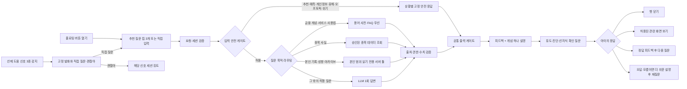

# 영웅 키움 — 기획 통합 문서 v2 (단일 마스터)

> **2차 팀 프로젝트 · 주제: 증권 · 심사: 키움증권 현직자 (인사이트랩팀 / 플랫폼전략팀 / AIX팀)**
> 최종 갱신: 2026-08-12 (v2.7 — 허용된 정보성 챗봇 답변에 DAPIE 상호작용 프레임 적용) · **이 문서가 제품 결정의 유일한 마스터다.**
>
> **대체 후 삭제한 구 문서**:
> `기획서.md`(v7) · `전체기획서.md` · `키움_가족모의투자_팀공유_정리_v2.md` · `펫서비스기획.md`(v5 폐기안) · `영웅키움_기획_통합문서_v1.md`
> `기능명세.md`·`디자인시스템.md`·`기술스택.md`와 기능 폴더의 `SPEC.md`는 실행 문서다. 제품 목표·법무·레드라인이 충돌하면 본 문서를 따르고, 기능 구현 상세는 해당 `SPEC.md`를 단일 원본으로 관리한다.
>
> **표기 원칙** (v7 승계): **[사실]** 출처 있음 / **[추론]** / **[가정]** 내부 확인 필요 / **[잠정]** 팀 재검토 전제로 채택 / **[확인 필요]** 검증 후 기재. 요약·발췌 시 표기를 떼지 말 것.

---

## 목차

1. [프로젝트 개요](#1-프로젝트-개요)
2. [문제 정의 & 페인포인트](#2-문제-정의--페인포인트)
3. [타겟 & 페르소나](#3-타겟--페르소나)
4. [Why 키움, Why Now](#4-why-키움-why-now)
5. [경쟁 구도](#5-경쟁-구도)
6. [서비스 구조 개요](#6-서비스-구조-개요)
7. [참가 조건 & KPI 퍼널](#7-참가-조건--kpi-퍼널)
8. [시즌 운영 설계](#8-시즌-운영-설계)
9. [전체 프로세스 (STEP 0~3)](#9-전체-프로세스-step-03)
10. [핵심기능 ① 모의투자 & 질문식 매매](#10-핵심기능--모의투자--질문식-매매)
11. [핵심기능 ② 성장 아카이브 — 성향 5축 + 친화도 스코어](#11-핵심기능--성장-아카이브--성향-5축--친화도-스코어)
12. [핵심기능 ③ 플로팅 AI 챗봇 "키웅이"](#12-핵심기능--플로팅-ai-챗봇-키웅이)
13. [AI 분리 구조 & 출력 필터](#13-ai-분리-구조--출력-필터)
14. [리워드 & 게임화 리스크 방어](#14-리워드--게임화-리스크-방어)
15. [법적·규제 검토 (컴플라이언스 쟁점)](#15-법적규제-검토-컴플라이언스-쟁점)
16. [UI/UX & 브랜딩](#16-uiux--브랜딩)
17. [기술 구현 & 데모](#17-기술-구현--데모)
18. [KPI](#18-kpi)
19. [검증 계획 (PoC)](#19-검증-계획-poc)
20. [평가 기준 매핑](#20-평가-기준-매핑)
21. [레드라인 (하지 않는 것)](#21-레드라인-하지-않는-것)
22. [미결정 사항 & 백로그](#22-미결정-사항--백로그)
23. [출처](#23-출처)

---

## 1. 프로젝트 개요

| 항목 | 내용 |
|---|---|
| 서비스명 | **영웅 키움** (단독 표기 확정) — 키움증권이 투자자를 '영웅'이라 부르는 데서 착안, 미래의 영웅(자녀)을 '키운다'는 중의적 의미 |
| 한 줄 소개 | **성장 발자취가 남는 가족 단위 모의투자 플랫폼** (어린이 눈높이) |
| 형태 | 신규 앱이 아니라 **기존 영웅문S#(키움 MTS) 내 신규 메뉴로 이식.** 메뉴 진입 시 전용 화면 세트로 전환 |
| 궁극적 목표 | 키움 계좌 보유 부모의 자녀를 잠재고객으로 보고 ① 미성년 계좌 개설을 유도하고 ② 투자 습관을 길러주며 ③ 잠재고객을 키움의 **장기고객으로 전환** |
| 사용자가 얻는 것 | 자녀의 투자 습관 형성, 주식 투자에 대한 친숙함 · 부모의 교육 부담 해소와 가족 금융 대화 |
| 핵심 구조 | 한 가족 = 한 팀. 부모·자녀가 **각자의 가상 지갑**으로 모의투자하고, AI가 행동을 읽어 성장 기록으로 돌려준다 |

### 핵심 AI Loop

```
각자 투자 (탐색·주문 + 질문식 기록: 근거 태깅·확신도·보유기간)
→ 행동 데이터 축적 (거래 로그 + 탐색 이벤트 + 근거·확신도)
→ 스코어링 엔진: 성향 5축 계산 (룰·통계, LLM 아님)
→ 아카이브: 성향 리포트·유형 라벨 + 친화도 스코어 갱신 + 가족 비교 → 시즌 기록
막히는 순간 언제든 → 플로팅 챗봇 키웅이 (묻면 답하고, 헤매면 먼저 돕는다 — 추천·예측 금지)
```

---

## 2. 문제 정의 & 페인포인트

### 사용자 페인포인트 (2겹 병합) [잠정]

> **메인:** 부모는 자녀가 비교적 안전한 환경에서 주식 투자를 경험하고 투자 습관을 기르게 해주고 싶은데 — **마땅한 플랫폼이 없다.**
> **서브:** 부모도 투자 전문가라는 보장이 없어 **직접 가르치기 어렵다.** ← 챗봇 '키웅이'가 존재하는 이유

- 기존 MTS·모의투자는 성인 기준의 용어·화면·정보량이라 아이가 쓸 수 없다
- 기존 모의투자는 개인 수익률 경쟁 중심이라 가족 간 대화 요소가 약하다
- 아이들은 경제·투자를 직접 경험하며 배울 기회가 부족하다

### 문제 정의의 레이어 분리

| 층위 | 주체 | 내용 |
|---|---|---|
| 사업 배경 | 키움 | 초중등 자녀 세대는 미래 잠재고객이나 접점·브랜드 경험이 없음 |
| 🔴 사용자 페인 | 부모 | 안전한 투자 경험을 시켜줄 플랫폼이 없고, 직접 가르치기도 어렵다 |
| 서비스 목표 | — | 자녀가 안전한 환경에서 투자 습관을 기르고 주식·키움에 친숙해진다 |
| 비즈니스 목표 | 키움 | 미성년 계좌 개설·활성화 → 가족 단위 이용 → 장기고객 전환 |

### 핵심 문제 재정의 (발표용)

> **"부모가 투자 전문가가 아니어도, 아이가 안전한 무대에서 스스로 투자해보고 AI의 도움을 받아 배우면서, 부모와 자연스럽게 투자 이야기를 나눌 수 없을까?"**

---

## 3. 타겟 & 페르소나

| 구분 | 대상 |
|---|---|
| 핵심 타겟 | **키움증권 계좌를 보유한 초·중등 자녀의 부모** 중 자녀에게 주식투자 경험을 시켜주고 싶은 부모 — 그리고 그 자녀들 |
| 사용 주체 | 자녀(모의투자 플레이어) + 부모(같이 참여하는 투자 파트너이자 법정대리인) |

**페르소나 ① 부모 (43세)** — 키움 계좌 보유, 종종 매매. 자녀가 안전한 플랫폼에서 주식을 경험하고 투자 습관·경제 관념을 갖길 바란다.
**페르소나 ② 자녀 (2014년생, 13세, 초6)** — 부모와 함께 체험하는 것을 좋아한다. 경제·투자·주식을 아직 잘 모르고 어려워한다.

> 역할 원칙: **부모 = 선생님이 아니라 같이 참여하는 투자 파트너.** 가르치는 역할은 챗봇, 읽어주는 역할은 아카이브가 맡는다.

---

## 4. Why 키움, Why Now

### 시장 신호 [사실 — 출처 §23]

- 미성년 주식계좌 급증: 0~9세 신규계좌 +119%, 10대 +100% 이상, 20세 미만 ETF 투자자 30만 명(2026-04) — 관심은 이미 행동으로 증명됨
- 신한투자증권이 미성년 vs 부모 성향차 통계를 발표하고 '우리아이 자산관리' 구축 추진 중(미출시) — **아직 아무도 가족 단위로 제품화하지 못했다**

### 키움 인프라 [사실 — 출처 §23]

- **상시·그룹 모의투자** 운영(개설·초대·그룹 내 비교) — 가족 리그는 그 관계 특화 변형
- **미성년자 비대면 계좌 개설**: 2023년 4월부터 영웅문S#에서 지원 — 부모가 정부24 발급 가족관계증명서·기본증명서 발급번호 진위확인으로 앱 안에서 개설 완료
- 영웅문S# AI 전면 배치(로보마켓 등)와 방향 일치
- **[가정]** 키움 고객층 2030 편중 → 가족 접점 약함. 내부 데이터 확인 필요

> 발표 프레임: **모의→실계좌→성인 전환의 전 퍼널이 키움 앱 하나에서 끊기지 않는다.** 세대 승계의 인프라가 이미 있다.

---

## 5. 경쟁 구도 (2026-08-09 검증 [사실] — 발표 방어 자산)

| 영역 | 대표 사례 | 우리의 기회 |
|---|---|---|
| 가족·청소년 금융 | 퍼핀, 아이부자, Greenlight, Fidelity Youth, Schwab Teen, Step, Goalsetter | 부모·자녀 **투자 스타일 비교·이해**가 없음 |
| 개인·그룹 모의투자 | 키움 상시·그룹, StockTrak, KB 모투의마블 | 가족 관계·세대 간 분석 없음 |
| AI 투자정보·자문 | DB증권 스윙스타, 우리투자 AI리포트, Robinhood Cortex | 전부 **개인 단위·성인용** — 아이 눈높이 AI 없음 |
| **가족 투자 AI 연결** | **미발견** (국내 9건+영어권 4쿼리 재탐색 — 부재 증명은 아님) | **선점 가능 공백** |

- **퍼핀 [사실]**: 가입자 33만, 주간 가족 모의투자 대회 운영 — 대회 포맷 선례. 그러나 가족 간 **순위 비교만** 제공. **우리 차별 = 대회 위에 얹는 AI 레이어**(눈높이 챗봇 + 성향·성장 아카이브)
- **DB 스윙스타 [사실]**: 행동 분석까지는 같은 재료, 출력이 종목 추천·손절가(자문형). 우리는 교육·이해형 — 자문업 규제 부담 회피 **[추론]**
- 부모 권한 선례 [사실]: Greenlight(건별 승인) ↔ Step(한도 내 자율) ↔ Fidelity Youth(전면 자율). **우리는 건별 승인 없음 + 한도 프리셋** — Step형

---

## 6. 서비스 구조 개요

```
영웅문S# (키움 MTS)
 └─ [영웅 키움] 메뉴 (신규)
     ├─ 튜토리얼 모드      ← 계좌 없이 개방 (전환 퍼널의 입구)
     ├─ 시즌 모의투자      ← 참가 조건: 자녀 명의 실계좌 (§7)
     │    ├─ 가족 팀 (부모+자녀, 개인별 가상 지갑)
     │    ├─ 질문식 매매 · 유니버스 51종 [확정]
     │    └─ 리그 단위 가족 경쟁 (수익률 기준)
     ├─ 성장 아카이브      ← 성향 5축 리포트 + 친화도 스코어 + 가족 비교
     └─ 플로팅 챗봇 키웅이 ← 전 화면 상시 대기
```

- **한 가족 = 한 팀**, 가족별 경쟁. **분기별 연 4회, 회당 4주** 시즌제
- 시즌이 반복될수록 아카이브에 가족·자녀의 성장 기록이 쌓인다 — 서비스명의 정체성

---

## 7. 참가 조건 & KPI 퍼널

### 참가 조건 (확정)

> **키움 계좌를 보유한 부모 중, 미성년 자녀 실계좌를 신규 개설했거나 이미 보유한 가족만 시즌 정식 참가 가능.**

### 2단 퍼널

| 단계 | 요구 조건 | 목적 |
|---|---|---|
| 튜토리얼·구경 모드 | 없음 (부모 로그인만) | 체험 전 이탈 방지 — "재밌어 보여서 계좌를 만든다"는 순서를 만든다 |
| 시즌 정식 참가 | **자녀 명의 미성년 실계좌** | 계좌 개설이 자연스러운 전환 이벤트 → 전환율 측정 가능 |

### KPI 이원화 (확정)

| KPI | 정의 | 계측 지점 |
|---|---|---|
| **① 신규 미성년 계좌 개설 수** | 참가를 위해 새로 개설된 자녀 계좌 | 온보딩 내 개설 플로우 완료 |
| **② 기존 미성년 계좌 활성화율** | 방치 상태이던 자녀 계좌의 첫 서비스 연결 | 기존 계좌 첫 팀 연결 |

> 이원화 이유: 이미 계좌를 만들어둔 가족은 '개설 수'에 잡히지 않지만, 방치 계좌를 깨우는 것 역시 키움에 동등하게 가치 있는 성과다.

**북극성 지표 병기 [잠정]**: 부모·자녀가 모두 주 1회 이상 활동한 **동반 활성 가족 수** — 계좌를 열게 만드는 힘의 원천은 가족의 지속 사용이므로, 개설 KPI의 선행 지표로 함께 관리한다.

---

## 8. 시즌 운영 설계

### 확정 규칙

| 항목 | 내용 |
|---|---|
| 시즌 | **4주 × 연 4회 (분기)** — 본 경쟁 4주를 어닝시즌에 걸치도록 배치 |
| 캘린더 | 모집·연습 1주 → 본 경쟁 4주 → 결산 1주. 시즌 오프에도 튜토리얼·연습 모드 상시 개방 |
| 시드 | **구성원 1인당 가상 100만원** 동일 지급 (용돈 스케일 — 아이 돈 감각 유지) |
| 지갑 | **개인별 가상 지갑** — 부모·자녀 각자 운용. 공동 통장 아님 |
| 가족 성적 | **구성원 수익률 평균** (전원 시드 동일 → 가족 총자산 수익률과 수학적으로 동일) |
| 실잔액 연동 | **하지 않음** — 자산 격차 노출·프라이버시·구현 복잡도. 현실감은 금액이 아니라 시세·체결 경험에서 나온다 |
| 시즌 종료 | 가상 자산 전액 리셋. 남는 것은 아카이브의 기록 |

### 왜 4주 × 연 4회인가

- 분기 개최 → 매 시즌 **실적 발표(어닝시즌)가 주가를 움직이는 실제 이벤트**를 한 번씩 경험
- 4주 = 최소 한 번의 등락 사이클을 견디는 "기다리는 경험"이면서 아이 집중력이 유지되는 길이, 용돈 주기(월)와 일치
- 회차가 끊겨야 신규 가족의 리셋 진입 시점이 생기고, 아카이브에 분기 단위 비교 기록이 쌓인다

### 공정성 설계

- 비교는 금액이 아니라 **수익률** — 가족 인원이 달라도 공정
- [잠정] **참가 인원 상한: 부모 1 + 자녀 1 필수, 최대 4인** (대가족일수록 평균이 중간으로 수렴하는 통계적 특성 완화)
- [잠정] **리그 분할: 30~50가족** 단위 — "우리 리그 4위"라는 체감 가능한 경쟁 단위
- [잠정] 순위 노출: **홈에 상시 표시**(리그 몰입감) + **알림·푸시는 주간만**(일희일비 단타 습관 방지) — 노출과 푸시를 분리

### 개인별 지갑이어야 하는 결정적 이유

공동 통장이면 사실상 부모가 주도하게 되고, 자녀 행동 데이터가 부모와 섞여 **질문식 매매 분석·성향 5축·친화도 스코어 산출이 전부 불가능**해진다. 데이터 기능이 이 구조를 강제한다.

---

## 9. 전체 프로세스 (STEP 0~3)

### STEP 0. 진입 & 가족 팀 결성 (모집 주간)

1. 부모가 영웅문S# 로그인 → **[영웅 키움]** 메뉴 진입 (부모 계좌 보유는 로그인으로 자동 충족)
2. **[가족 팀 만들기]** → 부모 명의에 연결된 미성년 자녀 계좌 존재 여부 조회
   - 자녀 계좌 **있음** → 바로 연결 *(KPI ② 활성화 카운트)*
   - 자녀 계좌 **없음** → 키움 기존 미성년 비대면 개설 플로우로 안내, 완료 후 복귀 *(KPI ① 신규 개설 카운트)*
3. 자녀는 자기 기기의 영웅문S#에서 자녀 계정 로그인 → **가족 초대 코드**로 팀 합류. 자녀의 서비스 가입·개인정보 수집 동의는 **부모 화면 안에서 법정대리인 동의로 처리** (§15)
4. 시즌 프리셋 선택(입문형/성장형 — §10) → 시즌 개막 대기. 계좌 없이도 튜토리얼·구경 모드 개방

### STEP 1. 시즌 개막 — 시드 지급

- 시즌 시작일, 구성원 1인당 가상 100만원 일괄 지급 (개인별 지갑). 이전 시즌 자산 전액 리셋

### STEP 2. 매매 진행 (본 경쟁 4주)

1. **종목 탐색** — 유니버스 51종 [확정], 종목명 옆 "이 회사는 ○○를 만들어요" 한 줄 설명
2. **질문식 매매** — 주문 플로우 내장, 근거 태깅 + 확신도 + 보유기간 (§10)
3. **주문** — 금액 단위 입력 지원("10만원어치" → 수량 자동 계산), 시장가+지정가, 수수료·세금 실제 수준 안내
4. **체결** — 장 운영시간에만 체결(장외 예약주문), 15~20분 지연시세 [잠정], 동일 종목 매도 후 30분 재매수 제한 [잠정]
5. 전 과정에서 키웅이 상시 대기, 헤매는 신호 감지 시 선제 발화 (§12)
6. 주간: 리그 순위 알림(월요일) + 아카이브 갱신 알림 ("이번 주 성향 리포트가 나왔어요!")

### STEP 3. 시즌 결산 (결산 주간)

1. 마지막 거래일 종가로 수익률 확정 → 가족 성적(구성원 평균) 산출
2. **시상 다각화** — 수익률 1등만 상 받는 구조 금지: 🏆 가족 종합(리그별 1위) / 🧒 개인 부문 / 🧭 행동 부문 [잠정: 분산투자상·진득이상·질문왕]
3. 리워드 지급 (§14)
4. **시즌 아카이브 발행** — 성향 5축 비포/애프터 + 친화도 스코어 변화 + 수익률 결산 (§11)
5. 다음 시즌 예고 + "지난 시즌의 나" 회고 카드 → 재참여 루프

---

## 10. 핵심기능 ① 모의투자 & 질문식 매매

> 구현 단일 원본: `web/features/f2-trade/SPEC.md` — F2와 F3가 함께 사용한다.

### 튜토리얼 모드

- 매수·매도·시장가·현재가·차트 등 **기본 버튼·용어를 화면 위에서 직접 설명** (코치마크 방식)
- 계좌 없이 개방 — 전환 퍼널의 입구

### 투자 유니버스 [잠정]

- **국내 우량주 51종 큐레이션** (섹터·종목 기준은 `모의투자_종목유니버스_데이터셋_설계.md`) · 일반 ETF는 2단계 검토
- 제외: 레버리지·인버스 ETF, ETN, 선물·옵션, 신용·미수, 공매도, 가상자산, 초저유동성 — "안전한 무대"의 실체
- 종목별 아이 눈높이 설명 수작성 ("이 회사는 무슨 일을 해?" / "최근 무슨 일이 있었어?")

### 거래 규칙

| 규칙 | 내용 | 근거 |
|---|---|---|
| 주문 | 시장가 + 지정가 (데모는 시장가 즉시 체결, 지정가는 설계) | |
| 수수료·세금 | 실제 수준 안내 표시 | 현실 감각 교육 |
| 시세 | 15~20분 지연시세 [잠정] | 실서비스 현실성 |
| 재매수 제한 | 동일 종목 매도 후 30분 [잠정] | 단타 억제 |
| 한도 프리셋 | 입문형(단일종목 ≤30%) / 성장형(≤40%) — 부모가 세부 설정에 빠지지 않게 | **[사실]** StockTrak이 단일종목 25% 상한 실운영 — 교육 시장 검증 관행 |
| 승인 | **건별 부모 승인 없음.** 한도 초과 주문만 차단+안내 | Step형 자율 구조 (§5) |
| 위험행동 | 손실 직후 거래금액 급증 등 감지 시 부모 코칭 알림: "차단하기보다 투자 이유를 먼저 물어보시겠습니까?" | |

### 질문식 매매 (A+B 병합 확정) — 이 서비스의 데이터 심장

주문 플로우 안에 내장되어 스킵 불가, **3탭 이내**로 끝낸다. '시험'이 아니라 **스코어링 엔진·리포트·친화도 스코어의 재료가 되는 생각 데이터.**

**매수 시:**

1. **근거 태깅** (필수, 1탭): 뉴스에서 봤어 / 차트가 좋아 보여 / 친구·가족이 추천했어 / 이 회사(제품)를 잘 알아 / 그냥 느낌이 좋아 — 근거 5축(뉴스·차트·추천·지식·느낌)
2. **확신도** (필수, 1탭): "키웅이가 궁금해해 — 얼마나 자신 있어?" 4단계: 잘 모르겠어(25) / 조금(50) / 꽤(75) / 완전(100). "정답은 없어!" 캡션 병기 — 채점 아님
3. **예상 보유기간** (필수, 1탭): 이번 주만 / 시즌 끝까지 / 모르겠어요 — 속도 축·계획-행동 일치 분석의 재료
4. 내 생각 한 줄 (선택)

**매도 시:** 근거 태깅 (필수): 목표한 만큼 올랐어 / 더 떨어질까 봐 걱정돼 / 다른 종목이 더 좋아 보여 / 그냥 불안해 / 기타 + 한 줄(선택)

- 체결 완료 화면: "기록 완료! 키웅이가 기억해둘게" (컨페티)
- 선례 **[사실]**: StockTrak "Require Trading Notes" 기본 활성 — '모의투자+기록'은 교육 시장의 검증된 결합

---

## 11. 핵심기능 ② 성장 아카이브 — 성향 5축 + 친화도 스코어

> 구현 단일 원본: `web/features/f9-archive/SPEC.md`

> **A+B 병합 확정: 두 개의 축이 공존한다.**
> **성향 5축** = 우열 없는 '스타일' — 아이에게 보여주는 얼굴. **친화도 스코어** = 성장을 증명하는 지표 — 부모·키움·심사에 보여주는 얼굴.

### 11.1 스코어링 엔진 — 성향 5축 (룰·통계 기반, LLM 아님)

관찰 데이터: 거래 로그(종목·수량·타이밍·실현손익) + **질문식 매매의 근거 태깅·확신도·보유기간** + 탐색 이벤트(상세 체류시간·조회 종목 수) + 포트폴리오 스냅샷. **챗봇 대화는 성향 스코어링에 반영하지 않는다** — 질문은 성향이 아니고, "물어보면 점수가 바뀐다"는 위축을 만들지 않는다.

| 축 | 측정 | 스타일 표현 (양끝 — 우열 없음) |
|---|---|---|
| 집중–분산 | 종목·업종 집중도 | 한우물형 ↔ 골고루형 |
| 속도 | 평균 보유기간·회전율 (+예상 보유기간과의 일치) | 진득이형 ↔ 재빨리형 |
| 신중함 | 주문 전 탐색 깊이 + 확신도-행동 일치 | 직진형 ↔ 돌다리형 |
| 손실 대응 | 하락 구간 행동 (보유·손절·추가매수 패턴) | 버티기형 ↔ 갈아타기형 |
| 탐험심 | 새 종목·새 업종 시도 비율 | 익숙함형 ↔ 개척자형 |

- 각 0~100, **주간 산출**. 유형 라벨 = 두드러진 상위 2축 조합 → 수작성 라벨 매트릭스(8~12종) 매핑, **주간 갱신**(고정 낙인 아님). 예: 민지 "재빨리 개척자형" / 엄마 "돌다리 분석가형"
- **원칙: 스코어는 '스타일'이지 '성적'이 아니다.** 잘함/못함 축이 없고 **어느 끝도 우열이 아니다.** 아이 화면에 "정답은 없어!" 캡션 병기 — 채점·낙인 논란의 구조적 방어(§14)

### 11.2 친화도 스코어 (ML — 명칭 미정) — 성장 증명 지표

주식투자에 대한 친화도·관심도를 산출하고, **서비스 이용 전후(시즌 초↔말, 시즌 간)로 상승 추이를 보여주는 것**이 목표.

**라벨 설계 (택1 — 미결정, A안 권장):**

| | A안 (권장): 재참여 예측 | B안: 설문 라벨 회귀 |
|---|---|---|
| 라벨 | 다음 시즌 재참여·접속 지속 여부 (데이터에 실재) | 시즌 시작·종료 리커트 설문 |
| 스코어 정의 | 투자 활동을 지속할 확률 | 행동 로그로 설문 점수 예측 |

**피처 원칙 — 순환 논리 금지:** 사용량 지표(접속·매매 횟수) 위주면 "많이 쓰면 오르는 점수"가 되어 전후 상승이 동어반복. 무게는 **질적 지표**에 — 근거 태깅의 구체성('느낌' 비중 감소), 분산도, 계획(보유기간)-행동 일치, 확신도-행동 일치 등. ※챗봇 대화의 피처 사용 여부는 [미결정 §22] — 위축 방지 원칙과 상충 소지.

**노출 이원화:** 아이 화면 = 성향 5축 게이지 + 유형 라벨(+레벨·뱃지). **친화도 수치는 부모 리포트·시즌 기록에만** — 아이에게 '올려야 하는 점수'로 보이는 순간 성향 5축의 "성적 아님" 원칙이 무너진다.

**정직성 원칙:** 실사용자 데이터가 없으므로 발표의 전후 상승 그래프는 **가상(시뮬레이션) 데이터임을 화면에 명시** — "측정 체계를 이렇게 설계했고, 가상 시나리오에서 이렇게 나타난다"로 프레이밍.

### 11.3 아카이브 화면 구성

1. **성향 리포트** (주간, 각자): 5축 게이지 + 유형 라벨 + 근거 태깅 분포·확신도 패턴 + LLM 서술(스타일 요약 2~3문장, 잘한 점·아쉬운 점 각 1~2개 — 관찰 톤, 훈계 금지) + 데이터 적으면 "아직 관찰 초기" 병기
2. **수익률 리포트**: 보유·평가손익·수익률 추이 (정량 그대로, LLM 서술 없음)
3. **가족 비교** [잠정]: 두 사람의 5축 나란히(레이더 또는 막대 병치) + 중립 서술 1줄 — "민지는 재빨리, 엄마는 진득하게. 스타일이 달라요." **퍼핀식 '순위 비교'를 넘어서는 가족 이해 장치이자 대화 소재.** **양측 공개 동의 전제** (§15)
4. **시즌 기록**: 성향 5축 비포/애프터 + **친화도 스코어 추이** + 수익률 결산 — 리워드·재참여의 근거 화면. 반복 참여할수록 시즌 기록이 쌓여 **가족과 자녀의 성장 아카이브**가 된다 — 서비스명 '영웅 키움'의 정체성

---

## 12. 핵심기능 ③ 플로팅 AI 챗봇 "키웅이"

> 구현·콘텐츠·데이터 단일 원본: `web/features/f10-chatbot/SPEC.md`

> **"정답을 주는 투자 AI"가 아니라 이해·기록·성찰을 돕는 개인 코치.** 아이 눈높이로 사용법·기초 개념·화면 맥락·본인 기록을 설명한다. **캐릭터: 키웅이(곰) — 기존 키움 마스코트 재활용** [제안 확정]. 영웅이(소)는 포스터·보조 그래픽.

### 왜 '아이 눈높이 챗봇'인가 (발표 Q&A 방어)

- 문제 직결: 부모가 전문가가 아니라 못 가르친다(§2) → 아이의 질문을 부모 대신 받아주는 존재가 서비스 안에 있어야 한다
- "범용 GPT 쓰면 되잖아?"의 답: ① **화면 맥락 인지** — 보고 있는 화면·종목 기준으로 답한다 ② **미성년 안전 가드레일 내장** — 추천·시점·가격·예측 차단 + 전 대화 로깅 ③ **앱 안 상주** — 막히는 순간 이탈 없이 바로 묻는다 ④ **아이 눈높이 페르소나 고정** ⑤ **본인 기록을 안다** — 범용 챗봇은 아이가 지난주에 왜 그 종목을 골랐는지 모른다 (기능 5·6·7)

### A. 수행 기능 9종 [팀 확정 2026-08-10]

| # | 기능 | 수행 내용 | 실행 방식 |
|---|---|---|---|
| 1 | 대화 시작 | "고민 있어?", "궁금한 거 있어?"처럼 부담 없이 대화를 연다 | 사용자가 플로팅 버튼을 열거나, 도움 신호가 발생했을 때 제안한다. 무시·종료·뮤트가 가능하다 |
| 2 | 금융 개념 교육 | 수익률·손익·분산·수수료·세금·시장가·지정가 등 기초 개념을 쉬운 말과 비유로 설명한다 | 자유 질문 또는 화면별 추천 질문 칩에 반응한다 |
| 3 | 서비스 사용 안내 | 리그 규칙, 거래 시간·방식, 종목 검색, 주문, 포트폴리오, 가족 비교 이용법을 안내한다 | 용어 사전·사용법 FAQ를 우선 사용한다 |
| 4 | 종목 유니버스 안내 | 유니버스 안 종목의 사업 내용·업종·제품·공개된 과거 사실을 설명한다 | 현재 종목 맥락을 읽되 **예측·추천은 하지 않는다** |
| 5 | 투자 기록 되짚기 | "왜 이 종목을 골랐어?", "처음 생각과 지금 생각이 같아?"처럼 거래 이유와 확신도를 돌아보게 돕는다 | 본인의 거래 로그와 F3 질문식 기록을 **읽기 전용**으로 참고한다 |
| 6 | 성향 분석 설명 | 5축 성향, 근거 태그 분포, 확신도 패턴, 거래 빈도·업종 분산·보유 패턴을 쉽게 풀어 설명한다 | **스코어링 엔진이 산출한 F9 JSON만 인용한다** (§13) |
| 7 | 아카이브 탐색 | 과거 매매 이유, 한 줄 메모, 수익률 추이, 시즌 기록을 찾아 비교·요약한다 | **본인의 아카이브 데이터만** 조회한다 |
| 8 | 사용법 헤맴 도움 | 반복 취소·긴 망설임·손실 직후 반복 조회에 짧은 도움을 제안한다 (아래 B) | 신호별 고정 스크립트와 카드 2장으로만 발화한다. LLM 미사용, 부모 미전달 |
| 9 | 안전 대응 | 추천·매매 시점·목표가·수익률 전망 요구를 거절하고, 오프토픽·유해·개인정보 입력을 우회한다. 정서 위기 표현에는 대화를 안전 종료하고 보호 안내를 제공한다 | 입력 분류와 공통 출력 필터를 거친 **고정 응답**을 사용한다 (§13) |

### 참조 범위 (읽기 전용 — 이 밖은 조회하지 않는다)

키웅이는 **화면 맥락 · 현재 종목 · 본인의 거래 로그 · 질문식 기록 · 성향 리포트 산출값**만 읽기 전용으로 참조한다.

- **수치와 사실은 엔진·API 값만 인용한다.** LLM이 수치를 만들면 버그다 (§13)
- **가족 구성원의 데이터는 조회하지 않는다.** 5·6·7번은 전부 본인 데이터 한정이며, 가족 비교는 아카이브 화면(§11.3)의 몫이다
- 챗봇 대화는 성향 스코어링에 반영하지 않고(§11.1), 대화 원문·행동 데이터는 부모에게 전달하지 않는다(§15-3)

### 진입·응답·라우팅

- **진입**: 전 화면 우하단 플로팅 버튼(키웅이 얼굴) → 탭하면 바텀시트 챗 UI. 자유 입력창 + 화면 맥락별 **추천 질문 칩 3개** (종목 상세: "이 회사는 뭐 하는 회사야?"·"PER이 뭐야?" / 주문: "시장가가 뭐야?" / 홈: "매수 어떻게 해?"). **"열어야 보인다"는 약점은 튜토리얼 소개와 칩으로 보완**
- **응답 원칙**: 허용된 정보성 답변은 DAPIE를 적용해 **행동·질문 피드백 → 한 번에 개념 하나 설명 → 유도·진단·선지식 확인 질문**으로 이어 간다. 설명 본문은 3문장 이내·쉬운 말·비유·이모지 원칙을 지킨다. 아이가 정답·오답·모름 중 무엇으로 반응해도 피드백 뒤 다음 질문을 제시하며, 명시적으로 "여기까지"를 고를 때만 종료한다. 종목 추천·매매 시점·가격·수익률 전망·훈계 금지. "뭐 사면 돼?" → **고정 거절 + 기준 안내**: "종목은 내가 골라줄 수 없어! 대신 고를 때 뭘 보면 좋은지 알려줄게 🐻"
- **라우팅**: 입력 분류 가드 → 용어 사전(~30개)·FAQ(~15개) 매칭 우선 (지연·비용·무대 리스크↓) → 미스 시에만 LLM(스트리밍) → 실패·타임아웃 시 고정 폴백. 부모도 동일 챗봇 사용 가능
- **DAPIE 적용 범위**: 금융 개념·서비스 사용법·화면 맥락·승인 종목 사실·본인 기록·성향·아카이브·허용 LLM 답변·선제 도움에 공통 적용한다. 추천 거절·개인정보·유해·오프토픽·정서 위기 대응은 즉시 보호가 우선이므로 고정 안전 응답으로 예외 처리하며, 데이터 없음·검수 중·일시 실패는 짧은 안내 뒤 가능한 다음 행동을 묻는다.
- 게이트별 판정·차단 동작·완료 기준은 `web/features/f10-chatbot/SPEC.md`에 둔다

### B. 선제 도움 신호 3종 [팀 확정 2026-08-11 — 사용법 도움 한정, 판단 개입·감시 아님]

헤매는 행동이 감지되면 키웅이가 먼저 짧게 말을 건다. 선제 발화 문구가 상황을 설명하며, 반응 카드는 2장 고정: **직접 질문 / 괜찮아**. 신호별 관찰 범위와 조건은 아래 표로 한정한다.

> **확정 범위:** 아래 **신호 유형 3종은 MVP 범위로 확정**한다. 반복 횟수·체류시간·손실률·재진입 횟수 등 수치 임계값은 여전히 **[가정] 초기 운영값**이며, 자녀 테스트 30세션 결과로 조정한다. 팀 재결정 없이 다른 행동 신호를 추가하지 않는다.

| # | 신호 (수치는 전부 [가정] — 초기 운영값) | 고정 발화 |
|---|---|---|
| 1 | 매수/매도 버튼을 누른 뒤 확인창 "매수하시겠습니까?"에서 "아니요"를 눌러 취소한 행동이 매수·매도 순으로 3회 연속 반복 | "매수와 매도가 헷갈려?" |
| 2 | 주문 또는 종목 상세 화면 체류시간이 **5분 초과** | "어디에서 막혔는지 같이 볼까?" |
| 3 | 해당 종목에서 **-10% 이하 손실을 실현**한 매도 체결 직후부터 5분간, 같은 종목 상세 화면에 **4회 이상 재진입** | "방금 본 종목이 계속 신경 쓰여?" |

- **발화 제한**: 선제 발화 간 최소 3분 / 동일 신호 10분 내 재발화 금지 / 세션 최대 2회 / [괜찮아] 선택 시 해당 신호는 세션 내 재발화 금지 / 30분 무활동이면 새 세션
- **제외한 신호와 이유** (설계 이력 — 재도입 논의 시 참조): 주문 확인창 뒤로가기 반복·주문 수량 반복 수정(불안행동 정의에서 제외) · 차트 기간 반복 변경(학습·탐색과 구분 불가) · 여러 종목 빠른 조회(정상 탐색) · 순위·손실 확인 후 주문(감시 느낌 위험) · 주문 오류 반복(오류 문구가 직접 설명하는 게 단순).
- 근거 **[사실]**: FCA 연구 노트·ICO 아동 설계 지침(넛지 §13)은 거래를 재촉하지 않는 **중립 개입** 방향을 뒷받침 — 단 반복 횟수 수치까지는 제공하지 않으므로 수치는 전부 [가정], 자녀 테스트 30세션에서 '실제 도움 필요 순간' 일치율 70% 미만 신호는 기준 상향 또는 제거 (§19)
- **대화 원문·행동 데이터는 부모에게 전달하지 않는다** (§15) — 아이가 안심하고 묻는 공간

### C. 챗봇 사용자 흐름 [팀 확정 2026-08-11]



- **고정 규칙 우선:** 단순 금융 용어·서비스 사용법은 툴이나 LLM을 호출하지 않고 사전·FAQ로 답한다.
- **동적 데이터만 툴:** 종목 사실·본인 거래 기록·F9 성향 JSON·아카이브는 서버의 허용 목록에 등록한 **읽기 전용 툴**로만 조회한다. 사용자 식별은 세션에서 확정하며 모델이나 클라이언트 입력에 맡기지 않는다.
- **RAG 경계:** “매수가 뭐야?” 같은 기초 질문은 룰 기반 사전이 우선이다. 사전 규모를 넘어서는 교육 자료 검색이 필요할 때만 승인된 교육 문서 안에서 소규모 검색을 사용하며, 공개 웹 검색 결과를 바로 답변 근거로 쓰지 않는다.
- **출력 전 검증:** 모델 원시 델타는 화면에 바로 표시하지 않는다. 최대 3문장을 완성 버퍼에 모아 금지 표현·허용 출처·권한·수치를 검증한 뒤 SSE로 전달한다.
- **후속 행동:** “관련 화면 보기”는 모델이 URL을 생성하거나 직접 이동시키는 방식이 아니라, 서버가 허용한 구조화 액션을 버튼으로 제안하고 사용자가 눌렀을 때만 실행한다.
- **대화 전이:** 서버가 등록된 스크립트·단계·선택지만 허용한다. 버튼 대신 직접 입력한 답은 보수적으로 해석하고, 애매하면 추측하지 않고 질문을 다시 보여 준다. 대화 선택은 이해도 점수나 성향 스코어로 쓰지 않는다.
- **개인정보 경계:** 본인 기록만 읽고 가족 구성원 원문 데이터는 조회하지 않는다. 챗봇 대화는 성향 스코어링에 반영하지 않으며 부모에게 전달하지 않는다.

---

## 13. AI 분리 구조 & 출력 필터

### 분리 구조 (환각 차단 — 발표의 기술 증거)

```
행동 이벤트 → [스코어링 엔진: 룰·통계] → 5축·유형·모든 수치 계산
                     ↓ (산출 JSON만 전달)
              [생성형 AI(LLM)] → ① 아카이브 성향 서술 ② 챗봇 답변 (도메인 제한 + 화면 맥락)
                     ↓
              [공통 출력 필터] → 화면
```

- **생성형 AI가 수치를 추정하지 않는다.** 시세·보유 수치는 엔진/API 값만 인용
- **출력 차단**: "이 종목을 사야 합니다 / 지금이 매수 기회 / 다음 주 상승 가능성 / 목표가·손절가 ○○원" — 전 AI 경로 공통 통과, 탐지 건수 로깅 (§18 안전 지표)
- **입력 분류**: 오프토픽(게임·숙제)·유해·개인정보 입력 → 고정 응답 우회 ("나는 투자 이야기만 할 수 있어!"). 전 대화 로깅
- 비상 차단 스위치: 사전·FAQ 전용 모드 강등

---

## 14. 리워드 & 게임화 리스크 방어

### 리워드 (B안 확정 — 전 항목 법무 검토 대상 §15)

| 대상 | 리워드 |
|---|---|
| 아이 | Robux, Minecoin, 시즌 인기 완구, (상위) 아이패드·닌텐도 |
| 가족 | 경험형 — 숙박권·항공권(휴가 시즌), 워터파크·리조트(여름), 스키장(겨울), 놀이공원·영화·외식권(상시). **"같이 투자해서, 같이 즐긴다"** |
| 금융 | 참가 조건이 실계좌이므로(§7) 개설 리워드가 아니라 **첫 입금·시즌 완주 연계** 투자지원금·소수점 주식으로 조정 [잠정] |
| 부모 | **로보마켓 프리미엄 체험권** (참가 즉시) → 대회 기간 체험 → 유료 전환·영웅문 사용 확대 |

### 게임화 리스크 방어 (발표 Q&A — 삭제 금지)

**[사실]** FCA(영국 금융감독청) 9,000명+ 실험: 포인트·경품은 거래 +12%·위험거래 +6%p, 리더보드·푸시는 젊은 층을 위험거래로 유인. OSC(캐나다): "게임화 자체가 아니라 보상 대상이 문제."

**"애들 도박 가르치는 것 아니냐"에 대한 방어 구조 7종:**

1. **모의투자다** — 실제 금전 손실이 없다 (FCA 실험은 실거래 맥락)
2. 위험상품 원천 배제 + 단일종목 한도 프리셋 — 몰빵 학습을 구조로 차단
3. **질문식 매매가 주문 플로우에 내장** — "왜"를 묻는 과정 학습이 강제 리듬
4. **챗봇이 '기준'을 가르친다** — 종목을 골라주는 게 아니라 고르는 기준·개념을 알려주는 교육 장치. 추천 요구는 거절 설계
5. **성향 리포트가 수익률 아닌 '스타일' 서사를 매주 제공** — 아이의 주간 관심사가 순위만이 아니게 한다
6. 수익률 알림은 주간만 [잠정] + 매도 후 30분 재매수 제한 [잠정] — 단타 억제 장치
7. 유형 라벨 주간 갱신(고정 낙인 아님), AI는 추천·시점·가격을 말하지 않고, 실력 채점·등급은 없다

---

## 15. 법적·규제 검토 (컴플라이언스 쟁점 — 전부 법무 검토 필요, 결론 미확정)

> 발표 프레임: **"저희는 규제를 우회하지 않았습니다. 법정대리인 동의가 필요하다는 사실이 저희 온보딩의 출발점입니다 — 부모가 시작하고, 부모가 동의하고, 부모가 초대합니다."**

### 구조적 대응 (설계에 내장)

1. **미성년 계좌 개설 (민법상 법정대리)**: 미성년자는 본인 개설 불가, 법정대리인 대리 개설. **키움은 2023-04부터 영웅문S# 미성년 비대면 개설 지원 [사실]** → 우리 온보딩은 기존 플로우에 연결만 하면 됨 = 실현 가능성 근거
2. **만 14세 미만 개인정보 (개인정보보호법 제22조의2 [사실])**: 법정대리인 동의 + 확인 의무 → **자녀가 스스로 가입하는 경로가 없다.** 부모 개시 플로우 + 부모는 이미 실명확인 고객이라 "동의자가 진짜 법정대리인인가" 문제까지 해결. 만 14세 이상도 계좌는 법정대리인 개설이므로 전 연령 부모 개시로 통일

### 검토 쟁점 8

| # | 쟁점 | 대응 방향 |
|---|---|---|
| 1 | 투자자문 경계 — AI 출력의 '조언' 해석 소지 | 추천·시점·가격·전망 전면 금지(§13) + 거절 설계. 면책 레퍼런스 [사실]: Robinhood Cortex "not financial advice" |
| 2 | 미성년 개인정보 | 위 구조적 대응 + 최소 수집 + **챗봇 대화 로그 수집·보관 고지** |
| 3 | 가족 간 정보 공유 | 가족 비교는 **양측 동의** 전제. 챗봇 대화 원문·행동 데이터는 부모 미전달. 신용정보법 해당 여부 [추론 — 검토] |
| 4 | 경품 규제 | Robux·아이패드·숙박권 등 경품류 한도·사행성 + 수익률 순위 연동 적정성. 미성년 대상 경품 고시 확인 — **리워드 B안 채택에 따른 최우선 검토 항목** |
| 5 | 전환 권유성 | 계좌 개설·입금 연계 안내의 투자 권유·광고 규제 범위 |
| 6 | 자동 성향 분류 고지 | 5축·유형 라벨·친화도 스코어 산출에 대한 고지 의무 + 관찰 항목(거래·탐색 데이터) 온보딩 고지 |
| 7 | AI 능력 과장 금지 | **[사실]** PortfolioPilot 'AI 워싱' SEC 제재($175,000, 2024) — "AI가 실력을 올려준다"류 효능 주장 금지, "관찰·교육 보조"로 일관. 친화도 스코어도 '실력'이 아니라 '친숙함·습관'의 지표로 서술 |
| 8 | 미성년 대상 대화형 AI 통제 | 도메인 제한 + 입력 분류 + 출력 필터 + 전 대화 로깅 + AI 고지("키웅이는 AI야") + 비상 차단 스위치(§13) |

---

## 16. UI/UX & 브랜딩

### UI 원칙

- 기존 영웅문S#와 유사한 골격, 단 아이가 쓴다는 전제에서 **더 쉽고 귀엽고 예쁜 아이 친화 스타일** — 둥근 카드, 친근한 표현, 금융앱스럽지 않게
- 간결한 문구·간단한 화면 (정보량 다이어트) · 금액 단위 입력 — "8만2천원 × 3주" 계산을 아이에게 시키지 않는다
- 자녀 뷰는 다정한 반말, 부모 뷰는 존댓말
- 모바일 390px 기준 (영웅문S# 내 서비스 컨셉)
- 참고 리소스: [nextlevelbuilder/ui-ux-pro-max-skill](https://github.com/nextlevelbuilder/ui-ux-pro-max-skill)

### 브랜딩

- 키움 Key Color: **Deep Navy `#001E5A`**(헤더·핵심 정보·주요 카드) / **Magenta `#D70082`**(CTA·선택·강조) / **Light Gray `#BEBEBE`**(배경·구분선·비활성) / Base White
- 캐릭터: **키웅이(곰)** = 챗봇 아바타 · **영웅이(소)** = 포스터·보조 그래픽
- 광고 톤: 남색+마젠타, 별·스티커·말풍선·컨페티, 어린이/가족 친화

---

## 17. 기술 구현 & 데모 (B안 확정 — 추후 대폭 고도화 예정)

### 데모 전제

| 항목 | 결정 |
|---|---|
| 가족 구성 | 부모 1(엄마) + 자녀 1(초등 고학년 "민지") |
| 데모 시점 | **4주 시즌 중 3주차** — 거래·기록·탐색 데이터 축적 상태 (성향 리포트가 빈 화면이면 안 됨 → 시드 데이터 필수) |
| 계정 전환 | 데모용 민지↔엄마 스위처 (한 기기 시연) |
| 참가 계좌 | 데모에서는 계좌 연결 완료 상태로 시작, 온보딩·개설 플로우는 와이어프레임 |
| 체결 | 데모는 시장가 즉시 체결. 지정가·재매수 제한은 설계+안내 표시 |
| LLM | **GPT-5.6 Luna 실연동** (`gpt-5.6-luna`) — F10 자유 질문은 스트리밍, F9은 성향 서술만 생성. 룰 기반 폴백 필수. 선제 발화는 LLM 미사용 |
| 스코어링 | 시드 2주치 + 시연 중 실거래 합산 실시간 재계산 — **스코어가 눈앞에서 움직이는 게 발표 증거** |

### 스택

- **Next.js App Router + TypeScript + Tailwind CSS + zustand** (+ localStorage)
- 시세: **키움 REST API** + 폴백 캐시. 발급 전·장외엔 픽스처 우선 **[확인 필요: 앱키 발급 절차·모의투자 지원 범위]**
- LLM SDK: **`openai`** 서버 전용 Responses API, 키는 `OPENAI_API_KEY`. F10은 `responses.create({ stream: true })`, F9은 `responses.create` 사용. `reasoning.effort`는 `low` **[사실 — 모델 스펙: 입력 $0.20/출력 $1.20 per 1M, 컨텍스트 1,050,000, 지식 컷오프 2026-02-16]**
- LLM·시세 키는 서버 전용. F10 스트림 델타는 문장 단위 버퍼 후 필터 통과분만 전송하며, 모든 AI 출력은 공통 필터 경유 (§13)
- 구현 검증: `npm run build`

### 실제 화면 구현 (4 + 전역 1)

1. 홈 (가족 순위·각자 수익률·포트폴리오 요약·시즌 진행바·튜토리얼 코치마크)
2. 종목 상세 (아이 눈높이 설명 + 탐색)
3. 주문 (매수/매도 — 질문식 매매 내장)
4. 아카이브 (성향 5축·유형 라벨·친화도 추이·가족 비교·수익률)
- 전역: 플로팅 챗봇 키웅이 (모든 화면, 화면 맥락 인지)

### 기획으로만 제시

실제 영웅문S# 연동 / 실제 증권계좌·주문 / 로보마켓 결제 연동 / 대규모 경품 운영 / 카카오 알림 실연동 / 해외주식 / 챗봇 음성·대화 기억 고도화

---

## 18. KPI

| 구분 | 지표 |
|---|---|
| **핵심 ①** | 신규 미성년 계좌 개설 수 |
| **핵심 ②** | 기존 미성년 계좌 활성화율 (방치 계좌의 첫 서비스 참여) |
| 북극성(선행) [잠정] | 부모·자녀 동반 주간 활성 가족 수 |
| 활성 | 튜토리얼→정식 참가 전환율 · 첫 주 주문 완료율 · 질문식 매매 태깅률 · 챗봇 질문 수/유효 응답률 · 선제 발화 수용률('괜찮아' 비율 = 뮤트 신호) · 성향 리포트 열람률 · 가족 비교 열람률 |
| 유지 | 4주 완주율 · 시즌 재참여율 |
| 교육 효과 | 동일 개념 재질문율 감소 · 업종 탐색 다양성 · 확신도-행동 일치 변화 · 근거 태깅 구체성('느낌' 비중 추이) · **친화도 스코어 변화** |
| 사업 | 첫 입금률 · 로보마켓 체험→유료 전환율 · 자녀 고객 CAC |
| 안전 | 고위험 집중 발생률 · 금지 표현 탐지 건수 · 챗봇 오프토픽 차단율 · AI 오류 신고율 · 가족 갈등 접수 |

초기 목표치 [가정 — 시즌1 베이스라인 수집 후 확정]: 초대→가입 전환 40% · 자녀 D28 리텐션 30% · 태깅률 80% · 선제 발화 뮤트율 20% 미만 · 부모 리포트 열람률 60%. **근거 없는 목표치를 발표에 쓰지 않는다.**

---

## 19. 검증 계획 (PoC)

**PoC-1 (가장 위험한 전제): "부모가 자녀와 함께 4주 시즌에 참여할 의향이 있다"**
- 초등 고학년~중학생 자녀를 둔 부모 8~12명 인터뷰 + 리포트·가족 비교 목업 반응
- 질문: 본인 모의투자 부담 / 주당 투입 시간 / 리포트로 대화 시작 의향 / 행동 스코어링의 감시·채점 느낌 여부 / 리워드 유인 효과
- 통과: 과반 "주 30분 이내면 참여" + 대화 의향 + 감시·채점 거부감 소수

**PoC-2: "미성년 대상 챗봇·리포트 생성이 안전하고 정확하다"**
- 챗봇: 아동 관점 질문 시나리오 50개(사용법/개념/맥락/추천 유도/오프토픽/유해) → 금지 표현 누출 0 · 추천 거절률 100% · 연령 적합성 · 사실 정확도
- 아카이브: 모의 데이터 20가족분 → 서술 생성 → 엔진 JSON 대비 사실 일치율(환각 검출) · 낙인성 표현 0
- 선제 신호: 자녀 30세션 기록 → '실제 도움 필요 순간' 일치율 70% 미만 신호는 상향·제거

---

## 20. 평가 기준 매핑

| 평가 축 (각 10점) | 이 기획에서 점수를 얹는 지점 |
|---|---|
| 기획·문제정의 | 페인포인트 레이어 분리(§2) · 경쟁 공백 검증 [사실](§5) · KPI 퍼널 논리(§7) · 규제를 출발점으로 삼은 온보딩(§15) |
| 데이터 활용·분석 | **질문식 매매 데이터(§10) + 성향 5축 스코어링 엔진(§11.1) + 친화도 ML 스코어(§11.2)** — AIX팀 대응 핵심. 엔진-LLM 분리 구조(§13)까지 방법론으로 방어 |
| 기술적 완성도 | REST API 연동 · 실시간 스코어 재계산 데모 · 챗봇 라우팅·가드레일 · 출력 필터(§13, §17) |
| UI/UX·서비스 완성도 | 아이 눈높이 화면(§16) · 2단 퍼널·막다른 길 없는 여정(§9) · 선제 발화의 절제 설계(§12) |
| 발표·문서화 | 본 문서 + [사실]/[가정] 표기 체계 + 발표 논리(문제→공백→해결→왜 키움→정직한 한계) |
| 팀워크·문제해결 | 역할 분담 문서화 (추후) · 문서 단일화 이력 자체가 협업 증거 |

---

## 21. 레드라인 (하지 않는 것)

| 금지 | 이유 |
|---|---|
| AI의 종목 추천·매매 시점·목표가·수익률 전망·훈계 | 투자자문 소지 + 교육 철학 위반 (전 경로 출력 필터) |
| 실제 잔액 연동 시드 | 가족 간 자산 격차 노출, 자녀에게 부모 잔액 노출 |
| 챗봇 대화 원문·행동 데이터의 부모 전달 | 아이가 안심하고 묻는 공간 보장 (§12, §15-3) |
| 챗봇 대화의 성향 스코어링 반영 | "물어보면 점수 바뀐다"는 위축 방지 |
| 아이에게 친화도 수치 직접 노출 | '올려야 하는 점수'가 되는 순간 "스타일이지 성적 아님" 원칙 붕괴 |
| 일간 수익률 푸시 | 단타 습관 유도 방지 (알림은 주간만 [잠정]) |
| 자녀 단독 가입 경로 | 법정대리인 동의 원칙 — 부모 개시 플로우로 통일 |
| "AI가 투자 실력을 올려준다"류 효능 주장 | AI 워싱 규제 [사실 — SEC 제재 사례] + 성과 약속 불가 |
| 시뮬레이션 데이터를 실측처럼 발표 | 근거 없는 사실 금지 원칙 |

---

## 22. 미결정 사항 & 백로그

### 팀 결정 필요
- [ ] 친화도 스코어 **명칭** ('영웅 지수' 보류 중) 및 라벨 방식 확정 (A안 재참여 예측 권장)
- [ ] 친화도 피처에 챗봇 사용 데이터 포함 여부 (위축 방지 원칙과 상충 소지 — §11.2)
- [x] 유니버스 51종 최종 목록 확정 (ETF 2단계 여부는 별도 검토)
- [ ] 가족 인원 상한(최대 4인)·리그 규모(30~50가족)·순위 노출(상시 표시+주간 알림) [잠정 해제]
- [ ] 행동 부문 시상 항목 확정
- [ ] 리워드 세부 (경품 법무 검토 결과 반영 — §15-4)
- [ ] 챗봇 페르소나 어투 (반말/존댓말)
- [x] 챗봇 선제 도움 신호 유형 3종 확정 (반복 취소·5분 초과 체류·손실 실현 종목 반복 조회)
- [ ] 선제 신호 임계값 (전부 [가정] — 30세션 검증 후 조정)

### 검증·확인 필요
- [ ] **키움 REST API 모의투자 지원 범위·앱키 발급 절차** [확인 필요]
- [ ] 키움 고객층 연령 분포 [가정]
- [ ] 그룹 모의투자 시스템 재사용 범위 [가정]
- [ ] 컴플라이언스 8쟁점 (§15)

### 제작 백로그
- [ ] 유니버스 51종 아이 눈높이 설명 수작성
- [ ] 용어 사전 ~30개 · 사용법 FAQ ~15개 수작성
- [ ] 유형 라벨 매트릭스 8~12종 수작성
- [ ] 데모 시드 데이터 (2주치 거래·기록·탐색)
- [ ] 발표 스토리라인·데모 시나리오 상세 / 팀 역할 분담 문서
- [x] `기능명세.md` v10을 기능 지도와 명세 라우터로 개정
- [x] 큰 기능 3종의 단일 명세를 `web/features/f2-trade|f9-archive|f10-chatbot/SPEC.md`로 배치

---

## 23. 출처

- 키움 미성년 비대면 개설: [머니투데이 2023-04-20](https://www.mt.co.kr/stock/2023/04/20/2023042010244536618)
- 키움: [모의투자](https://www.kiwoom.com/h/mock/ordinary/VMockTotalMHOMEView) · [대학생 대회 37회](https://www.ceoscoredaily.com/page/view/2025062311454685102) · [영웅문 AI·EXAONE-BI](https://news.dealsitetv.com/articles/171006) · [로보마켓](https://www.kiwoom.com/inv/roboMarket/AB/introduce)
- 시장: [0~9세 +119%](https://www.etoday.co.kr/news/view/2581592) · [미성년 ETF 30만](https://www.bizhankook.com/bk/article/32179) · [미성년 비대면 4사](http://www.newstomato.com/ReadNewspaper.aspx?epaper=1&no=1186920)
- 경쟁: [퍼핀 회사소개](https://www.firfin.family/company) · [퍼핀 모의투자왕](https://www.firfin.family/blog/post/detail/mockinvest_winner) · [DB 스윙스타(한경)](https://www.hankyung.com/article/2025121783716) · [신한 보도자료](https://www.newswire.co.kr/newsRead.php?no=1033471) · [Schwab Teen](https://pressroom.aboutschwab.com/press-releases/press-release/2026/Introducing-the-Schwab-Teen-Investor-Account/default.aspx) · [Step](https://step.com/press/step-launches-stock-investing-hits-4-million-accounts-and-wins-nasdaq) · [StockTrak Specs](https://www.stocktrak.com/stock-market-simulations/virtual-trading-product-specs/) · [Goalsetter](https://goalsetter.co/features/) · [아이부자](https://m.hanabank.com/cont/ibooja/intro.html)
- 게임화·개입: [FCA 게임화](https://www.fca.org.uk/news/press-releases/fca-keeps-trading-apps-under-review-over-gaming-concerns) · [OSC](https://www.osc.ca/en/investors/investor-research-and-reports/gamification-and-retail-investing-positive-use-cases-and-mitigation-techniques) · [FCA 연구 노트](https://www.fca.org.uk/publications/fca-research/research-note-digital-engagement-practices-trading-apps-experiment) · [ICO 아동 설계 §13 넛지](https://ico.org.uk/for-organisations/uk-gdpr-guidance-and-resources/childrens-information/childrens-code-guidance-and-resources/age-appropriate-design-a-code-of-practice-for-online-services/13-nudge-techniques/)
- AI 면책·규제: [Robinhood Cortex](https://robinhood.com/us/en/newsroom/introducing-strategies-banking-and-cortex/) · [Public Alpha](https://help.public.com/en/articles/9354354-what-is-alpha) · [SEC 2024-36 AI워싱](https://www.sec.gov/newsroom/press-releases/2024-36)
- 규제: [개인정보보호법 제22조의2](https://casenote.kr/%EB%B2%95%EB%A0%B9/%EA%B0%9C%EC%9D%B8%EC%A0%95%EB%B3%B4_%EB%B3%B4%ED%98%B8%EB%B2%95/%EC%A0%9C22%EC%A1%B0%EC%9D%982)

---

*영웅 키움 기획 통합 문서 v2.7 · 2026-08-12 · 제품 결정 단일 마스터*
