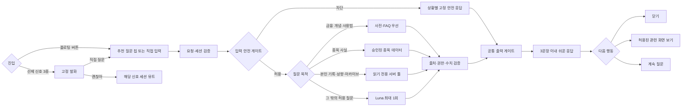

# 키웅이 챗봇 구조 안내

이 문서는 F10 **키웅이 챗봇**을 처음 맡는 조원이 확정 사용자 흐름, 현재 구현 상태, 수정 위치를 빠르게 이해하도록 정리한 실행 문서다. 제품 기준은 통합문서 v2.5 §12-C이며, 아래에서 **목표 흐름**과 **현재 구현**을 구분한다.

## 확정 사용자 흐름



### 경로별 실행 경계

| 경로 | 처리 방식 | 조회 범위 | 모델 호출 |
|---|---|---|---|
| 금융 개념·서비스 사용법 | 고정 사전·FAQ 우선 | 승인된 교육 문서·서비스 규칙 | 미스일 때만 최대 1회 |
| 종목 사실 | 구조화된 종목 데이터 조회 | 유니버스 안 승인 사실 | 쉬운 설명이 필요할 때만 최대 1회 |
| 투자 기록 | 읽기 전용 서버 툴 | 세션 사용자 본인의 F2·F3 기록 | 조회 결과 요약에만 최대 1회 |
| 성향 설명 | 읽기 전용 서버 툴 | 세션 사용자 본인의 F9 JSON | 엔진 값 설명에만 최대 1회 |
| 아카이브 | 읽기 전용 서버 툴 | 세션 사용자 본인의 시즌 기록 | 조회 결과 비교·요약에만 최대 1회 |
| 안전 대응 | 고정 응답 | 조회 없음 | 호출 없음 |

- 정적 FAQ·거절·선제 도움은 툴이 아니다. 동적·개인화 데이터만 허용 목록의 읽기 전용 서버 툴로 제공한다.
- 사용자·가족 식별은 서버 세션에서 확정한다. 클라이언트나 모델이 조회 대상 ID를 정하지 않는다.
- 기초 용어는 사전이 우선이다. RAG는 승인된 교육 문서가 커져 의미 검색이 필요할 때만 추가하고 공개 웹 검색은 MVP 답변 경로에서 제외한다.
- 모델 원시 델타와 원시 툴 결과는 표시하지 않는다. 최대 3문장을 완성 버퍼에 모아 출처·권한·수치·금지 표현을 검증한 뒤 전송한다.
- 관련 화면 이동은 허용 목록의 구조화 `uiAction`을 버튼으로 제안하고 사용자 탭 후 실행한다.

## 현재 구현 한눈에 보기

키웅이는 종목 추천을 하는 챗봇이 아니라, 모의투자 용어·화면 사용법·현재 화면의 사실을 설명하는 AI 도우미다. 가능한 질문은 규칙으로 즉시 답하고, 규칙으로 처리할 수 없는 허용 질문만 서버에서 OpenAI에 보낸다.

```text
사용자 입력 또는 추천 질문 칩
  → 클라이언트 1차 라우팅
    ├─ FAQ·화면 맥락·안전/거절 → 즉시 고정 답변
    └─ fallback(일반 허용 질문) → POST /api/chat
         → 서버 2차 라우팅
         → OpenAI Responses API 스트리밍
         → 문장 단위 버퍼
         → 금지 표현 필터
         → SSE(status/text/done)
         → 클라이언트 채팅 말풍선에 누적 표시
```

## 파일별 책임

| 위치 | 책임 | 수정할 때 |
|---|---|---|
| `web/features/f10-chatbot/F10ChatbotDemo.tsx` | 채팅 시트 UI, 화면별 추천 질문, 요청 전송, SSE 수신·렌더링 | UI·상태·입력 경험을 바꿀 때 |
| `web/features/f10-chatbot/lib/routing.ts` | 질문 분류, FAQ·맥락 답변, 추천/개인정보/위기 거절, 선제 도움 신호 | 답변 범위나 규칙을 바꿀 때 |
| `web/app/api/chat/route.ts` | 요청 검증, SSE 전송, 서버 필터 적용, 장애 폴백 | API 계약·스트림 흐름을 바꿀 때 |
| `web/features/f10-chatbot/lib/openai.ts` | OpenAI 스트리밍 호출과 시스템 지시문 | 모델 프롬프트를 바꿀 때 |
| `web/shared/llm/client.ts` | 서버 전용 OpenAI 클라이언트, 환경변수 로드 | 키·모델 설정 방식을 바꿀 때 |
| `web/shared/llm/filter.ts` | 생성 답변의 투자 권유 표현 차단, 문장 분리 | 안전 필터 규칙을 바꿀 때 |

## 현재 요청 흐름

### 1. 클라이언트: 먼저 규칙으로 답한다

`F10ChatbotDemo.tsx`의 `ask()`가 사용자의 입력과 현재 화면 맥락을 `routeMessage()`에 전달한다.

- `faq`: PER, ETF, 시장가 등 용어·사용법 질문은 고정 답변을 즉시 보여 준다.
- `context`: 주문 화면의 수량·단가 계산이나 종목·아카이브 화면 맥락을 사용해 답한다.
- `refusal`: 종목 추천, 매수·매도 시점, 목표가, 수익률 전망 요청을 거절한다.
- `safety`: 개인정보·자해/위기·유해 표현에 안전 안내를 제공한다.
- `outOfScope`: 서비스 범위 밖의 질문을 안내한다.
- `fallback`: 위 규칙에 없지만 허용 가능한 일반 질문이다. 이 경우에만 API를 호출한다.

현재 화면 맥락은 다음처럼 요청에 포함된다. 서버와 모델은 이 값 외의 보유 수치나 시세를 만들어서는 안 된다.

```ts
{
  screen: "home" | "stock" | "order" | "archive",
  stockName?: string,
  quantity?: number,
  unitPrice?: number,
}
```

### 2. 서버: 요청을 다시 검증하고 스트리밍한다

`POST /api/chat`은 메시지가 문자열인지, `context.screen`이 허용된 값인지 검증한다. 메시지는 공백을 제거한 뒤 최대 500자로 제한한다.

서버도 `routeMessage()`를 다시 호출한다. 클라이언트 검증을 우회해도 고정 답변·거절 경로는 OpenAI까지 가지 않는다. `fallback`일 때만 `streamChatAnswer()`를 호출한다.

응답은 SSE(Server-Sent Events) 형식이다.

| 이벤트 | 용도 |
|---|---|
| `status` | “질문을 확인하는 중”, “답변을 준비하는 중” 같은 처리 상태 |
| `text` | 필터를 통과한 답변 문장 조각 |
| `done` | 스트림 종료 |

클라이언트는 `text` 이벤트를 마지막 AI 말풍선에 이어 붙여 스트리밍처럼 보여 준다.

### 3. OpenAI 호출

`openai.ts`는 서버에서만 `openai` SDK의 스트리밍 **Responses API** 호출을 사용한다.

- API 키: `.env`의 `OPENAI_API_KEY`
- 모델: `gpt-5.6-luna` — `shared/llm/client.ts`의 단일 상수 `LLM_MODEL`
- 모델명은 환경변수로 바꾸지 않는다. 별칭 `gpt-5.6`은 sol로 라우팅되므로 쓰지 않는다.
- `reasoning.effort`는 `low`, `max_output_tokens`는 800. 스트림은 `response.output_text.delta` 이벤트만 읽는다.
- 시스템 지시문은 투자 기초, 앱 사용법, 제공된 화면 맥락의 사실 설명만 허용한다.
- 답변은 친근한 반말, 최대 3문장으로 제한한다.

`.env` 값과 API 키는 클라이언트 코드, `NEXT_PUBLIC_*` 변수, 문서에 넣지 않는다.

## 안전장치

안전장치는 한 단계가 아니라 여러 단계로 겹쳐 있다. 아래 게이트를 **순서대로** 통과한 텍스트만 화면에 나간다. 순서 자체가 설계다 — 특히 **G1은 G4보다 먼저**여야 위기·추천 요구가 모델까지 가지 않는다.

| | 게이트 | 통과 판정 | 막혔을 때 | 위치 | 현재 |
|---|---|---|---|---|---|
| G0 | 요청 검증 | `message`가 문자열이고 `context.screen`이 허용값 | `400` | `api/chat/route.ts` | △ 세션·선택 필드 스키마 미검증 |
| G1 | 입력 분류 | 위기 → 개인정보 → 유해 → 추천 요구 → 오프토픽 **이 순서로** 미해당 | 고정 응답, **모델 미호출** | `routing.ts` | △ 패턴 보강 필요 |
| G2 | 화면 맥락 응답 | 화면 값으로 서버가 계산 가능한 질문인가 | — (해당 시 고정 답변) | `routing.ts` | ✅ |
| G3 | 사전·FAQ | 용어 사전·사용법 FAQ 매칭 | — (해당 시 고정 답변) | `routing.ts` | △ 10개뿐 |
| G4 | 모델 호출 | G1~G3을 모두 지난 `fallback`만 | 고정 폴백 | `openai.ts` | △ 타임아웃 없음 |
| G5 | 문장 버퍼 | 문장 끝(`.!?`)까지 도착 | 보류 | `filter.ts` | ✅ |
| G6 | 출력 필터 | `filterGeneratedText()` 금지 표현 미검출 | `SAFE_REFUSAL` 후 **스트림 종료** | `filter.ts` | △ 7패턴·문장별 검사만 구현 |
| G7 | 근거·권한·수치 검증 | 답변의 출처·조회 대상·숫자가 허용 컨텍스트·엔진 값에 실재 | 전체 답변을 고정 응답으로 대체 | — | ❌ 미구현 |
| G8 | 길이 제한 | 3문장 이내 | 절단 | `api/chat/route.ts` | ✅ |
| G9 | 로깅 | — (차단하지 않음) | — | — | ❌ 미구현 |

- G1~G3은 클라이언트와 서버에서 **두 번** 돈다. 클라이언트는 즉답용, 서버는 권한 판정용이다. 클라이언트를 우회해도 서버 G1이 다시 막는다.
- G7이 필요한 이유: "수치는 엔진·API 값만 인용한다"(통합문서 §13)는 지금 **시스템 지시문으로 부탁만** 하고 있다. 통합문서 §12 기능 5·6·7(본인 기록·성향·아카이브)을 붙이는 순간 강제 장치가 있어야 한다.
- 필터는 서버에서 적용한다. 따라서 클라이언트에서 직접 OpenAI SDK를 호출하거나 원시 청크를 표시하면 안 된다.
- 현재 고정 FAQ·거절은 클라이언트에서 바로 끝나므로 서버가 모든 대화를 보지 못한다. 전 대화 로깅과 세션 권한 검증을 붙일 때는 모든 입력이 서버 공통 진입점을 통과하도록 바꾼다.

## 목표 게이트 완료 조건

| 단계 | 완료 조건 | 실패 처리 |
|---|---|---|
| T0 요청·세션 | 전체 요청 스키마 유효 + 세션 사용자 확정 | `400` 또는 로그인 안내 |
| T1 입력 안전 | 위기·개인정보·유해·추천·오프토픽 분류 | 상황별 고정 응답, 모델·툴 미호출 |
| T2 목적 라우팅 | 허용 목적 6종 또는 안전 대응으로 단일 분류 | 범위 안내 고정 응답 |
| T3 툴 권한 | 허용 목록의 읽기 전용 툴 + 세션 본인 범위 | 조회 중단, 고정 응답 |
| T4 근거 검증 | 종목·기록·F9·아카이브 값이 승인 데이터에 존재 | 전체 답변 폐기 |
| T5 출력 안전 | 완성된 최대 3문장에 금지 표현 없음 | 고정 안전 응답 |
| T6 후속 행동 | `uiAction`이 허용 화면 목록에 존재 | 액션 제거, 텍스트만 표시 |
| T7 로깅 | 경로·차단·툴·필터 결과 기록, 부모 전달·F9 반영 금지 | 메트릭 장애가 답변 권한을 넓히지 않음 |

## 선제 도움은 별도 흐름이다

사용자가 질문하지 않아도 주문 과정에서 불안 행동이 감지되면, 모델을 호출하지 않고 `PROACTIVE_SCRIPTS`의 고정 문구를 보여 준다.

선제 도움 **유형은 아래 3종으로 확정**했으며, 현재 `routing.ts`도 같은 3종을 구현한다. 반복 횟수·시간·손실률 등 수치 임계값만 [가정]으로 남겨 30세션 검증 후 조정한다.

| 신호 | 감지 기준 | 예시 발화 |
|---|---|---|
| `switch` | 최근 3번의 취소 주문이 매수·매도로 번갈아 발생 | “매수랑 매도 사이가 헷갈려?” |
| `dwell` | 주문 또는 종목 상세 화면에 5분 초과 체류 | “어디에서 망설여져? 같이 볼까?” |
| `lossRevisit` | 손실률 -10% 이하 매도 후 5분 안에 해당 종목 상세를 4번 이상 재방문 | “방금 본 종목이 계속 신경 쓰여?” |

UI의 **직접 질문** 버튼은 채팅 시트를 열고, **괜찮아** 버튼은 현재 세션에서 해당 신호를 숨긴다. 선제 도움 문구는 LLM이 생성하지 않으며 부모에게 전달되지 않는다.

데모 UI와 `routing.ts`는 위 3개 신호를 동일하게 사용한다. 팀 재결정 없이 신호 유형을 늘리지 않으며, 임계값을 바꿀 때는 마스터의 [가정] 표기·안내 문구·테스트·감지 로직을 함께 갱신한다.

## 미구현 항목과 완료 기준

통합문서 §12·기능명세 F10이 요구하지만 아직 코드에 없는 것들이다. **순서대로** 처리한다 — 게이트가 먼저고 모델 확장이 나중이다.

| # | 항목 | 완료 기준 | 근거 |
|---|---|---|---|
| 1 | T0 요청·세션 스키마 | 메시지·컨텍스트 전체 검증 + 서버 세션 사용자 확정. 클라이언트의 사용자 ID는 무시 | §12-C |
| 2 | 용어 사전 ~30 · FAQ ~15 | `routing.ts` 매칭 표를 데이터로 분리하고 45개 항목 + 동의어. 각 항목 테스트 1개 | §12 라우팅 |
| 3 | G1 입력 분류 보강 | 위기 표현이 현재 5패턴뿐 — 우회 표현 포함해 확장. 오탐/미탐 케이스 테스트 | §12-A-5 |
| 4 | 목적 라우터 + 읽기 전용 툴 | 종목·F2/F3·F9·아카이브 경로를 허용 목록과 런타임 스키마로 분리. 가족 데이터 접근 테스트 | §12-A·C |
| 5 | T4·T5 전체 답변 검증 | 최대 3문장 완성 버퍼 + 출처·권한·수치 화이트리스트 + 금지 표현 검사. 통과 전 클라이언트 전송 금지 | §12-C·§13 |
| 6 | 발화 제한 | 발화 간 3분 · 동일 신호 10분 · 세션 2회 · [괜찮아] 세션 뮤트 · 30분 무활동=새 세션. `shared/engine` 순수 함수 + 테스트 | §12-B |
| 7 | 선제 신호 UI 연결 | `detectAnxietySignals()`를 실제 주문·상세 화면 이벤트에 연결. 현재는 데모 버튼 수동 트리거 | §12-B |
| 8 | 타임아웃·로깅 | `AbortController` 8초 폴백 + 전 대화·게이트·툴·필터 결과 구조화 로그. 부모 전달·F9 반영 금지 | §13, §18 |
| 9 | 구조화 후속 행동·상태 UI | 허용 `uiAction` 버튼 + 현재 한 줄 `status`를 단계 칩 타임라인으로 표시 | 기능명세 F10-A·C |

**4번은 F2 주문 화면이 있어야 한다** — F10 단독으로는 끝나지 않는다.

`shared/ui` 공용 컴포넌트가 아직 0개라 `F10ChatbotDemo.tsx`가 Tailwind 클래스를 직접 쓰고 있다. 디자인시스템 §6의 `BottomSheet`·`ChatComposer`·`CoachAvatar`·`SpeechBubble`이 생기면 그쪽으로 옮긴다.

## 새 질문 또는 규칙을 추가하는 방법

1. **고정 답변이 적절한가?** 용어·사용법·안전 안내라면 `routing.ts`의 FAQ 또는 분기 규칙에 추가한다.
2. **현재 화면 맥락이 필요한가?** `ChatContext`에 꼭 필요한 최소 필드만 추가하고, 클라이언트와 API 검증을 함께 맞춘다.
3. **생성형 응답이 꼭 필요한가?** 고정 답변으로 충분하지 않은 허용 질문만 `fallback`으로 둔다.
4. **금지 표현이 생기는가?** `shared/llm/filter.ts`와 `filter.test.ts`에 차단 규칙·테스트를 추가한다.
5. **검증한다.** `web`에서 `npm test`와 `npm run build`를 실행한다.

## 변경 시 지켜야 할 경계

- F10 UI와 라우팅 규칙은 `web/features/f10-chatbot/`이 소유한다.
- 공용 OpenAI 클라이언트와 필터는 `web/shared/llm/`이 소유한다.
- `app/api/chat`은 요청 검증과 필터 통과 SSE 전송만 담당한다.
- 점수·성향 계산은 챗봇이나 LLM이 아니라 `shared/engine`의 규칙·통계 로직이 담당한다.
- 종목 추천, 매매 시점, 목표가, 손절가, 가격·수익률 전망, 훈계는 어떤 경로에서도 제공하지 않는다.
