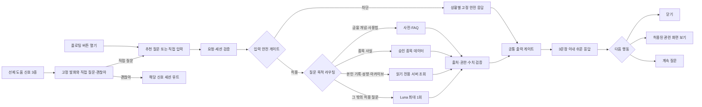

# F10 — 플로팅 AI 챗봇 “키웅이” 기능 명세

> **기능 단일 원본** · 2026-08-12 · 기준: `docs/영웅키움_기획_통합문서_v2.md` v2.7 §12·§13
>
> F10의 사용자 흐름, 콘텐츠, 데이터 수집·적재, API·안전 경계, 현재 구현과 완료 기준은 이 파일에서 관리한다. 제품 목표·법무·전역 레드라인은 통합문서를 따르며, 이 기능을 바꿀 때는 이 파일을 먼저 수정하고 전역 문서에는 요약과 링크만 둔다.

## 1. 제품 계약

키웅이는 “정답을 주는 투자 AI”가 아니라 **이해·기록·성찰을 돕는 개인 코치**다. 아이 눈높이로 금융 기초, 서비스 사용법, 승인된 종목 사실, 본인의 기록을 설명한다.

### 1.1 수행 기능 9종

| # | 기능 | 수행 내용 | 실행 방식 |
|---:|---|---|---|
| 1 | 대화 시작 | 부담 없는 인사와 질문 시작 | 플로팅 버튼 또는 선제 도움 뒤 사용자 선택 |
| 2 | 금융 개념 교육 | 수익률·손익·분산·수수료·세금·시장가·지정가 등 | 용어 사전 우선, 미스 시 Luna 최대 1회 |
| 3 | 서비스 사용 안내 | 검색·주문·포트폴리오·가족 비교·리그 규칙 | FAQ 우선, 미스 시 Luna 최대 1회 |
| 4 | 종목 유니버스 안내 | 51종의 사업·업종·제품·승인된 과거 사실 | 구조화된 종목 데이터 조회, 추천·예측 금지 |
| 5 | 투자 기록 되짚기 | 본인의 거래 이유·확신도·예상 보유기간 회고 | F2·F3 기록 읽기 전용 조회 |
| 6 | 성향 분석 설명 | 5축·근거 분포·확신도 패턴을 쉽게 설명 | 본인의 F9 엔진 JSON만 읽기 전용 조회 |
| 7 | 아카이브 탐색 | 본인의 과거 기록과 시즌 변화를 조회·요약 | 본인의 F9 시즌 기록만 읽기 전용 조회 |
| 8 | 사용법 헤맴 도움 | 확정 신호 3종에 짧은 도움 제안 | 고정 스크립트, LLM 미사용 |
| 9 | 안전 대응 | 추천·예측·개인정보·유해·오프토픽·위기 대응 | 입력 분류 후 상황별 고정 응답 |

### 1.2 참조 범위

키웅이는 다음만 읽을 수 있다.

- 현재 화면과 현재 종목
- 화면에 실제 표시된 수치
- 세션 사용자 본인의 F2 거래 로그와 F3 질문식 기록
- 세션 사용자 본인의 F9 엔진 JSON과 시즌 기록
- 승인된 51종 종목·13개 섹터 교육 데이터
- 승인된 용어 사전과 서비스 FAQ

가족 구성원의 원문 데이터는 조회하지 않는다. 수치와 사실은 엔진·API·승인 데이터 값만 인용하며 모델이 새 수치를 만들면 버그다.

### 1.3 전 경로 금지

- 종목 추천·비추천
- 매수·매도·보유 제안과 매매 시점
- 목표가·손절가·예상 수익률
- 향후 가격 상승·하락 전망
- 종목 간 우열 판단
- 실력 채점·훈계
- 출처 없는 최신 사실·실적·뉴스 생성
- 가족 구성원의 기록 조회 또는 부모에게 대화 원문 전달

## 2. 소유권과 파일 책임

| 위치 | 책임 |
|---|---|
| `web/features/f10-chatbot/F10ChatbotDemo.tsx` | 채팅 시트 UI, 추천 질문, SSE 수신·렌더링 |
| `web/features/f10-chatbot/lib/routing.ts` | 입력 분류, FAQ·맥락 응답, 고정 거절, 선제 신호 |
| `web/features/f10-chatbot/lib/openai.ts` | Luna Responses API 호출과 F10 시스템 지시문 |
| `web/app/api/chat/route.ts` | 요청 검증, 목적 라우팅 연결, 출력 게이트, SSE 전송 |
| `web/shared/data/` | 용어·FAQ·종목·섹터의 승인된 정적 데이터 |
| `web/shared/llm/client.ts` | 서버 전용 OpenAI 클라이언트와 모델 상수 |
| `web/shared/llm/filter.ts` | 금지 표현 차단과 문장 처리 |
| `web/shared/engine/` | 선제 도움 신호·발화 제한 순수 함수 |

- F10 UI와 프롬프트는 기능 폴더가 소유한다.
- API 라우트 변경은 `web/app/AGENTS.md`, 공용 데이터·LLM·엔진 변경은 `web/shared/AGENTS.md`를 함께 따른다.
- `app/api/chat`은 전송과 검증을 담당한다. 모델 프롬프트나 스코어 계산을 넣지 않는다.

## 3. 사용자 흐름



### 3.1 진입 UI

- 모든 화면 우하단에 키웅이 플로팅 버튼을 둔다.
- 탭하면 모바일 바텀시트 챗 UI를 연다.
- 자유 입력창과 현재 화면 맥락 기반 추천 질문 3개를 제공한다.
- 예: 종목 상세 “이 회사는 뭐 하는 회사예요?”, “PER이 뭐예요?” / 주문 “시장가가 뭐예요?” / 홈 “매수 어떻게 해요?”
- “이 회사”처럼 종목명이 생략된 질문은 실제 앱 화면이 전달한 현재 `stockId`·`stockName`을 사용한다. 특정 종목을 기본값으로 추정하지 않는다.
- “키웅이는 AI 도우미야”라는 고지를 상시 표시한다.

### 3.2 응답 계약

```ts
type ChatResponse = {
  text: string;
  suggestedQuestions?: string[];
  uiAction?: {
    type: "open_screen";
    target: "home" | "stock" | "order" | "archive";
  };
};

type ChatAction =
  | Pick<ChatResponse, "suggestedQuestions" | "uiAction">
  | {
      kind: "explain";
      turn: { scriptId: `term:${string}`; stage: "brief" | "detail" };
      choices: Array<{ id: string; label: string }>;
    }
  | {
      kind: "stock-explore";
      turn: {
        stockId: `KRX:${string}`;
        shownTopics: Array<"company" | "business" | "industry" | "financial">;
        prompt: string;
        choices: Array<{ id: string; label: string }>;
      };
    };
```

- 답변은 해요체·쉬운 말·비유·이모지를 사용하고 최대 3문장이다. 자녀 뷰의 말끝은 “~예요/~해요/~하면 돼요”로 맺고 “~합니다”체와 “~하세요” 지시체는 쓰지 않는다.
- `uiAction`은 서버 허용 목록의 화면만 제안한다.
- 모델이 URL을 만들거나 화면을 직접 이동시키지 않는다. 사용자가 버튼을 눌러야 실행한다.

### 3.3 DAPIE 설명 대화

- [사실] DAPIE 연구의 대화형 설명 근거는 `docs/DAPIE_논문_추출.md`에 정리한다. 승인 금융 용어는 EPS와 같은 내용별 DAPIE 문답을 적용한다. 서비스 사용법 FAQ와 화면 맥락형 사용 안내는 DAPIE 전이 없이 승인 답변과 허용 `uiAction`을 바로 제공한다.
- 한 번의 응답은 **피드백 → 한 번에 개념 하나 설명 → 질문**으로 구성한다. 질문은 유도(Guiding)·진단(Diagnosis)·선지식 확인(Eliciting) 중 하나이며 버튼 선택지와 직접 입력을 함께 허용한다.
- 승인 금융 용어 32건은 모두 내용별 진단·오답 조정·예시 복귀 스크립트를 가진다. 서비스 사용법 FAQ 15건과 화면 맥락형 사용 안내는 공통 유도 질문으로 감싸지 않으며, 동적 조회·허용 LLM 답변은 기존 공통 유도 질문을 유지한다.
- 정답이면 구체적 피드백 뒤 다음 행동을 묻고, 오답이면 정답을 바로 주지 않고 더 쉬운 설명·더 작은 질문으로 분기한 뒤 원래 흐름으로 돌아간다. “모르겠어”도 같은 조정 경로를 사용한다. 사용자가 명시적으로 “여기까지”를 고른 경우에만 대화를 종료한다.
- 추천 거절·개인정보·유해·오프토픽·정서 위기 대응은 즉시 보호 안내가 우선이므로 DAPIE 전이의 예외다. 데이터 없음·검수 중·일시 실패는 짧게 사실을 알리고 가능한 다음 행동을 묻는다.
- 모든 문구와 선택지는 승인된 정적 데이터만 사용한다. LLM은 단계 문구·선택지·정답을 생성하거나 해석하지 않는다.
- 서버는 클라이언트가 보낸 `scriptId`, `stage`, `choiceId`를 등록된 스크립트와 현재 단계에 대조한다. 등록되지 않은 선택지 또는 단계 전이는 무효이며 기존 단답으로 돌아간다.
- 본문뿐 아니라 확인 질문과 선택지 라벨도 정적 데이터 테스트에서 금지 표현·문장 수 게이트를 통과해야 한다.
- 이해 여부를 평가하거나 점수화하지 않으며, 사용자는 언제든 다른 질문으로 전환할 수 있다.

#### 3.3.1 버튼 대신 타이핑했을 때 (구어체 처리)

선택지 버튼이 주 경로지만 입력창은 계속 열려 있으므로 아이가 선택지 문구나 `몰라`·`모르겠어`처럼 직접 칠 수 있다. `lib/colloquial.ts`가 LLM 없이 판정하며, 진행 중인 단계가 있으면 클라이언트는 `choiceId` 없이 `explain.scriptId`와 `explain.stage`만 보낸다.

- 판정 순서는 이모지 치환(👍 → `응`) → NFKC 정규화·소문자·기호 제거 → 3회 이상 반복 축약(`응응응응` → `응응`) → 사전 **정확 일치**다.
- 선택지 라벨은 정규화 후 정확히 일치할 때만 받는다. `몰라`·`모르겠어`·`헷갈려`·`어려워`는 오답으로 단정하지 않고 `unsure`로 매핑해 예시와 작은 질문을 다시 제시한다.
- `ㅋㅋ`·`ㄱㅊ`·`글쎄`는 의도적으로 판정하지 않는다. 부분 일치도 쓰지 않는다 — “아니면 뭐야?”가 부정으로 삼켜지면 안 된다.
- 판정에 실패하면 추측하지 않는다. 새 질문으로 보이면 일반 라우팅으로 넘기고, 그 밖에는 같은 단계를 유지한 채 선택지를 다시 보여준다.
- ⚠ NFKC는 호환 자모 `ㅇ`(U+3147)을 조합용 자모 `ᄋ`(U+1100)으로 바꾼다. 사전 상수도 반드시 같은 정규화 함수를 통과시켜 생성해야 초성체가 매칭된다.

### 3.4 종목 정보 연속 탐색

- 51종 각각의 승인 정보를 `회사 소개 → 수익 구조 → 산업 역할 → 과거 실적` 네 주제로 나눈다. 초등·중학생용 설명은 별도 사실이 아니라 같은 주제의 난이도 조정에 사용한다.
- 첫 질문은 아이가 물은 주제를 답하고, 이후에는 아직 보여주지 않은 다음 주제 질문 하나와 `여기까지 볼래`를 제시한다. 어떤 주제에서 시작해도 네 주제는 한 번씩만 제공한다.
- 종목 답변은 **구체적 피드백 → 주제 하나 설명 → 남은 정보 추천 질문**으로 DAPIE를 충족한다. 공통 `이해했어 / 더 쉽게 볼래` 전이를 중복 표시하지 않는다.
- 선택지는 서버가 만든 `stockId`·주제 ID·이미 본 주제를 함께 보내며, 서버는 등록된 51종과 고정 주제 순서에 대조한다. 답변 문장은 요청 본문이 아니라 승인 데이터에서 다시 조회한다.
- 네 주제를 모두 본 뒤에는 완료 사실을 알리고 `다른 종목 물어볼래 / 여기까지 볼래`로 전환한다. 새 응답이 시작되면 이전 턴의 선택지는 비활성화한다.

## 4. 질문 목적별 실행 경계

| 목적 | 우선 처리 | 허용 데이터 | 생성형 AI |
|---|---|---|---|
| 금융 개념 | 용어 사전 | 승인 교육 문서 | 미스 또는 쉬운 재설명이 필요할 때 1회 |
| 서비스 사용법 | FAQ + 허용 화면 액션 | 현재 화면·서비스 규칙 | FAQ 미스일 때 1회 |
| 종목 사실 | 구조화된 종목 데이터 | 51종 승인 사실 | 조회 결과를 쉽게 풀 때 1회 |
| 투자 기록 | 읽기 전용 서버 조회 | 본인의 F2·F3 기록 | 조회 결과 요약에만 1회 |
| 성향 설명 | 읽기 전용 서버 조회 | 본인의 F9 엔진 JSON | 엔진 값 설명에만 1회 |
| 아카이브 | 읽기 전용 서버 조회 | 본인의 시즌 기록 | 조회 결과 비교·요약에만 1회 |
| 안전 대응 | 입력 분류 후 고정 응답 | 조회 없음 | 호출 없음 |

- 사용자·가족 식별자는 서버 세션이 주입한다. 클라이언트와 모델은 조회 대상을 선택하지 못한다.
- 정적 FAQ·거절·선제 도움은 툴로 만들지 않는다.
- 동적·개인화 데이터만 허용 목록의 서버 전용 읽기 툴로 제공한다.
- 기초 용어는 사전이 우선이다. 승인 교육 문서가 커져 의미 검색이 필요할 때만 소규모 RAG를 추가한다.
- 공개 웹 검색과 출처 없는 모델 기억은 MVP 답변 근거로 사용하지 않는다.

## 5. 요청·스트리밍 계약

### 5.1 요청

```ts
type ChatRequest = {
  message: string;
  context: {
    screen: "home" | "stock" | "order" | "archive";
    stockId?: string;
    stockName?: string;
    quantity?: number;
    unitPrice?: number;
  };
  explain?: { scriptId: string; stage: "brief" | "detail" | "followup"; choiceId?: string };
  stockExplore?: {
    stockId: `KRX:${string}`;
    shownTopics: Array<"company" | "business" | "industry" | "financial">;
    choiceId: "company" | "business" | "industry" | "financial" | "ask-other" | "done";
  };
};
```

- 메시지는 문자열인지 검증하고 공백 정리 후 최대 500자로 제한한다.
- 화면과 선택 필드는 런타임 스키마로 검증한다.
- iframe 기반 프로토타입은 화면·종목이 바뀔 때 부모에 채팅 맥락을 전달한다. 부모는 동일 출처·해당 iframe·필드 스키마를 확인한 값만 챗봇 요청에 사용한다.
- 본인 식별자는 요청 본문에서 받지 않고 서버 세션에서 확정한다.

### 5.2 SSE 이벤트

| 이벤트 | 용도 |
|---|---|
| `status` | 질문 분류·자료 조회·답변 준비·안전 점검 상태 |
| `text` | 모든 검증을 통과한 답변 텍스트 |
| `action` | 검증된 `uiAction`·추천 질문 또는 DAPIE 설명의 선택지·전이 상태 |
| `done` | 스트림 종료 |

처리 상태 문구는 수작성 고정 문구다. “안전 점검 통과” 전에는 원시 모델 답변을 화면에 표시하지 않는다.

### 5.3 OpenAI 호출

- SDK는 서버 전용 `openai`, API는 **Responses API**다.
- 키는 `OPENAI_API_KEY`만 사용하며 문서·클라이언트·`NEXT_PUBLIC_*`에 넣지 않는다.
- 모델은 `web/shared/llm/client.ts`의 단일 상수 `gpt-5.6-luna`다. 별칭 `gpt-5.6`은 사용하지 않는다.
- `reasoning.effort`는 `low`, `max_output_tokens`는 800이다.
- 스트림에서 `response.output_text.delta` 이벤트만 읽는다.
- 한 요청에서 모델 호출은 최대 1회다. 모델이 툴을 반복 선택하는 에이전트 루프는 만들지 않는다.

## 6. 안전 게이트

게이트는 아래 순서로 실행한다. 입력 차단은 모델 호출보다 먼저, 전체 출력 검증은 화면 전송보다 먼저다.

| 단계 | 판정 | 실패 처리 |
|---|---|---|
| T0 요청·세션 | 요청 스키마 유효·세션 사용자 확정 | `400` 또는 로그인 안내 |
| T1 입력 안전 | 위기 → 개인정보 → 유해 → 추천 → 오프토픽 순서 분류 | 상황별 고정 응답, 모델·툴 미호출 |
| T2 목적 라우팅 | 허용 목적 6종 또는 안전 대응 | 범위 안내 고정 응답 |
| T3 조회 권한 | 허용 툴·세션 본인 범위 | 조회 중단, 고정 응답 |
| T4 근거 검증 | 종목·기록·F9·아카이브 값이 승인 데이터에 존재 | 전체 답변 폐기 |
| T5 출력 안전 | 완성된 최대 3문장에 금지 표현 없음 | 고정 안전 응답 |
| T6 후속 행동 | `uiAction`이 허용 화면 목록에 존재 | 액션 제거, 텍스트만 표시 |
| T7 로깅 | 경로·차단·조회·필터 결과 기록 | 메트릭 장애가 권한을 넓히지 않음 |

- 클라이언트 라우팅은 빠른 즉답용이며 권한 판정이 아니다. 서버가 다시 검증한다.
- 원시 모델 델타와 원시 조회 결과를 화면에 직접 표시하지 않는다.
- 최대 3문장을 완성 버퍼에 모아 출처·권한·수치·금지 표현을 함께 검증한다.
- 출력 필터가 차단하면 전체 답변을 고정 안전 응답으로 대체하고 스트림을 종료한다.
- 비상 시 사전·FAQ 전용 모드로 강등할 수 있어야 한다.

### 6.1 고정 안전 응답 원칙

- 추천·예측 요구: “종목은 제가 골라줄 수 없어요! 대신 고를 때 뭘 보면 좋은지 알려줄게요 🐻”
- 오프토픽·유해·개인정보: “저는 투자 이야기만 할 수 있어요!”를 기본으로 상황별 안내를 덧붙인다.
- 과몰입·정서 위기: 생성형 답변 없이 대화를 안전 종료하고 보호 안내를 제공한다.
- 데이터 부족: 조회하지 않고 “아직 관찰 초기야”라고 안내한다.

#### 6.1.1 추천·예측 질문의 대안 전환

추천 차단은 특정 문장 목록의 정확 일치가 아니라 정규화한 자연어의 의미 단서 조합으로 판정한다. 띄어쓰기·문장 부호·존댓말·반말·`낼`, `떡상`, `존버`, `담다`, `찍어 줘` 같은 구어체가 달라도 아래 취지가 같으면 동일하게 차단한다.

| 하위 의도 | 포함 예 | 고정 대안 질문 |
|---|---|---|
| 종목 선택·우열 | “나라면 뭐 살래”, “하나만 골라 줘”, “뭐가 제일 나아” | 현재 종목의 회사 소개·수익 구조 또는 종목 검색 |
| 가격·수익 예측 | “내일 오를까”, “반등 확률”, “목표가·손절가를 정해 줘” | 차트·변동성의 의미와 승인된 회사 사실 |
| 매매·보유 시점 | “언제 팔아”, “지금 털어”, “계속 들고 있어?” | 본인 거래 기록과 주문 전 확인 순서 |
| 매수 수량·비중 | “몇 주 사야 해”, “30만 원 어디에 넣어” | 예상 금액과 주문 확인 방법 |
| 안전·무손실·인기 | “안 망할 회사”, “제일 안전한 종목”, “많이 산 주식” | 위험·분산투자 개념 |
| 손실 만회·순위 추격 | “본전 찾으려면”, “엄마를 이기려면” | 본인 거래 기록과 평가손익 의미 |
| 가족·친구·영상 추종 | “친구 따라 사도 돼?”, “유튜브 고수처럼” | 본인의 투자 근거와 거래 기록 |
| 지표·뉴스·사건으로 선택 | “PER 낮은 걸 골라 줘”, “컴백 전에 사면 이득?” | 지표의 의미 또는 회사 수익 구조와 변동성 |

- 거절 본문은 요청한 행위가 종목 선택인지, 미래 예측인지, 매매 시점인지, 수량 결정인지 구체적으로 밝힌다.
- 후속 질문은 고정된 승인 문구 두 개만 제공하고, 다시 추천 차단으로 들어가거나 범위 밖으로 빠지는 문구를 만들지 않는다.
- 현재 종목이 있으면 회사 소개·수익 구조 질문에 실제 `stockName`을 넣는다. 종목 맥락이 없으면 종목 검색·금융 개념 질문으로 전환한다.
- “주가가 오르면 수익률은 어떻게 계산해?”, “매수는 무슨 뜻이야?”처럼 미래 판단이 아닌 조건 설명·용어·사용법 질문은 추천으로 오탐하지 않는다.
- 추천 거절과 대안 선택지는 모델·Tool을 호출하지 않는 고정 응답이며 DAPIE 전이를 시작하지 않는다.

#### 6.1.2 보호·안전 질문의 상황별 전환

`unsafe`는 하나의 공통 거절이 아니라 아래 하위 의도로 판정한다. 정확한 문장 목록이 아니라 NFKC 정규화 뒤 개인정보 종류, 타인 데이터 조회 동사, 감정·압박 표현, 충동적 거래 표현의 조합을 사용한다. 띄어쓰기·문장 부호·존댓말·반말·`비번`, `개빡쳐`, `다 팔아버릴까` 같은 구어체가 달라도 같은 취지면 동일하게 보호한다.

| 하위 의도 | 포함 예 | 고정 대안 질문 |
|---|---|---|
| 위기 가능 표현 | “죽고 싶어”, “다 포기하고 싶어” | 현재 안전 여부 확인·가까운 어른과 긴급 도움 안내 |
| 비밀번호·인증정보 | “비번 기억해?”, “비밀번호로 대신 주문해 줘” | 챗봇 역할·주문 전 확인 방법 |
| 계좌번호·주소 등 개인정보 | “계좌번호를 적으면?”, “우리 집 주소 알려줄까?” | 챗봇 역할·모의투자 규칙 |
| 가족 데이터·공개 범위 | “엄마 수익률 알려 줘”, “내 성향을 친구에게 공개해?” | 동의 기반 가족 비교 화면·본인 기록 |
| 대리 주문·권한 변경 | “친구 폰으로 주문해도 돼?”, “대신 눌러 줘” | 직접 주문 방법·주문 전 확인 순서 |
| 서비스 오류·분노 | “주문 왜 안 돼, 짜증나” | 주문 확인·사용법 안내 |
| 부모 압박·가족 갈등 | “수익률로 평가해서 부담돼” | 수익률의 의미·본인 기록 회고 |
| 순위 비교·자기비하 | “나만 못하는 것 같아” | 성향은 성적이 아니라는 설명·본인 기록 |
| 뉴스·주문 불안·반복 확인 | “계속 확인하게 돼”, “불안해서 못 누르겠어” | 변동성 개념·본인 기록 |
| 감정적인 전량 매도 | “열받는데 다 팔아버릴까?” | 매매 결정을 멈추고 본인 기록·매도 개념 확인 |
| 윤리적 괴로움 | “전쟁으로 이익을 얻는 것 같아” | 현재 회사의 승인 사실·본인 투자 근거 |

- 입력 안전 우선순위는 **위기 → 인증정보·개인정보 → 가족 데이터·대리 행동 → 감정적인 거래 → 정서 지원 → 추천**이다. 여러 의도가 섞이면 앞선 보호 이유를 먼저 안내한다.
- 비밀번호·계좌번호·주소처럼 입력에 포함된 값은 답변에서 되풀이하지 않는다. 실제 인증정보로 보이면 진위 여부를 묻지 않고 공식 화면에서 변경·확인하도록 안내한다.
- 챗봇은 가족 구성원의 데이터를 조회하지 않는다. 가족 비교는 양측 동의가 있는 아카이브 화면을 사용자가 직접 열도록 안내하며, 성향·수익률을 실력이나 성적으로 판정하지 않는다.
- 분노·불안 표현은 말투를 훈계하지 않고 불편을 먼저 인정한다. “다 팔아버릴까?”에는 매도·보유 어느 쪽도 권하지 않는다.
- 위기 가능 표현은 투자 대화를 중단하고 현재 안전 여부를 먼저 확인한다. 위험하거나 도움을 요청하면 가까운 보호자·교사 등 믿을 수 있는 어른과 `112`·`119`를 안내한다.
- 위기 확인 선택지를 제외한 후속 질문 두 개는 기존 허용 FAQ·용어·본인 기록 경로로만 보낸다. 모든 보호 응답과 선택지는 모델·Tool을 호출하지 않는 고정 응답이며 DAPIE 전이를 시작하지 않는다.

#### 6.1.3 서비스·리그 규칙 질문의 직접 안내

`rule`은 안전 거절이 아니라 허용된 서비스 사용 안내다. 정확한 문장 목록이 아니라 NFKC 정규화 뒤 한도·거래 비용·시즌·순위·공개·가상 자산·체결 규칙을 묻는 의미 단서 조합으로 판정한다. 띄어쓰기·문장 부호·존댓말·반말·`얼마까지 살 수 있어`, `돈 남았는데 왜 막혀`, `몇 번 더 할 수 있어` 같은 표현이 달라도 같은 취지면 동일한 고정 FAQ로 답한다.

| 하위 의도 | 포함 예 | 직접 답변과 고정 대안 |
|---|---|---|
| 주문·단일 종목 한도 | “얼마까지 살 수 있어?”, “나눠 주문하면 한도를 넘을 수 있어?” | 가상 100만원·입문형 30%·성장형 40%·누적 한도 설명, 주문 화면의 가능 금액·프리셋 확인 |
| 수수료·세금·손익 반영 | “수수료도 빠져?”, “세금이 손익에 들어가?” | 현재 주문 화면의 비용 항목을 확인하고 실제 거래와 데모를 구분, 비용 내역·손익 계산 확인 |
| 참여 여부 | “이거 꼭 해야 돼?”, “리그 참여가 의무야?” | 구경·튜토리얼과 선택 참여를 구분, 참여 규칙·구경 모드 안내 |
| 기록 확인·시즌 보존 | “기록까지 봐야 돼?”, “시즌 끝나면 없어져?” | 주문 이유 기록과 선택적 아카이브 열람을 구분, 가상 자산 리셋 뒤 기록 보존 안내 |
| 시즌 기간·거래 횟수 | “3주차면 며칠 남아?”, “마지막 주에도 주문돼?” | 화면의 종료일 확인, 최소·주간 거래 횟수 제한 없음, 종료 시점 규칙 안내 |
| 순위·성향·시상 | “거래 횟수도 순위에 들어가?”, “동점이면 어떻게 해?” | 가족 수익률 평균과 성향 중간값 설명, 동점·갱신 주기·리워드 세부는 미정으로 안내 |
| 공개·알림 범위 | “친구에게 내 종목이 보여?”, “낮은 수익률이 바로 알려져?” | 다른 가족 비공개·가족 상호 동의·즉시 저수익 알림 없음, 가족 비교·공개 범위 확인 |
| 가상 지갑·현금 전환 | “팀이면 돈이 합쳐져?”, “진짜 돈으로 바꿔?” | 구성원별 독립 가상 100만원·실계좌 비연동·현금 전환 불가 안내 |
| 체결 시점 | “어떤 가격으로 체결돼?” | 데모 즉시 체결과 예약 주문 설계를 구분, 현재 주문 유형·시장가와 지정가 확인 |
| 친구 추천의 규칙상 처리 | “친구가 추천한 걸 사면 규칙 위반이야?” | 친구 추천을 거래 이유로 기록할 수 있으나 챗봇은 매수를 승인·보증하지 않음, 투자 근거·주문 확인 안내 |

- 입력 처리 우선순위는 **위기·개인정보 등 보호 → 유해 → 명시적 서비스 규칙 → 추천·예측 → 그 밖의 허용 목적**이다. “친구가 추천한 걸 사도 규칙 위반이야?”, “시즌 전에 팔아야 이겨?”처럼 매매 단어가 있어도 묻는 대상이 리그 규칙이면 규칙 부분만 답하고 매매 결론을 주지 않는다.
- 고정된 제품 사실은 최대 3문장으로 직접 답한다. 사용자별 주문 가능 금액·비용·남은 날짜·갱신 시각은 모델이 만들지 않고 현재 화면의 값을 확인하도록 안내한다.
- 동점 처리, 순위 갱신 주기, 역할별 한도 예외, 중도 규칙 변경 책임, 리워드 세부, 부모·자녀 순위 노출 차이는 현재 미정이다. 임시 기준을 생성하지 않고 확정되지 않았다고 직접 안내한다.
- 분노·도발이 섞여도 보호가 필요한 감정 신호가 아니면 말투를 훈계하지 않고 규칙을 답한다. “한 종목에 전부 넣어도 되지?”에는 매수 비중을 제안하지 않고 한도만 설명한다.
- 공개 범위 질문은 가족 구성원의 원문 데이터를 조회하지 않는다. 다른 가족·친구 비공개와 상호 동의 원칙만 안내하고 사용자가 가족 비교 화면에서 직접 확인하도록 한다.
- 모든 규칙 응답은 서비스 FAQ와 같은 고정 `service_help` 응답이다. 모델·Tool·DAPIE 전이를 시작하지 않으며, 후속 질문 두 개는 기존 허용 FAQ 또는 같은 규칙 경로로만 보낸다.

## 7. 선제 도움

선제 도움은 대화 생성 경로와 분리된 고정 규칙이다. **신호 유형은 아래 3종으로 확정**하며 팀 재결정 없이 추가하지 않는다.

| 코드 | 조건 | 고정 발화 |
|---|---|---|
| `switch` | 매수·매도 확인창 취소가 번갈아 3회 연속 | “매수와 매도가 헷갈려?” |
| `dwell` | 주문 또는 종목 상세 화면 5분 초과 체류 | “어디에서 막혔는지 같이 볼까요?” |
| `lossRevisit` | -10% 이하 손실 실현 후 5분 안에 같은 종목 상세 4회 이상 재진입 | “방금 본 종목이 계속 신경 쓰여?” |

- 횟수·시간·손실률 임계값은 [가정] 초기 운영값이며 자녀 테스트 30세션 후 조정한다.
- 반응 카드는 **직접 질문 / 괜찮아** 두 개다.
- 발화 간 최소 3분, 동일 신호 10분 내 재발화 금지, 세션 최대 2회다.
- “괜찮아”를 누르면 해당 신호는 세션 동안 뮤트한다.
- 30분 무활동이면 새 세션으로 본다.
- 선제 문구는 LLM이 생성하지 않고 부모에게 전달하지 않는다.

제외 신호: 주문 수량 반복 수정, 차트 기간 반복 변경, 여러 종목 빠른 조회, 순위·손실 확인 후 주문, 주문 오류 반복. 정상 탐색 또는 직접 오류 안내와 구분하기 어렵기 때문이다.

## 8. 종목·섹터 교육 콘텐츠

### 8.1 지원 질문

51종 각각에 다음 네 주제를 고정 데이터로 답하고, 남은 주제를 추천 질문으로 이어갈 수 있어야 한다.

1. “이 회사는 뭐 하는 회사예요?”
2. “이 회사는 어떻게 돈을 벌어요?”
3. “이 회사는 산업에서 어떤 역할을 해요?”
4. “검수된 과거 실적은 어땠어요?”

13개 섹터 각각에 “이 섹터는 어떤 일을 해요?”를 답할 수 있어야 한다.

### 8.2 답변 카드

| 카드 | 내용 | 데이터 기준 |
|---|---|---|
| 회사 한 줄 소개 | 제공 제품·서비스 | `companySummary` |
| 산업 속 역할 | 같은 섹터에서 맡는 역할 | `companyRole`·`sector` |
| 일상 연결 | 사용자가 만나는 제품·서비스 장면 | `everydayTouchpoints` |
| 돈의 흐름 | 회사가 대가를 받는 기본 구조 | `offerings`·사업 흐름 |
| 화면 읽기 | 현재가·등락·수량·예상 금액의 의미 | 화면 컨텍스트·API 값 |

한 답변은 질문에 필요한 카드만 골라 최대 3문장으로 설명한다. 회사의 미래나 투자 가치를 연결하지 않는다.

### 8.3 연령별 깊이

| 대상 | 설명 방식 |
|---|---|
| 초등학생 | 친숙한 일상 장면, 쉬운 명사, 1~2문장 |
| 중학생 | 고객·제조·유통·산업 연결, 2~3문장 |

### 8.4 섹터별 필수 설명 주제

| 섹터 | 필수 주제 |
|---|---|
| 게임 | 제작·출시·운영·업데이트 |
| 물류 | 생산자에서 가게·집까지의 이동, 육상·택배·해상 역할 |
| 반도체 | 칩·메모리·부품과 전자기기 연결 |
| 방산 | 국방·항공 장비의 개발·제조·정비 |
| 식품 | 원재료·제조·포장·유통 |
| 에너지 | 발전·정유·유통과 가정·학교·공장 연결 |
| 엔터테인먼트 | 음악·영상·공연의 기획·제작·유통 |
| 유통 | 상품 선정·매장·온라인·제품 서비스 |
| 은행·금융 | 예금·송금·대출 기초와 증권사의 주문 중개 |
| 자동차 | 완성차·부품·타이어의 협업 구조 |
| 조선 | 선박 설계·건조·관리 |
| 항공 | 비행 준비·운항·서비스 역할 |
| 화장품 | 연구·기획·제조·판매, 효능 단정 금지 |

종목 목록과 섹터 배정은 `docs/모의투자_종목유니버스_데이터셋_설계.md`가 소유한다.

## 9. 교육 데이터 계약

주문, 시세, 종목 상세, 챗봇은 같은 `stockId`를 사용한다.

```ts
type FactSource = {
  field: "identity" | "business" | "offering" | "touchpoint" | "sector";
  title: string;
  url: string;
  publishedAt?: string;
  checkedAt: string;
};

type StockEducationContent = {
  stockId: string;
  companySummary: string;
  companyRole: string;
  offerings: string[];
  everydayTouchpoints: string[];
  elementaryExplanation: string;
  middleSchoolExplanation: string;
  approvedQuestions: string[];
  factSources: FactSource[];
  reviewedAt: string;
  status: "draft" | "reviewed";
};

type SectorEducationContent = {
  sector: string;
  label: string;
  elementarySummary: string;
  middleSchoolSummary: string;
  valueChain: string[];
  keyTerms: Array<{ term: string; definition: string }>;
  factSources: FactSource[];
};
```

- 종목·섹터 설명을 한 문장에 섞어 저장하지 않는다.
- 제품명 나열보다 오래 유지되는 제품·서비스 범주를 우선한다.
- 실적·주가·계약·점유율처럼 시점에 민감한 정보는 기본 데이터에서 제외한다.

## 10. 사실 수집·검수·적재

### 10.1 출처 우선순위

| 순위 | 원본 | 사용 정보 |
|---:|---|---|
| 1 | 거래소 상장정보 | 종목코드·공식명·시장구분 |
| 2 | 전자공시 회사 개황·사업 내용 | 주요 사업·사업 부문 |
| 3 | 회사 공식 홈페이지·IR | 제품·서비스 범주·산업 역할 |
| 4 | 공식 브랜드·서비스 페이지 | 일상 접점 |
| 5 | 공공기관·산업협회 교육 자료 | 섹터 구조·용어 |

뉴스·블로그·위키·검색 요약은 초안 탐색에만 사용할 수 있고 최종 사실의 단독 원본으로 쓰지 않는다.

### 10.2 작업 흐름

```text
51종·13섹터 작업 목록
  → 출처 카드 수집
  → 초등·중학생용 문장 편집
  → 자동 구조·금지 표현 검수
  → 사람의 사실·눈높이·안전 검수
  → reviewed 데이터만 TypeScript로 적재
  → F2 종목 상세와 F10이 stockId로 공유
```

- 작업 상태는 `todo → sourced → drafted → reviewed → loaded` 순서다.
- 자동 검수는 51개 `stockId` 1:1, 13개 섹터, 필수 필드·URL·확인일, 금지 표현을 검사한다.
- 사람 검수는 출처의 필드 근거, 연령 적합성, 최신성, 방산·금융·화장품의 중립성을 확인한다.
- 종목·제품 정보는 분기 1회와 공식 페이지 변경 시 재검수하며 `reviewedAt`과 `checkedAt`을 함께 갱신한다.

### 10.3 응답 우선순위

```text
고정 사실 데이터
  → 화면 컨텍스트 계산
  → 승인된 읽기 전용 조회
  → 필요한 경우 Luna 1회 설명
  → 전체 출력 게이트
```

회사·제품·일상 접점·섹터 역할 질문은 51종·13섹터 모두 OpenAI 호출 없이 기본 답변이 가능해야 한다.

## 11. 개인정보와 로그

- 입력 분류, 라우팅 경로, 조회 종류, 필터 결과, 선제 신호와 “괜찮아” 선택을 구조화 로그로 남긴다.
- 대화 원문과 행동 데이터는 부모에게 전달하지 않는다.
- F10 로그는 F9 성향 스코어링에 반영하지 않는다.
- 로깅 실패가 조회 권한이나 답변 범위를 넓혀서는 안 된다.
- 세션 사용자가 아닌 가족 구성원의 기록 접근 시도는 거부하고 테스트한다.

## 12. 현재 구현과 남은 작업

### 12.1 구현 완료 — 2026-08-12

- 모든 UI 질문이 `/api/chat` 공통 진입점을 거치며, 클라이언트 라우팅은 권한·안전 판정에 사용하지 않는다.
- 메시지·화면·`stockId`·수량·단가를 런타임 검증하고 요청 본문의 사용자·가족 식별자를 거부한다.
- 실제 인증이 없는 데모에서는 서버가 `demo-child` 고정 세션을 주입한다. 클라이언트 대화 이력은 모델 입력으로 받지 않는다.
- 용어 사전 32개와 서비스 FAQ 15개를 우선 검색하며, 가장 긴 동의어 일치 항목을 선택한다.
- 입력은 금융 개념·서비스 안내·종목 사실·본인 기록·본인 성향·본인 아카이브의 6개 허용 목적과 안전 대응으로 분류한다.
- 추천·예측 표본 125건과 자연어 동등 표현을 서버 입력 게이트에서 9개 하위 의도로 분류하고, 질문 취지에 맞는 승인 대안 두 개를 모델·Tool 호출 없이 제공한다.
- 보호·안전 표본 124건과 자연어 동등 표현을 서버 입력 게이트에서 11개 하위 의도로 분류하고, 개인정보를 재노출하지 않는 상황별 보호 안내와 승인 대안을 제공한다.
- 서비스·리그 규칙 표본 67건과 자연어 동등 표현을 10개 하위 의도로 분류하고, 확정·동적·미정 규칙을 구분한 직접 답변과 승인 대안 두 개를 모델·Tool 호출 없이 제공한다.
- 승인 종목 사실·본인 거래 기록·본인 성향·본인 아카이브의 읽기 전용 Tool 4종을 서버 허용 목록으로 고정했다. 모델은 Tool을 선택하거나 반복 호출하지 않는다.
- Luna 스트림의 원시 델타를 노출하지 않고 전체 답변을 서버 버퍼에 모은다. 최대 3문장·금지 표현·미검증 숫자를 통과한 텍스트만 전송하며 8초 후 고정 폴백으로 바꾼다.
- SSE `action` 이벤트와 허용 화면 `uiAction`을 구현했다. 모델 URL은 받지 않고 사용자가 버튼을 눌러야 이동한다.
- `switch`·`dwell`·`lossRevisit` 판정, 발화 간 3분·동일 신호 10분·세션 최대 2회·신호 뮤트·30분 초기화를 `shared/engine` 순수 함수로 구현했다.
- 화면 진입·가시 탭 체류·주문 확인 취소를 공용 zustand 이벤트 저장소에 연결했다. `trade_filled`와 종목 재진입 계약도 같은 저장소가 받는다.
- 대화 원문 없이 요청 ID·목적·경로·Tool·필터·실패 결과만 구조화 로그로 남긴다.
- 승인 금융 용어 32건은 모두 EPS와 같은 내용별 진단·오답 조정·예시 복귀 DAPIE 전이를 사용한다.
- 서비스 사용법 FAQ 15건과 화면 맥락형 사용 안내는 DAPIE 전이 없이 승인 답변을 바로 제공하고, 등록된 `uiAction`을 같은 응답에 유지한다. 읽기 전용 Tool·허용 LLM·실패 안내는 기존 공통 유도형 전이를 유지한다.
- 진행 중인 설명에서도 새 질문을 자유롭게 시작할 수 있고, 정답 뒤에는 다음 질문 또는 명시적 종료를 고르게 한다.
- 51종 승인 교육 데이터는 회사 소개·수익 구조·산업 역할·2024년 실적 네 주제로 조회하며, 종목 질문 뒤에는 아직 보지 않은 주제를 중복 없이 추천한다.

### 12.2 남은 외부 의존성과 콘텐츠 작업

| 우선순위 | 항목 | 현재 경계와 완료 조건 |
|---:|---|---|
| 1 | 실제 인증 세션 | 현재 서버 고정 데모 세션을 인증 서비스의 사용자·가족 범위 세션으로 교체하고 가족 식별자 위조를 통합 테스트한다. |
| 2 | 51종목 사실 검수 | 런타임 유니버스 51종의 업종별 교육 데이터가 출처·확인일·사람 검수를 마쳤다. Tool은 이 승인 데이터만 응답한다. |
| 3 | F2·F3·F9 데이터 소스 | 현재 개인화 Tool은 안전한 초기 상태를 반환한다. 실제 저장소가 생기면 본인 `userId`만 받는 서버 어댑터를 연결한다. |
| 4 | F2 실제 이벤트 생산자 | 현재 데모 화면의 주문 취소·화면 체류는 연결됐다. F2가 구현되면 체결 손익과 실제 종목 재진입 이벤트를 공용 저장소에 기록한다. |
| 5 | 실제 사용자 골든 패스 | 모바일 화면에서 FAQ→`uiAction`, 취소 3회→선제 발화, 추천 유도→고정 거절을 브라우저 E2E로 고정한다. |

F2·F3·F9 실데이터가 없는 기능 5·6·7은 고정 초기 상태로 응답한다. F10 단독 구현으로 완료 처리하지 않는다.

## 13. 변경 절차

1. 고정 답변으로 충분한지 먼저 판단한다.
2. 화면 맥락이 필요하면 최소 필드만 요청·런타임 스키마에 함께 추가한다.
3. 동적 데이터가 필요하면 서버의 읽기 전용 허용 목록과 본인 권한 테스트를 먼저 만든다.
4. 생성형 응답이 꼭 필요한 허용 질문만 Luna 경로로 보낸다.
5. 새 금지 표현은 `web/shared/llm/filter.ts`와 테스트에 함께 추가한다.
6. API 계약을 바꾸면 클라이언트 SSE 처리와 Route Handler를 같이 검증한다.
7. 기능 변경은 이 `SPEC.md`에 먼저 반영한다.

## 14. 완료 기준

- 골든 패스 ②에서 종목 상세 추천 질문이 승인 데이터로 답한다.
- 골든 패스 ③에서 확정 선제 신호가 고정 발화와 두 카드로 동작한다.
- 골든 패스 ⑤에서 “뭐 사면 돼요?”가 모델 호출 없이 고정 거절된다.
- 추천·예측 표본 125건과 구어체·띄어쓰기 변형이 모두 고정 거절되고, 하위 의도별 대안 두 개는 허용 라우팅과 출력 게이트를 통과한다.
- 보호·안전 표본 124건과 구어체·복합 의도 변형이 우선순위에 따라 고정 안전 응답으로 처리되고, 위기 확인을 제외한 대안 질문은 허용 라우팅과 출력 게이트를 통과한다.
- 서비스·리그 규칙 표본 67건과 구어체·복합 의도 변형이 고정 `service_help`로 직접 답변되고, 동적 수치를 생성하거나 미정 규칙을 확정하지 않으며 대안 질문 두 개가 허용 라우팅과 출력 게이트를 통과한다.
- 51종·13섹터의 필수 사실 데이터가 출처와 검수일을 가진다.
- 본인 F2·F3·F9·아카이브 조회가 세션 권한을 지키고 가족 데이터 접근을 차단한다.
- 원시 모델 델타·조회 결과가 화면에 노출되지 않는다.
- 모든 출력이 출처·권한·수치·금지 표현 검증을 통과하고 최대 3문장이다.
- 승인 금융 용어 32건이 내용별 피드백·설명·질문과 검증된 선택지를 제공하고, 서비스 사용법 FAQ 15건과 화면 맥락형 사용 안내는 DAPIE 선택지 없이 승인 답변과 허용 화면 액션을 바로 제공한다.
- 51종 모두에서 네 종목 주제가 각각 한 번만 제공되고, 마지막에는 완료 안내와 다른 종목 전환 선택지가 나타난다.
- F10 라우팅·필터·데이터 테스트와 `web/`의 `npm run build`가 통과한다.
