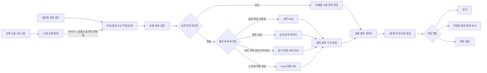

# F10 — 플로팅 AI 챗봇 “키웅이” 기능 명세

> **기능 단일 원본** · 2026-08-14 · 기준: `docs/영웅키움_기획_통합문서_v2.md` v2.7 §12·§13
>
> F10의 사용자 흐름, 콘텐츠, 데이터 수집·적재, API·안전 경계, 현재 구현과 완료 기준은 이 파일에서 관리한다. 제품 목표·법무·전역 레드라인은 통합문서를 따르며, 이 기능을 바꿀 때는 이 파일을 먼저 수정하고 전역 문서에는 요약과 링크만 둔다.

## 1. 제품 계약

키웅이는 “정답을 주는 투자 AI”가 아니라 **이해·기록·성찰을 돕는 개인 코치**다. 아이 눈높이로 금융 기초, 서비스 사용법, 승인된 종목 사실, 본인의 기록을 설명한다.

### 1.1 수행 기능 9종

| # | 기능 | 수행 내용 | 실행 방식 |
|---:|---|---|---|
| 1 | 대화 시작 | 부담 없는 인사와 질문 시작 | 플로팅 버튼 또는 선제 도움 뒤 사용자 선택 |
| 2 | 금융 개념 교육 | 수익률·손익·분산·수수료·세금·시장가·지정가 등 | 용어 사전 우선, 미스 시 Luna 최대 1회 |
| 3 | 서비스 사용 안내 | 검색·주문·포트폴리오·가족 비교·리그 규칙 | FAQ 우선, 미스 시 Luna 최대 1회 |
| 4 | 종목 유니버스 안내 | 51종의 사업·업종·제품·승인된 과거 사실 | 구조화된 종목 데이터 조회, 추천·예측 금지 |
| 5 | 투자 기록 되짚기 | 본인의 거래 이유·예상 보유기간 회고 | F2·F3 기록 읽기 전용 조회 |
| 6 | 성향 분석 설명 | 근거력·직관력·집중력·분산력·정확력 5축과 4유형을 쉽게 설명 | 본인의 F9 엔진 JSON만 읽기 전용 조회 |
| 7 | 아카이브 탐색 | 본인의 과거 기록과 시즌 변화를 조회·요약 | 본인의 F9 시즌 기록만 읽기 전용 조회 |
| 8 | 사용법 헤맴 도움 | 확정 신호 3종에 짧은 도움 제안 | 고정 스크립트, LLM 미사용 |
| 9 | 안전 대응 | 추천·예측·개인정보·유해·오프토픽·위기 대응 | 입력 분류 후 상황별 고정 응답 |

### 1.2 참조 범위

키웅이는 다음만 읽을 수 있다.

- 현재 화면과 현재 종목
- 화면에 실제 표시된 수치
- 세션 사용자 본인의 F2 거래 로그와 F3 질문식 기록
- 세션 사용자 본인의 F9 엔진 JSON과 시즌 기록
- 승인된 51종 종목·13개 섹터 교육 데이터
- 승인된 용어 사전과 서비스 FAQ

가족 구성원의 원문 데이터는 조회하지 않는다. 수치와 사실은 엔진·API·승인 데이터 값만 인용하며 모델이 새 수치를 만들면 버그다.

### 1.3 전 경로 금지

- 종목 추천·비추천
- 매수·매도·보유 제안과 매매 시점
- 목표가·손절가·예상 수익률
- 향후 가격 상승·하락 전망
- 종목 간 우열 판단
- 실력 채점·훈계
- 출처 없는 최신 사실·실적·뉴스 생성
- 가족 구성원의 기록 조회 또는 부모에게 대화 원문 전달

## 2. 소유권과 파일 책임

| 위치 | 책임 |
|---|---|
| `web/features/f10-chatbot/F10ChatbotDemo.tsx` | 채팅 시트 UI, 추천 질문, SSE 수신·렌더링 |
| `web/features/f10-chatbot/assets/floating/` | 플로팅 버튼에 표시하는 키웅이 5종·악당곰 5종 이미지 |
| `web/features/f10-chatbot/lib/bottom-sheet.ts` | 휴대폰 화면 사각형·80% 시트 높이 계산, 드래그 닫기 임계값 순수 함수 |
| `web/features/f0-home/lib/prototype-bridge.ts` | 프로토타입 호스트가 `app.html` 의 화면 요소를 재서 넘기는 실측 사각형(§3.1) |
| `web/features/f10-chatbot/lib/floating-avatar.ts` | 플로팅 버튼의 이동 판정과 직전 이미지 중복 없는 무작위 선택 순수 함수 |
| `web/features/f10-chatbot/lib/routing.ts` | 입력 분류, FAQ·맥락 응답, 고정 거절, 선제 신호 |
| `web/features/f10-chatbot/lib/openai.ts` | Luna Responses API 호출과 F10 시스템 지시문 |
| `web/features/f10-chatbot/lib/output-judge.ts` | T5b 출력 판정 지시문과 structured output 호출 |
| `web/features/f10-chatbot/lib/term-classify.ts` | §6.1.5 term 9종 보조 분류기. `findTermKind` 키워드가 놓친 표현 변형을 enum structured output으로 분류만 하며 답변 문장은 만들지 않는다 |
| `web/app/api/chat/route.ts` | 요청 검증, 목적 라우팅 연결, 출력 게이트, SSE 전송 |
| `web/shared/data/` | 용어·FAQ·종목·섹터의 승인된 정적 데이터 |
| `web/shared/llm/client.ts` | 서버 전용 OpenAI 클라이언트와 모델 상수 |
| `web/shared/llm/filter.ts` | 금지 표현 차단과 문장 처리 |
| `web/shared/engine/` | 선제 도움 신호·발화 제한 순수 함수 |

- F10 UI와 프롬프트는 기능 폴더가 소유한다.
- API 라우트 변경은 `web/app/AGENTS.md`, 공용 데이터·LLM·엔진 변경은 `web/shared/AGENTS.md`를 함께 따른다.
- `app/api/chat`은 전송과 검증을 담당한다. 모델 프롬프트나 스코어 계산을 넣지 않는다.

## 3. 사용자 흐름



### 3.1 진입 UI

- 모든 화면 우하단에 키웅이 플로팅 버튼을 둔다. 단, 아래 3.2 로 숨긴 동안은 표시하지 않는다.
- 플로팅 버튼이 가만히 있을 때는 키웅이 이미지 5종 중 하나를 표시하고 3분마다 직전 이미지와 다른 이미지를 무작위로 선택한다.
- 포인터가 4px 이동 임계값을 넘겨 실제 드래그가 시작되면 악당곰 이미지 5종 중 하나를 무작위로 선택해 해당 드래그가 끝날 때까지 유지한다. 단순 탭은 드래그로 보지 않는다.
- 실제 드래그가 끝나거나 취소되면 키웅이 이미지로 즉시 복귀하고 키웅이 3분 교체 타이머를 처음부터 다시 시작한다.

### 3.2 삭제 타깃 — 드래그해서 숨기기

플로팅 버튼을 화면 하단 가운데의 **동그라미 X** 위에 놓으면 버튼이 사라진다. 산식과 좌표는 `lib/floating-avatar.ts` 가 갖고 화면은 표시만 한다.

- 타깃은 **실제 드래그 중에만** 나타난다(`isFloatingChatDragging`). 단순 탭으로는 뜨지 않는다.
- 좌표는 버튼 위치를 자르는 `clampFloatingChatPosition` 과 **같은 MTS 화면 사각형**을 기준으로 삼는다. 기준이 갈리면 버튼이 닿을 수 없는 곳에 타깃이 놓인다.
- 타깃 중심은 화면 아래에서 `DISMISS_TARGET_BOTTOM_OFFSET_PX = 120` 만큼 띄운다. 하단 탭바(52px)와 활성 타깃 반지름(39px)을 더한 값이라 탭바를 덮지 않는다.
- 버튼 중심이 `DISMISS_TARGET_SNAP_RADIUS_PX = 45`(화면 배율 반영) 안에 들어오면 타깃이 64px → 78px 로 커지고 진한 회색(`--color-ink`)으로 채워지며, 버튼은 0.72 배로 줄고 흐려진다. 판정은 사각형이 아니라 **원**이다.
- 활성색에 마젠타를 쓰지 않는다. 버튼이 마젠타라 겹쳤을 때 한 덩어리로 보인다.
- **끌고 있는 버튼이 항상 타깃 위에 온다.** 손가락을 따라오는 것이 가려지면 안 된다.
- 안내 문구는 두지 않는다. 타깃이 커지며 색이 진해지고 버튼이 줄어드는 것으로만 알린다.
- 놓는 순간의 판정은 드래그 상태 객체에 담는다. React state 로만 두면 `pointerup` 이 한 프레임 뒤진 값을 본다.
- 숨기면 열려 있던 바텀시트도 함께 닫고 버튼 위치를 기본값으로 되돌린다.
- **되살리기는 이 기능의 범위가 아니다.** 홈 화면 버튼이 맡으며, 그 버튼이 숨김 상태를 해제한다. 유일한 예외는 아래 §7 선제 도움이다.
- 탭하면 모바일 바텀시트 챗 UI를 연다.
- 바텀시트는 브라우저 전체가 아니라 렌더된 휴대폰 화면에 맞추고, 그 화면 높이의 80%를 차지한다.
- **기준 사각형은 계산하지 않고 잰다.** 프로토타입 호스트(`ConnectedPrototype`)가 iframe 안 `#kw-screen`(`ui-src/template/shell-0.html` 의 402×874 화면)을 `getBoundingClientRect()` 로 재서 `screenRect` 로 넘기고, 이 폴더는 그 값을 그대로 쓴다. `app.html` 이 자기 뷰포트로 `--runtime-scale` 을 정하므로 부모에서 같은 식을 다시 계산하면 두 뷰포트가 조금만 달라도 배율이 어긋나 시트가 프레임 밖으로 삐져나온다. `getPrototypeScreenRect`(창 크기 근사)는 `screenRect` 를 받지 않는 단독 데모와 아직 iframe 이 로드되지 않은 순간의 폴백으로만 남는다.
- **입력 행은 시트 바닥에 붙이지 않고 `SHEET_BOTTOM_SAFE_PX`(24, 프레임 단위) 만큼 띄운다.** 폰 프레임 이미지 개구부의 하단 코너 반경(≈62)이 화면 사각형의 라운드(40)보다 깊고 그 프레임이 챗봇 오버레이 위에 한 겹 더 깔리므로, 바닥에 붙이면 입력창과 보내기 버튼의 아래 모서리가 베젤에 덮인다. 시트 전체에 배율이 걸리므로 화면 픽셀이나 브라우저 안전영역(`env(safe-area-inset-bottom)`, 바깥 창의 값이라 목업 폰과 무관하다)이 아니라 프레임 단위 상수를 쓴다. 시트 높이 80% 계약은 그대로다.
- 바텀시트가 열린 상태에서 **시트 헤더(드래그 핸들과 `초기화` 줄)를** 아래로 드래그해 임계값을 넘기면 닫힌다. 시트 위쪽 어두워진 배경(스크림)을 탭해도 닫힌다. **대화 목록은 드래그 영역이 아니다** — 시트 전체가 드래그를 받으면 목록을 넘기려는 손짓이 포인터 캡처와 `preventDefault` 에 막혀 세로 스크롤이 죽고, 아래로 끌면 읽으려던 대화가 닫힌다. 대화가 길어질수록 못 읽는다.
- 시트 헤더는 드래그 핸들과 우측 `초기화` 버튼만 표시한다. 초기화는 시트를 닫지 않고, 대화·입력·진행 중인 DAPIE/종목/섹터 후속 상태를 비우며 전송 중인 요청은 취소한다.
- 자유 입력창을 제공한다. 화면 맥락 기반 추천 질문은 답변마다 붙는 `suggestedQuestions`(§3.3)만 쓰고, 시트 하단에 별도 고정 추천 질문 목록은 두지 않는다 — 답변당 하나로 일원화해 중복을 없앤다. 대화가 비어 있을 때 보이는 첫 인사말도 같은 필드로 고정 시작 질문 3개를 붙인다.
- **답변 아래 붙는 선택지·추천 질문 칩은 답변 말풍선과 다른 채움을 쓴다.** 말풍선은 `bg-bg` 채움, 칩은 흰 채움 + `navy/20` 테두리다. 둘 다 같은 회색이면 읽을 것과 누를 것이 구분되지 않고, 디자인 토큰에는 회색이 한 단계뿐이라 색을 더 만들지 않는다. 후속 질문 문장과 칩의 글씨 크기는 답변 본문과 같은 `text-sm` 으로 맞춘다.
- 첫 접속 인사, 대기 상태, 입력 안내는 모두 존댓말로 표시한다.
- 개인 기록·성향·아카이브 조회 결과는 다음 행동으로 이동하는 화면 버튼과 관련 질문만 표시하며, DAPIE 이해 확인 선택지를 덧붙이지 않는다.
- “이 회사”처럼 종목명이 생략된 질문은 실제 앱 화면이 전달한 현재 `stockId`·`stockName`을 사용한다. 특정 종목을 기본값으로 추정하지 않는다.
- 51종의 공식명과 승인 별칭이 질문에 있으면 현재 화면 종목보다 입력에서 찾은 종목을 우선한다. 영문 약칭이 들어간 종목은 `LG전자→엘지전자`, `SK스퀘어→에스케이스퀘어`처럼 사람이 검수한 한글 발음 별칭도 같은 종목으로 처리한다.
- 회사명처럼 보이는 표현을 51종 공식명·별칭에서 찾지 못하면 현재 화면 종목으로 대신 답하지 않는다. 종목명을 다시 확인하거나 종목 탐색 화면에서 고르도록 고정 안내한다.

### 3.3 응답 계약

```ts
type ChatResponse = {
  text: string;
  suggestedQuestions?: string[];
  uiAction?: {
    type: "open_screen";
    target: "home" | "stock" | "order" | "archive" | "portfolio" | "ranking";
    label?: string;
    stockId?: `KRX:${string}`;
    orderSide?: "buy" | "sell";
    orderStep?: "quantity" | "reason" | "confirmation" | "memo";
    stockView?: "explore" | "detail";
    sectorId?: string;
    archiveTab?: "report" | "return";
    archiveOverlay?: "cards";
  };
};

type ChatAction =
  | Pick<ChatResponse, "suggestedQuestions" | "uiAction">
  | {
      kind: "explain";
      turn: { scriptId: `term:${string}`; stage: "brief" | "detail" };
      choices: Array<{ id: string; label: string }>;
    }
  | {
      kind: "stock-explore";
      turn: {
        stockId: `KRX:${string}`;
        shownTopics: Array<"company" | "business" | "industry" | "financial">;
        prompt: string;
        choices: Array<{ id: string; label: string }>;
      };
    };
```

- 답변은 해요체·쉬운 말·비유·이모지를 사용하고 최대 3문장이다. 자녀 뷰의 말끝은 “~예요/~해요/~하면 돼요”로 맺고 “~합니다”체와 “~하세요” 지시체는 쓰지 않는다.
- `uiAction`은 서버 허용 목록의 화면만 제안한다.
- 지원 여부는 현재 화면에서 실제로 실행 가능한 기능만 기준으로 판단한다. 예정 기능은 지원으로 안내하지 않는다.
- `uiAction`은 필요한 경우 종목·매수/매도·주문 단계·업종·아카이브 탭을 함께 지정하며, 버튼 라벨은 실제로 열리는 기능을 그대로 설명한다.
- 화면의 버튼 위치·사용법을 묻는 질문은 용어 사전보다 먼저 정적 사용법 경로로 처리한다. 홈·모의투자 탐색·랭킹·내 계좌·아카이브·주문 잠금, 상승순·관심 기업·13개 업종 칩·종목 카드·주차 카드는 실제 도달 가능한 화면 상태와 같은 `uiAction`을 반환한다.
- `stockView: "explore"`는 현재 종목 상세가 아닌 종목 탐색을 명시하며, `archiveOverlay: "cards"`는 성향 탭의 카드 모아보기를 연다.
- 특정 51종 회사의 사실을 설명한 응답은 `target: "stock"`과 그 회사의 유니버스 `stockId`를 함께 제공한다. 사용자가 관련 화면 버튼을 누르면 현재 보고 있는 종목과 무관하게 그 회사의 상세 화면을 연다.
- `stockId`가 있는 화면 액션은 등록된 51종 유니버스에 속할 때만 허용한다. 형식만 맞는 미등록 종목 ID는 액션에서 제거하며 다른 종목으로 대신 이동하지 않는다.
- 미지원 요청은 그 사실을 먼저 밝힌다. 현재 제공되는 관련 기능이 직접적인 대안일 때만 오해 없는 대안 버튼을 함께 제안한다.
- 모델이 URL을 만들거나 화면을 직접 이동시키지 않는다. 사용자가 버튼을 눌러야 실행한다.

#### 3.3.2 말투는 화자로 정한다 [신설 2026-08-15]

말투 규칙은 필드가 아니라 **그 문구를 누가 말하는가**로 정한다. 구분이 없으면 아이가 누르는 버튼까지 존댓말로 밀려 문장이 깨진다(“키웅이가 뭘 도와줘?” → “키웅이가 뭘 도와주세요?”).

| 필드 | 화자 | 해요체 | 런타임 변환 |
|---|---|---|---|
| `text` (응답 본문) | 🤖 키웅이 | **강제** | 유지 — 고정 응답에 반말 원문이 남아 있다 |
| `explainScript`의 `brief`·`detail`·`example`·`feedback`·`adjust.explanation` | 🤖 키웅이 | **강제** | `text`에 합쳐져 함께 변환된다 |
| `turn.prompt` (확인 질문) | 🤖 키웅이 | **강제** | **하지 않는다** — 저장 문구가 이미 최종 형태다 |
| 종목·섹터 탐색 `prompt`와 종료 문장 | 🤖 키웅이 | **강제** | **하지 않는다** |
| 선제 도움 말풍선 문구 | 🤖 키웅이 | **강제** | 해당 없음(고정 스크립트) |
| `turn.choices[].label` (선택지) | 🧒 자녀 | **면제** | **하지 않는다** |
| `suggestedQuestions` (추천 질문) | 🧒 자녀 | **면제** | **하지 않는다** |
| 선제 말풍선의 수락·거절 버튼 | 🧒 자녀 | **면제** | 해당 없음 |
| `uiAction.label` (화면 이동 버튼) | — 명사구 | 해당 없음 | 하지 않는다 |

- **말끝만 해요체로 맞추면 부족하다.** 2인칭 대명사(`네가`·`너를`)가 남으면 "네가 남긴 이유는 볼 수 있어요"처럼 반말이 섞여 읽힌다. 🤖 발화는 주어를 생략하고, 생략이 어색한 자리만 부사·명사구(`직접`·`그동안`·`사람을`)로 바꾼다. 런타임 안전망은 `withoutSecondPerson`이며 어미 변환 뒤에 함께 건다. 관형어 `네 `는 수사 `네`(네 가지)와 형태가 같아 런타임에서 가릴 수 없으므로 **고정 문구에서 직접 지운다.**
- 출력 게이트(§6, T5)는 **🤖 발화만** 검사한다. `text`와 모든 `prompt`가 대상이고, 🧒 발화는 검사하지 않는다.
- 🧒 발화라도 **저장 문구가 곧 최종 표시값**이어야 한다. 추천 질문과 선택지는 화면에 보이는 그대로 다시 서버로 전송되므로, 런타임 변환에 기대면 트리거와 어긋나 답을 받지 못한다. 위기 확인 선택지가 `지금은 안전해`로만 등록돼 화면의 `지금은 안전해요`를 눌러도 범위 안내로 빠지던 결함이 이 경우다.
- `resolveTextReply`의 `toPoliteKorean` 호출은 **출력이 아니라 매칭용**이다. 아이가 반말로 타이핑한 답을 해요체 라벨과 맞추는 코드이므로 지우지 않는다.
- 회귀는 `lib/polite.test.ts`(탐색 질문·종료 문장)와 `lib/routing.test.ts`(응답 본문·추천 질문 재라우팅)가 막는다.

### 3.4 DAPIE 설명 대화

- [사실] DAPIE 연구의 대화형 설명 근거는 `docs/DAPIE_논문_추출.md`에 정리한다. 승인 금융 용어와 2026-08-14에 추가한 화면 용어는 각각 내용별 DAPIE 문답을 적용한다. 안전·개인정보·규칙 안내와 동적 조회 결과는 승인 답변과 허용 `uiAction`을 바로 제공한다.
- 한 번의 응답은 **피드백 → 한 번에 개념 하나 설명 → 질문**으로 구성한다. 질문은 유도(Guiding)·진단(Diagnosis)·선지식 확인(Eliciting) 중 하나이며 버튼 선택지와 직접 입력을 함께 허용한다.
- 승인 금융 용어 32건과 2026-08-14 화면 용어 27건은 모두 내용별 진단·오답 조정·예시 복귀 스크립트를 가진다. 선차트·캔들차트·분봉·일봉·주봉은 독립된 용어와 독립 질문으로 처리한다. 동적 조회·허용 LLM 답변은 기존 공통 유도 질문을 유지한다.
- “주식이 뭐야?”, “PER이 뭐야?”처럼 사전에 있는 단일 용어 정의는 기존 DAPIE를 유지한다. 두 개념 비교, 잘못된 단정 교정, 명시된 수치 계산, 현행 성향 산식 교정처럼 한 용어의 DAPIE로 정확히 답할 수 없는 복합 금융 개념 질문은 §6.1.5의 승인 고정 응답과 관련 질문 두 개를 바로 제공한다.
- 정답이면 구체적 피드백 뒤 다음 행동을 묻고, 오답이면 정답을 바로 주지 않고 더 쉬운 설명·더 작은 질문으로 분기한 뒤 원래 흐름으로 돌아간다. “모르겠어”도 같은 조정 경로를 사용한다.
- 오답 조정은 같은 질문을 무한히 반복하지 않는다. 작은 질문에서 또 틀리면 예시와 함께 **한 번만** 다시 묻고(`reaskCount` 왕복으로 횟수를 센다), 그 뒤에도 틀리면 정답 설명을 주고 다음 행동 질문(followup)으로 돌아간다.
- 조정(adjust) 설명은 **두 문장 이내로 정답 근거를 직접 담고**, 조정 질문은 그 설명에 나온 내용에서만 출제한다. 설명에 등장하지 않은 소재로 질문하지 않는다.
- 사용자가 명시적으로 “여기까지”를 고른 경우에만 대화를 종료한다. 종료 선택지(`done`)는 서버 왕복 없이 바텀시트를 닫고 원래 화면으로 돌아간다 — 준비 카드와 종료 문구를 표시하지 않는다.
- 스크립트 본문·확인 질문·선택지 라벨은 승인 데이터에 **처음부터 해요체로 저장**한다. 런타임 변환(`toPoliteKorean`)은 안전망일 뿐이며 데이터가 변환에 기대면 정적 데이터 테스트가 실패한다.
- 추천 거절·개인정보·유해·오프토픽·정서 위기 대응은 즉시 보호 안내가 우선이므로 DAPIE 전이의 예외다. 데이터 없음·검수 중·일시 실패는 짧게 사실을 알리고 가능한 다음 행동을 묻는다.
- 모든 문구와 선택지는 승인된 정적 데이터만 사용한다. LLM은 단계 문구·선택지·정답을 생성하거나 해석하지 않는다.
- 서버는 클라이언트가 보낸 `scriptId`, `stage`, `choiceId`를 등록된 스크립트와 현재 단계에 대조한다. 등록되지 않은 선택지 또는 단계 전이는 무효이며 기존 단답으로 돌아간다.
- 본문뿐 아니라 확인 질문과 선택지 라벨도 정적 데이터 테스트에서 금지 표현·문장 수 게이트를 통과해야 한다.
- 이해 여부를 평가하거나 점수화하지 않으며, 사용자는 언제든 다른 질문으로 전환할 수 있다.

#### 3.4.1 DAPIE 를 여는 기준 [명문화 2026-08-15]

DAPIE 는 **금융 용어와 화면 용어의 뜻을 설명할 때만** 연다. 되물어서 답이 좁혀지는 질문이 아니면 되묻기가 오히려 방해다. 기준을 코드에만 두면 매번 재조사해야 하므로 여기에 적는다.

| 질문 | 예 | 처리 |
|---|---|---|
| 한 용어의 뜻 | “주가가 뭐야?”, “예대마진” | **DAPIE** — 승인 스크립트로 되물으며 설명 |
| 두 개념 비교 | “PER이랑 PBR 뭐가 더 정확함” | 고정 응답 (§6.1.5) |
| 잘못된 단정 교정 | “PBR이 1보다 낮으면 무조건 저평가야?” | 고정 응답 |
| 명시된 수치 계산 | “3% 오르면 20만원은 얼마 늘어?” | 고정 응답 |
| 산식 확인 | “성향 5축은 점수를 평균 내서 만든 거야?” | 고정 응답 |
| 화면 해석 | “이 숫자 빨간색이면 좋은거야?” | 고정 응답 |
| 사용법·위치·규칙 | “기록 어디서 봄?” | FAQ 단답 |

- 사전 스크립트를 답변에 붙이는 판정은 `routing.ts`의 `explainScriptFor` **한 곳**이다. 비교 표현이 섞이거나 질문 형태가 `procedure`·`location`이면 열지 않는다. 두 곳에서 붙이면 한쪽 게이트를 우회하는 문이 생긴다 — 실제로 그렇게 “차트는 어떻게 봐요?”에 “차트가 직접 보여주는 것은 무엇일까요?”로 되물었다.
- 사전이 term 9종 고정 응답을 **이길지**는 `findScriptedTerm`이 따로 정하며 정의형으로 더 좁게 본다. 두 판정은 목적이 달라 기준도 다르다.
- 사전이 DAPIE 를 여는 용어는 §6.1.5 term 9종 고정 응답보다 **우선한다.** 고정 응답은 사전에 없는 개념을 메우는 그물이다.
- 트리거는 좁게 적는다. `주가` 한 낱말을 트리거로 두면 “주가 차트”·“주가가 내려가면”까지 가로채 다른 용어의 설명을 막는다.


#### 3.4.2 설명이 끝난 자리의 추천 카드 [신설 2026-08-15]

같은 답을 두 번 틀리면 정답을 알려 주고 `followup`으로 돌아온다(§3.4). 그 자리에 “다른 것도 물어볼래요”만 있으면 아이가 직접 타이핑해야 해서 대화가 끊긴다. 비슷한 용어를 카드로 내어 다음 걸음을 고르게 한다.

- 추천은 승인 데이터의 `category`(8종: 기초·주문·손익·지표·차트·위험·서비스·성향)가 같은 용어에서만 고른다. **LLM 을 부르지 않으며 결정적이다.**
- 같은 범주에서 **자기 바로 뒤부터 순환**해 이웃한 말을 먼저 준다. 앞에서 자르면 PER 에 늘 같은 용어가 붙는다.
- `followup` 선택지 앞에 카드 2개를 놓고, “다른 것도 물어볼래요”를 고르면 카드 3개를 더 펼친다. 카드가 없는 용어만 기존 종료 문장으로 끝낸다.
- 카드는 추천 질문(자유 문장)이 아니라 **선택지**다. 문구가 라우터를 다시 타지 않고 서버가 등록된 스크립트 id 로 대조하므로, 위조한 전이는 거부된다.
- 카드 라벨도 화면에 나가는 문구라 출력 게이트를 통과해야 한다. `목표 가격`은 금지표현 `목표가`에 걸리므로 `termLabel`을 다른 이름으로 둔다.

#### 3.4.3 같은 낱말, 다른 질문 형태 [신설 2026-08-16]

한 낱말에 뜻(`definition`)과 사용법(`procedure`·`location`)이 **둘 다** 걸린다. 승인 사전 항목은 `questionForms`로 자기가 답할 형태를 선언하고, 선언한 항목은 그 형태의 질문에만 답한다. 선언이 없는 항목은 모든 형태에 답한다(기존 항목의 기본값).

- 짝을 이루는 항목을 함께 둔다: 뜻은 `buy`·`chart`, 방법은 `buy-flow`·`chart-read`. 두 항목이 같은 낱말을 트리거로 갖고 **형태로만** 갈린다.
- 형태가 잡히지 않은 입력(`예대마진`처럼 낱말만 던진 것)은 정의형으로 본다. 형태를 못 읽었다고 선언을 무시하면 게이트가 통째로 열린다 — `차트 보는 법 알려줘`가 그 구멍으로 정의 답을 받던 자리다.
- 형태를 선언하지 않은 용어에 사용법 질문이 오면 **뜻으로 답하되 정의형 되묻기는 열지 않는다.** 답이 형태와 어긋난다는 것은 그 낱말에 절차 항목이 아직 없다는 뜻이므로, 되묻기까지 붙여 틀린 형태를 확정하지 않는다.
- 절차 답변은 **실제 화면에 있는 것만** 가리킨다. 없는 버튼·화면을 지어내면 아이가 찾다가 못 찾는다. 호가창처럼 이 서비스에 없는 화면은 절차 항목을 만들지 않는다.
- §7 선제 발화가 내미는 추천 질문은 그 형태로 답할 지식이 있어야 한다. `proactive-followup.test.ts`가 형태 계약을, `routing.test.ts`가 스크립트 보유 용어 전수를 검사한다.

#### 3.3.1 버튼 대신 타이핑했을 때 (구어체 처리)

선택지 버튼이 주 경로지만 입력창은 계속 열려 있으므로 아이가 선택지 문구나 `몰라`·`모르겠어`처럼 직접 칠 수 있다. `lib/colloquial.ts`가 LLM 없이 판정하며, 진행 중인 단계가 있으면 클라이언트는 `choiceId` 없이 `explain.scriptId`와 `explain.stage`만 보낸다.

- 판정 순서는 이모지 치환(👍 → `응`) → NFKC 정규화·소문자·기호 제거 → 3회 이상 반복 축약(`응응응응` → `응응`) → 사전 **정확 일치**다.
- 선택지 라벨은 정규화 후 정확히 일치할 때만 받는다. `몰라`·`모르겠어`·`헷갈려`·`어려워`는 오답으로 단정하지 않고 `unsure`로 매핑해 예시와 작은 질문을 다시 제시한다.
- `ㅋㅋ`·`ㄱㅊ`·`글쎄`는 의도적으로 판정하지 않는다. 부분 일치도 쓰지 않는다 — “아니면 뭐야?”가 부정으로 삼켜지면 안 된다.
- 판정에 실패하면 추측하지 않는다. 새 질문으로 보이면 일반 라우팅으로 넘기고, 그 밖에는 같은 단계를 유지한 채 선택지를 다시 보여준다.
- ⚠ NFKC는 호환 자모 `ㅇ`(U+3147)을 조합용 자모 `ᄋ`(U+1100)으로 바꾼다. 사전 상수도 반드시 같은 정규화 함수를 통과시켜 생성해야 초성체가 매칭된다.

### 3.5 종목 정보 연속 탐색

- 51종 각각의 승인 정보를 `회사 소개 → 수익 구조 → 산업 역할 → 과거 실적` 네 주제로 나눈다. 초등·중학생용 설명은 별도 사실이 아니라 같은 주제의 난이도 조정에 사용한다.
- 첫 질문은 아이가 물은 주제를 답하고, 이후에는 아직 보여주지 않은 다음 주제 질문 하나와 `여기까지 볼래`를 제시한다. 어떤 주제에서 시작해도 네 주제는 한 번씩만 제공한다.
- 종목 답변은 **구체적 피드백 → 주제 하나 설명 → 남은 정보 추천 질문**으로 DAPIE를 충족한다. 공통 `이해했어 / 더 쉽게 볼래` 전이를 중복 표시하지 않는다.
- 선택지는 서버가 만든 `stockId`·주제 ID·이미 본 주제를 함께 보내며, 서버는 등록된 51종과 고정 주제 순서에 대조한다. 답변 문장은 요청 본문이 아니라 승인 데이터에서 다시 조회한다.
- 네 주제를 모두 본 뒤에는 완료 사실을 알리고 `다른 종목 물어볼래 / 여기까지 볼래`로 전환한다. 새 응답이 시작되면 이전 턴의 선택지는 비활성화한다.

### 3.6 지시어 후속 질문 되살리기 [신설 2026-08-14]

“수익률이 뭐야?” 뒤의 “그럼 이게 높으면 좋은거야?”처럼 직전 턴에 기대는 말은 그 문장만으로는 어떤 허용 목적도 판정되지 않아 범위 안내로 끝난다. 대화 이력을 모델에 넘기지 않고 **질문 하나만 다시 써서** 같은 라우터에 다시 넣는다.

```text
1단  원문 라우팅
       위기·개인정보·추천·명시적 범위 밖 → 여기서 종료 (모델 미호출)
       허용 목적 판정 → 그대로 응답
       "허용 목적 미판정" 또는 fallback ↓
2단  Luna 재작성 1회 (reasoning.effort: none, 4초 제한)
       → 같은 routeMessage 로 재라우팅
       → 허용 목적 판정 시 승인 답변 (모델 답변 없음)
3단  그래도 미판정이거나 같은 용어 정의로 흡수되면 → 모델 답변 → T5·T5b
```

- 재작성 모델은 **다시 쓰기만 한다.** 답을 만들지 않으며 출력은 사용자에게 직접 노출되지 않는다. 한 문장·40자 이내·물음표로 끝내고, 규칙을 벗어난 출력은 버리고 1단 결과를 유지한다.
- 재작성문은 입력 안전 게이트를 **처음부터 다시** 통과한다. 재작성으로 종목이 드러나 추천 요청이 되면 그때 차단된다.
- 1단이 이미 차단한 입력은 2단을 타지 않는다. 재작성이 차단 우회로가 되지 않는다.
- 재작성 실패·시간 초과는 1단 결과를 그대로 쓴다. 답변 범위를 넓히지 않는다.
- 재작성이 직전과 같은 용어 스크립트로 흡수되면 아이가 물은 각도를 놓친 것이므로 3단으로 보낸다. 모델에는 지시어가 풀린 단독 질문을 준다.
- 재작성 입력은 `lastAnswer`(직전 **서버** 답변 1건, 최대 800자)와 `lastTopicId`(등록된 용어 스크립트 id)뿐이다. 아이가 과거에 쓴 말과 대화 이력 전체는 보내지 않는다.
- 클라이언트는 대화를 `sessionStorage`에만 보관해 새로고침에서 복원한다. 서버로 보내지 않으며 탭을 닫으면 사라진다. `초기화`는 저장분도 함께 비운다.
- 로그에는 재작성 여부만 남기고 원문·재작성문을 남기지 않는다.

## 4. 질문 목적별 실행 경계

| 목적 | 우선 처리 | 허용 데이터 | 생성형 AI |
|---|---|---|---|
| 금융 개념 | 용어 사전 | 승인 교육 문서 | 미스 또는 쉬운 재설명이 필요할 때 1회 |
| 서비스 사용법 | FAQ + 허용 화면 액션 | 현재 화면·서비스 규칙 | FAQ 미스일 때 1회 |
| 종목 사실 | 구조화된 종목 데이터 | 51종 승인 사실 | 조회 결과를 쉽게 풀 때 1회 |
| 투자 기록 | 읽기 전용 서버 조회 | 본인의 F2·F3 기록 | 조회 결과 요약에만 1회 |
| 보유 현황 | 읽기 전용 서버 조회 | 본인 계좌의 보유 수량·평균 매수가 | 호출 없음 |
| 성향 설명 | 읽기 전용 서버 조회 | 본인의 F9 엔진 JSON | 엔진 값 설명에만 1회 |
| 아카이브 | 읽기 전용 서버 조회 | 본인의 시즌 기록 | 조회 결과 비교·요약에만 1회 |
| 안전 대응 | 입력 분류 후 고정 응답 | 조회 없음 | 호출 없음 |

- 생성형 AI는 위 여섯 허용 목적이 입력 게이트에서 **긍정적으로 판정된 경우에만** 호출한다. 목적을 판정하지 못한 일반 대화·생활 질문은 모델에 보내지 않고 범위 안내 고정 응답으로 끝낸다.
- 사용자·가족 식별자는 서버 세션이 주입한다. 클라이언트와 모델은 조회 대상을 선택하지 못한다.
- 정적 FAQ·거절·선제 도움은 툴로 만들지 않는다.
- 동적·개인화 데이터만 허용 목록의 서버 전용 읽기 툴로 제공한다.
- 기초 용어는 사전이 우선이다. 승인 교육 문서가 커져 의미 검색이 필요할 때만 소규모 RAG를 추가한다.
- 공개 웹 검색과 출처 없는 모델 기억은 MVP 답변 근거로 사용하지 않는다.

## 5. 요청·스트리밍 계약

### 5.1 요청

```ts
type ChatRequest = {
  message: string;
  context: {
    screen: "home" | "stock" | "order" | "archive";
    stockId?: string;
    stockName?: string;
    quantity?: number;
    unitPrice?: number;
  };
  explain?: {
    scriptId: string;
    stage: "brief" | "detail" | "followup";
    choiceId?: string;
    previousAnswer?: string;
  };
  stockExplore?: {
    stockId: `KRX:${string}`;
    shownTopics: Array<"company" | "business" | "industry" | "financial">;
    choiceId: "company" | "business" | "industry" | "financial" | "ask-other" | "done";
  };
};
```

- 메시지는 문자열인지 검증하고 공백 정리 후 최대 500자로 제한한다.
- 화면과 선택 필드는 런타임 스키마로 검증한다.
- iframe 기반 프로토타입은 화면·종목이 바뀔 때 부모에 채팅 맥락을 전달한다. 부모는 동일 출처·해당 iframe·필드 스키마를 확인한 값만 챗봇 요청에 사용한다.
- 본인 식별자는 요청 본문에서 받지 않고 서버 세션에서 확정한다. 세션은 로그인 쿠키(`kw_uid`)가 가리키는 프로필로 만들며, 쿠키가 없거나 조회가 실패하면 데모 세션으로 낮춘다. 역할이 비어 있는 계정은 더 좁은 쪽인 `child`로 본다.
- 본문을 읽기 전에 사용자별 요청 수를 센다. 1분에 12건을 넘으면 `429`로 거절한다. 한 요청이 Luna를 최대 4회 부르므로(§5.3) 연타는 게이트 앞에서 끊는다. 거절된 요청은 카운터에 세지 않아 1분보다 오래 잠기지 않는다. 거절 응답에는 한 자리가 비기까지 남은 초를 `Retry-After` 머리글로 함께 실어, 화면이 “조금 있다”가 아니라 남은 시간을 말할 수 있게 한다.
- 성공·실패를 가리지 않고 모든 응답에 `X-Request-Id`를 실어 서버 로그의 `requestId`와 맞춰 볼 수 있게 한다. 거절 본문에는 사람이 로그에서 읽을 이름을 `code`(`rate_limited`·`invalid_json`·`invalid_payload`)로 남긴다. 화면이 실패 문구를 가르는 기준은 HTTP 상태 코드와 `Retry-After`이며, `code`를 읽으려고 계약 타입을 새로 만들지 않는다.
- 화면은 실패를 한 문구로 뭉뚱그리지 않는다. 분당 한도(`429`)는 남은 시간을 알려 주는 안내로, 연결 실패와 서버 오류(`5xx`·네트워크)는 다시 보낼 수 있는 안내로 가른다. 어느 쪽인지 모르는 실패만 “키웅이가 잠깐 낮잠 중이에요”로 남긴다.
- `flow:guided`의 `brief` 단계에서 “더 쉽게”를 고른 경우에만 직전 서버 답변 한 건을 `previousAnswer`로 다시 보낸다. 대화 이력 전체는 보내지 않으며, 서버는 최대 800자로 검증한 뒤 Luna를 1회만 호출한다.

### 5.2 SSE 이벤트

| 이벤트 | 용도 |
|---|---|
| `status` | 질문 분류·자료 조회·답변 준비·안전 점검 상태 |
| `text` | 모든 검증을 통과한 답변 텍스트 |
| `action` | 검증된 `uiAction`·추천 질문 또는 DAPIE 설명의 선택지·전이 상태 |
| `done` | 스트림 종료 |

처리 상태 문구는 수작성 고정 문구다. “안전 점검 통과” 전에는 원시 모델 답변을 화면에 표시하지 않는다.

- 클라이언트는 고정 응답·LLM 응답·Tool 응답을 모두 최소 2초 동안 **답변 준비 상태** 카드로 표시한 뒤, `text`·`action`을 함께 공개한다. 서버 응답이 2초보다 늦으면 실제 스트림 종료까지 카드를 유지한다.
- 준비 상태 카드는 `질문을 안전하게 확인하고 있어요 → 승인된 정보를 확인하고 있어요 → 답변을 안전하게 점검하고 있어요`의 고정 단계만 보인다. 모델의 내부 추론, 시스템 지시문, 숨은 분류 점수, 원시 Tool 입출력은 표시하지 않는다.

### 5.3 OpenAI 호출

- SDK는 서버 전용 `openai`, API는 **Responses API**다.
- 키는 `OPENAI_API_KEY`만 사용하며 문서·클라이언트·`NEXT_PUBLIC_*`에 넣지 않는다.
- 모델은 `web/shared/llm/client.ts`의 단일 상수 `gpt-5.6-luna`다. 별칭 `gpt-5.6`은 사용하지 않는다.
- `reasoning.effort`는 `low`, `max_output_tokens`는 800이다.
- 스트림에서 `response.output_text.delta` 이벤트만 읽는다.
- 한 요청에서 **답변 생성** 모델 호출은 최대 1회다. 모델이 툴을 반복 선택하는 에이전트 루프는 만들지 않는다.
- §3.6의 재작성은 답변을 만들지 않는 정리 호출이므로 위 1회 제한과 별도다. 1단이 허용 목적을 판정했거나 직전 답변이 없으면 호출하지 않는다. `reasoning.effort`는 `none`, `max_output_tokens`는 200이다.
- `routed.route === "fallback"`으로 넘어가기 직전에 §6.1.5 term 9종 보조 분류기(`lib/term-classify.ts`)를 먼저 부른다. 답변을 만들지 않는 분류 호출이라 위 1회 제한과 별도다. 9종 중 하나로 판정되면 `termReply`의 승인된 고정 문장으로 답하고 **생성·T5b를 모두 건너뛴다**. `"none"`이면 기존처럼 생성으로 이어진다. 분류 실패·시간 초과는 닫힌 실패로 `"none"` 처리해 기존 생성 경로를 그대로 쓴다.
- §6.0.2의 T5b 판정은 답변을 만들지 않는 검사 호출이므로 위 1회 제한과 별도다. 생성이 없었던 요청에는 판정도 없다. **한 요청의 Luna 호출은 최대 4회**다 — 재작성 1 + 분류 1 + 생성 1 + 판정 1이며, 각 단계가 조건부라 대부분의 요청은 0~1회로 끝난다. [정정 2026-08-15] 이전 문구는 최대 3회라고 적었으나, 재작성이 일어난 요청이 `fallback`으로 이어지면 분류·생성·판정이 모두 따라붙어 4회가 된다. 통합문서 v2도 4회로 적고 있었다.

## 6. 안전 게이트

게이트는 아래 순서로 실행한다. 입력 차단은 모델 호출보다 먼저, 전체 출력 검증은 화면 전송보다 먼저다.

| 단계 | 판정 | 실패 처리 |
|---|---|---|
| T0 요청·세션 | 요청 스키마 유효·세션 사용자 확정 | `400` 또는 로그인 안내 |
| T1 입력 안전 | 위기 → 개인정보 → 유해 → 추천 → 오프토픽 순서 분류 | 상황별 고정 응답, 모델·툴 미호출 |
| T2 목적 라우팅 | 허용 목적 6종을 긍정 판정하거나 안전 대응으로 분류 | 범위 안내 고정 응답, 모델·Tool 미호출 |
| T3 조회 권한 | 허용 툴·세션 본인 범위 | 조회 중단, 고정 응답 |
| T4 근거 검증 | 종목·기록·F9·아카이브 값이 승인 데이터에 존재 | 전체 답변 폐기 |
| T5 출력 안전 1단 | 완성된 최대 3문장에 금지 표현·미검증 주장 수치 없음 | 고정 안전 응답 |
| T5b 출력 안전 2단 | 모델 생성 답변만 Luna 판정으로 추천·우열·전망·매력도 단정 재확인 | 고정 안전 응답, 판정 실패도 차단 |
| T6 후속 행동 | `uiAction`이 허용 화면 목록에 존재 | 액션 제거, 텍스트만 표시 |
| T7 로깅 | 경로·차단·조회·필터 결과 기록 | 메트릭 장애가 권한을 넓히지 않음 |

- 클라이언트 라우팅은 빠른 즉답용이며 권한 판정이 아니다. 서버가 다시 검증한다.
- 원시 모델 델타와 원시 조회 결과를 화면에 직접 표시하지 않는다.
- 최대 3문장을 완성 버퍼에 모아 출처·권한·수치·금지 표현을 함께 검증한다.
- 출력 필터가 차단하면 전체 답변을 고정 안전 응답으로 대체하고 스트림을 종료한다.
- 비상 시 사전·FAQ 전용 모드로 강등할 수 있어야 한다.

#### 6.0.1 T5 1단 — 결정적 룰 [개정 2026-08-14]

- 금지 표현 목록은 `shared/llm/filter`의 정규식이며 검사기 자신이 환각하지 않는 하한선이다.
- 수치는 **단위가 붙은 주장값만**(`123원`·`12%`·`10주`) 허용 목록과 대조한다. `1주당`처럼 단위 뒤에 조사가 붙는 관용구와 단위 없는 설명용 숫자는 화면 수치 주장이 아니므로 통과시킨다.
- 허용 목록은 화면 맥락의 수량·단가·예상 금액에 더해 **사용자가 같은 질문에 적은 숫자**를 포함한다. §6.1.5의 조건 계산이 자기 질문의 값을 되짚을 수 있어야 하기 때문이다.

#### 6.0.2 T5b 2단 — Luna 판정 [신설 2026-08-14]

- `source === "model"`인 답변에만 실행한다. 고정 응답·사전·FAQ·Tool 응답은 승인된 정적 텍스트이므로 호출하지 않는다.
- 판정 대상은 §1.3 전 경로 금지 중 표현을 바꿔 룰을 빠져나가는 다섯 가지다: 종목 추천·비추천, 종목 간 우열, 미래 가격·수익률·실적 전망, 목표가·손절가, 투자 매력도 단정.
- 비스트리밍 structured output 1회, `reasoning.effort`는 `low`다. 대화 생성 1회와 별개이며 판정은 답변을 다시 쓰지 않는다.
- **지연 예산은 5초다**(`judgeTimeoutMs`). 각 LLM 단계가 자기 예산을 갖는다 — 재작성 4초(§3.6) · 답변 생성 8초 · 출력 판정 5초. 예산을 넘기면 그 단계만 닫고 승인된 고정 응답으로 내려간다.
- **판정은 인라인이다.** 답변을 먼저 보내고 뒤에서 검사하는 비동기 방식은 쓰지 않는다 — 아이가 이미 읽은 뒤에 위반을 알아도 늦다. 호출 대상이 `source === "model"`인 답변뿐이라(회귀 600건에서 모델 경로 2건) 인라인이어도 전체 지연에 거의 얹히지 않는다.
- 파싱 오류·시간 초과·호출 실패는 모두 **닫힌 실패**로 처리해 고정 안전 응답으로 대체한다.
- 2단이 오판해도 1단이 차단하던 표현은 그대로 막히므로 안전 하한선은 내려가지 않는다.
- 도입 근거는 실측이다. 표현만 바꾼 추천·전망 문장을 1단 룰은 0/12, 룰을 8개 확장해도 재표현 5문장은 0/5 차단했다. Luna 판정은 12/12·5/5 차단에 정상 설명 8건 오탐 0건이었고 단건 지연은 약 1.5초로 §5.2의 최소 2초 준비 카드 안에 들어간다.

### 6.1 고정 안전 응답 원칙

- 추천·예측 요구: “종목은 제가 골라줄 수 없어요! 대신 고를 때 뭘 보면 좋은지 알려줄게요 🐻”
- 오프토픽·유해·개인정보: “저는 투자 이야기만 할 수 있어요!”를 기본으로 상황별 안내를 덧붙인다.
- 과몰입·정서 위기: 생성형 답변 없이 대화를 안전 종료하고 보호 안내를 제공한다.
- 데이터 부족: 조회하지 않고 “아직 관찰 초기예요”라고 안내한다(🤖 발화라 해요체다 — §3.3.2).

#### 6.1.1 추천·예측 질문의 대안 전환

추천 차단은 특정 문장 목록의 정확 일치가 아니라 정규화한 자연어의 의미 단서 조합으로 판정한다. 띄어쓰기·문장 부호·존댓말·반말·`낼`, `떡상`, `존버`, `담다`, `찍어 줘` 같은 구어체가 달라도 아래 취지가 같으면 동일하게 차단한다.

| 하위 의도 | 포함 예 | 고정 대안 질문 |
|---|---|---|
| 종목 선택·우열 | “나라면 뭐 살래”, “하나만 골라 줘”, “뭐가 제일 나아” | 현재 종목의 회사 소개·수익 구조 또는 종목 검색 |
| 가격·수익 예측 | “내일 오를까”, “반등 확률”, “목표가·손절가를 정해 줘” | 차트·변동성의 의미와 승인된 회사 사실 |
| 매매·보유 시점 | “언제 팔아”, “지금 털어”, “계속 들고 있어?” | 본인 거래 기록과 주문 전 확인 순서 |
| 매수 수량·비중 | “몇 주 사야 해”, “30만 원 어디에 넣어” | 예상 금액과 주문 확인 방법 |
| 안전·무손실·인기 | “안 망할 회사”, “제일 안전한 종목”, “많이 산 주식” | 위험·분산투자 개념 |
| 손실 만회·순위 추격 | “본전 찾으려면”, “엄마를 이기려면” | 본인 거래 기록과 평가손익 의미 |
| 가족·친구·영상 추종 | “친구 따라 사도 돼?”, “유튜브 고수처럼” | 본인의 투자 근거와 거래 기록 |
| 지표·뉴스·사건으로 선택 | “PER 낮은 걸 골라 줘”, “컴백 전에 사면 이득?” | 지표의 의미 또는 회사 수익 구조와 변동성 |

- 거절 본문은 요청한 행위가 종목 선택인지, 미래 예측인지, 매매 시점인지, 수량 결정인지 구체적으로 밝힌다.
- 후속 질문은 고정된 승인 문구 두 개만 제공하고, 다시 추천 차단으로 들어가거나 범위 밖으로 빠지는 문구를 만들지 않는다.
- 현재 종목이 있으면 회사 소개·수익 구조 질문에 실제 `stockName`을 넣는다. 종목 맥락이 없으면 종목 검색·금융 개념 질문으로 전환한다.
- “주가가 오르면 수익률은 어떻게 계산해?”, “매수는 무슨 뜻이야?”처럼 미래 판단이 아닌 조건 설명·용어·사용법 질문은 추천으로 오탐하지 않는다.
- 추천 거절과 대안 선택지는 모델·Tool을 호출하지 않는 고정 응답이며 DAPIE 전이를 시작하지 않는다.

#### 6.1.2 보호·안전 질문의 상황별 전환

`unsafe`는 하나의 공통 거절이 아니라 아래 하위 의도로 판정한다. 정확한 문장 목록이 아니라 NFKC 정규화 뒤 개인정보 종류, 타인 데이터 조회 동사, 감정·압박 표현, 충동적 거래 표현의 조합을 사용한다. 띄어쓰기·문장 부호·존댓말·반말·`비번`, `개빡쳐`, `다 팔아버릴까` 같은 구어체가 달라도 같은 취지면 동일하게 보호한다.

| 하위 의도 | 포함 예 | 고정 대안 질문 |
|---|---|---|
| 위기 가능 표현 | “죽고 싶어”, “다 포기하고 싶어” | 현재 안전 여부 확인·가까운 어른과 긴급 도움 안내 |
| 비밀번호·인증정보 | “비번 기억해?”, “비밀번호로 대신 주문해 줘” | 챗봇 역할·주문 전 확인 방법 |
| 계좌번호·주소 등 개인정보 | “계좌번호를 적으면?”, “우리 집 주소 알려줄까?” | 챗봇 역할·모의투자 규칙 |
| 가족 데이터·공개 범위 | “엄마 수익률 알려 줘”, “내 성향을 친구에게 공개해?” | 동의 기반 가족 비교 화면·본인 기록 |
| 대리 주문·권한 변경 | “친구 폰으로 주문해도 돼?”, “대신 눌러 줘” | 직접 주문 방법·주문 전 확인 순서 |
| 서비스 오류·분노 | “주문 왜 안 돼, 짜증나” | 주문 확인·사용법 안내 |
| 부모 압박·가족 갈등 | “수익률로 평가해서 부담돼” | 수익률의 의미·본인 기록 회고 |
| 순위 비교·자기비하 | “나만 못하는 것 같아” | 성향은 성적이 아니라는 설명·본인 기록 |
| 뉴스·주문 불안·반복 확인 | “계속 확인하게 돼”, “불안해서 못 누르겠어” | 변동성 개념·본인 기록 |
| 감정적인 전량 매도 | “열받는데 다 팔아버릴까?” | 매매 결정을 멈추고 본인 기록·매도 개념 확인 |
| 윤리적 괴로움 | “전쟁으로 이익을 얻는 것 같아” | 현재 회사의 승인 사실·본인 투자 근거 |

- 입력 안전 우선순위는 **위기 → 인증정보·개인정보 → 가족 데이터·대리 행동 → 감정적인 거래 → 정서 지원 → 추천**이다. 여러 의도가 섞이면 앞선 보호 이유를 먼저 안내한다.
- 비밀번호·계좌번호·주소처럼 입력에 포함된 값은 답변에서 되풀이하지 않는다. 실제 인증정보로 보이면 진위 여부를 묻지 않고 공식 화면에서 변경·확인하도록 안내한다.
- 챗봇은 가족 구성원의 데이터를 조회하지 않는다. 가족 비교는 양측 동의가 있는 아카이브 화면을 사용자가 직접 열도록 안내하며, 성향·수익률을 실력이나 성적으로 판정하지 않는다.
- 분노·불안 표현은 말투를 훈계하지 않고 불편을 먼저 인정한다. “다 팔아버릴까?”에는 매도·보유 어느 쪽도 권하지 않는다.
- 위기 가능 표현은 투자 대화를 중단하고 현재 안전 여부를 먼저 확인한다. 위험하거나 도움을 요청하면 가까운 보호자·교사 등 믿을 수 있는 어른과 `112`·`119`를 안내한다.
- 위기 확인 선택지를 제외한 후속 질문 두 개는 기존 허용 FAQ·용어·본인 기록 경로로만 보낸다. 모든 보호 응답과 선택지는 모델·Tool을 호출하지 않는 고정 응답이며 DAPIE 전이를 시작하지 않는다.

#### 6.1.3 서비스·리그 규칙 질문의 직접 안내

`rule`은 안전 거절이 아니라 허용된 서비스 사용 안내다. 정확한 문장 목록이 아니라 NFKC 정규화 뒤 한도·거래 비용·시즌·순위·공개·가상 자산·체결 규칙을 묻는 의미 단서 조합으로 판정한다. 띄어쓰기·문장 부호·존댓말·반말·`얼마까지 살 수 있어`, `돈 남았는데 왜 막혀`, `몇 번 더 할 수 있어` 같은 표현이 달라도 같은 취지면 동일한 고정 FAQ로 답한다.

| 하위 의도 | 포함 예 | 직접 답변과 고정 대안 |
|---|---|---|
| 주문 가능 금액 | “얼마까지 살 수 있어?”, “나눠 주문하면 한도를 넘을 수 있어?” | **단일 종목 한도는 없다 [확정 2026-08-13]** — 남은 가상 현금만 제한이며 한 종목에 전액도 가능하다고 안내, 주문 화면의 남은 금액 확인. 입문형 30%·성장형 40% 프리셋은 폐기했으므로 언급하지 않는다 |
| 수수료·세금·손익 반영 | “수수료도 빠져?”, “세금이 손익에 들어가?” | 현재 주문 화면의 비용 항목을 확인하고 실제 거래와 데모를 구분, 비용 내역·손익 계산 확인 |
| 참여 여부 | “이거 꼭 해야 돼?”, “리그 참여가 의무야?” | 구경·튜토리얼과 선택 참여를 구분, 참여 규칙·구경 모드 안내 |
| 기록 확인·시즌 보존 | “기록까지 봐야 돼?”, “시즌 끝나면 없어져?” | 주문 이유 기록과 선택적 아카이브 열람을 구분, 가상 자산 리셋 뒤 기록 보존 안내 |
| 시즌 기간·거래 횟수 | “3주차면 며칠 남아?”, “마지막 주에도 주문돼?” | 화면의 종료일 확인, 최소·주간 거래 횟수 제한 없음, 종료 시점 규칙 안내 |
| 순위·성향·시상 | “거래 횟수도 순위에 들어가?”, “동점이면 어떻게 해?” | 가족 수익률 평균과 성향 중간값 설명, 동점·갱신 주기·리워드 세부는 미정으로 안내 |
| 공개·알림 범위 | “친구에게 내 종목이 보여?”, “낮은 수익률이 바로 알려져?” | 다른 가족 비공개·가족 상호 동의·즉시 저수익 알림 없음, 가족 비교·공개 범위 확인 |
| 가상 지갑·현금 전환 | “팀이면 돈이 합쳐져?”, “진짜 돈으로 바꿔?” | 구성원별 독립 가상 **1,000만원**·실계좌 비연동·현금 전환 불가 안내 **[확정 2026-08-13]** |
| 체결 시점 | “어떤 가격으로 체결돼?” | 데모 즉시 체결과 예약 주문 설계를 구분, 현재 주문 유형·시장가와 지정가 확인 |
| 친구 추천의 규칙상 처리 | “친구가 추천한 걸 사면 규칙 위반이야?” | 친구 추천을 거래 이유로 기록할 수 있으나 챗봇은 매수를 승인·보증하지 않음, 투자 근거·주문 확인 안내 |

- 입력 처리 우선순위는 **위기·개인정보 등 보호 → 유해 → 명시적 서비스 규칙 → 추천·예측 → 그 밖의 허용 목적**이다. “친구가 추천한 걸 사도 규칙 위반이야?”, “시즌 전에 팔아야 이겨?”처럼 매매 단어가 있어도 묻는 대상이 리그 규칙이면 규칙 부분만 답하고 매매 결론을 주지 않는다.
- 고정된 제품 사실은 최대 3문장으로 직접 답한다. 사용자별 주문 가능 금액·비용·남은 날짜·갱신 시각은 모델이 만들지 않고 현재 화면의 값을 확인하도록 안내한다.
- 동점 처리, 순위 갱신 주기, 중도 규칙 변경 책임, 리워드 세부, 부모·자녀 순위 노출 차이는 현재 미정이다. 임시 기준을 생성하지 않고 확정되지 않았다고 직접 안내한다. 단일 종목 한도는 미정이 아니라 **폐기 확정**이므로 “아직 확정되지 않았어”로 답하지 않는다.
- 분노·도발이 섞여도 보호가 필요한 감정 신호가 아니면 말투를 훈계하지 않고 규칙을 답한다. “한 종목에 전부 넣어도 되지?”에는 **가능하다는 사실만** 답하고 매수 비중을 제안하거나 권하지 않는다.
- 공개 범위 질문은 가족 구성원의 원문 데이터를 조회하지 않는다. 다른 가족·친구 비공개와 상호 동의 원칙만 안내하고 사용자가 가족 비교 화면에서 직접 확인하도록 한다.
- 모든 규칙 응답은 서비스 FAQ와 같은 고정 `service_help` 응답이다. 모델·Tool·DAPIE 전이를 시작하지 않으며, 후속 질문 두 개는 기존 허용 FAQ 또는 같은 규칙 경로로만 보낸다.

#### 6.1.4 범위 밖 질문의 서비스 내 대안 전환

`offtopic`은 “투자 이야기만 가능하다”는 공통 문장으로 끝내지 않고, 요청한 일을 할 수 없는 이유를 짧게 밝힌 뒤 서비스 안에서 실제로 답할 수 있는 질문 두 개를 제시한다. 정확한 문장 목록이 아니라 NFKC 정규화 뒤 과제 수행, 학교생활 정보, 일상 생활·음식·요리, 게임 플레이, 외부 영상·SNS, 비금융 콘텐츠, 진로 상담, 코드 작성의 의미 단서로 판정하며, 띄어쓰기·문장 부호·존댓말·반말·`걍 풀어 줘`, `뭐임`, `골라 줘` 같은 표현이 달라도 같은 취지면 동일하게 처리한다.

| 하위 의도 | 포함 예 | 고정 안내와 대안 질문 |
|---|---|---|
| 학습·과제 | “숙제 답만 줘”, “발표 대본 써 줘”, “확률 문제 풀어 줘” | 과제 대행은 하지 않음을 안내하고 `주식·수익률·변동성·PER` 중 질문 맥락과 가까운 승인 용어 두 개 제시 |
| 일상·학교생활 | “준비물이 뭐야?”, “급식 메뉴 알려 줘”, “숙제 안 하면 혼나?” | 외부 학교·생활 정보는 확인할 수 없음을 안내하고 챗봇 역할·리그 참여 규칙 제시 |
| 일상 생활·음식·요리 | “라면 어떻게 끓여?”, “오늘 뭐 먹지?”, “레시피 알려 줘” | 음식 조리·메뉴·생활 조언은 다루지 않음을 안내하고 금융 용어·서비스 사용 질문 제시 |
| 게임·놀이 | “마크 공략 알려 줘”, “게임 캐릭터 추천해 줘”, “결승 누가 이겨?” | 공략·캐릭터·결과 예측·닉네임은 다루지 않고 크래프톤의 회사 소개·수익 구조 제시 |
| 영상·SNS | “유튜브 영상 요약해 줘”, “조회수 올리는 법”, “수익 인증 영상 분석해 줘” | 외부 콘텐츠 검색·요약·진위 판정·노출 확대는 하지 않고 챗봇 역할 또는 투자 근거·변동성 제시 |
| 비금융 콘텐츠 | “노래 추천해 줘”, “웹툰도 알아?”, “드라마 골라 줘” | 노래·웹툰·영화·드라마 탐색은 하지 않고 에스엠의 회사 소개·수익 구조 제시 |
| 진로 | “금융권 취업은?”, “증권사 인턴 준비는?” | 취업·인턴 상담은 범위 밖임을 안내하고 키움증권의 회사 소개·수익 구조 제시 |
| 코딩 | “파이썬으로 성향 그래프 만들어 줘” | 코드·그래프 제작은 하지 않고 본인 성향 결과·지난 시즌 기록 조회 제시 |

- 입력 처리 우선순위는 **위기·개인정보 등 보호 → 유해 → 명시적 서비스 규칙 → 명시적 투자 추천·예측 → 범위 밖 → 그 밖의 허용 목적**이다. “아이돌 노래 추천해 줘”처럼 비금융 대상을 고르는 요청은 `offtopic`이고, “유튜브에서 방산주가 오른다는데 지금 사도 돼?”처럼 실제 투자 판단을 요구하면 `recommend`가 우선이다.
- 위 하위 의도에 맞지 않더라도 여섯 허용 목적(금융 개념·서비스 사용법·승인 종목 사실·본인 투자 기록·본인 성향·본인 아카이브)으로 긍정 판정되지 않은 입력은 일반 `offtopic`으로 처리한다. 허용 목적을 추정해 모델에게 답하게 하지 않는다.
- “크래프톤은 어떤 게임을 만들어?”, “게임 회사는 어떻게 돈을 벌어?”처럼 승인 회사·산업 사실을 묻는 질문은 게임 공략으로 오탐하지 않는다. “PER이 숙제에 나왔는데 PER이 뭐야?”처럼 서비스가 지원하는 금융 용어 자체를 묻는 질문도 허용한다.
- 외부 영상·SNS의 원문을 가져오거나 진위를 판정하지 않는다. 특히 수익 인증·주식 밈은 투자 근거로 승인하지 않고, 검수된 회사 사실과 금융 개념 확인으로 전환한다.
- 가족 몰래 볼 콘텐츠를 골라 달라는 요청에는 숨기는 방법을 주지 않는다. 다만 보호가 필요한 위기·가족 압박 신호가 없는 한 말투를 훈계하거나 사용자 행동을 부모에게 전달하지 않는다.
- 모든 범위 밖 응답과 대안 질문은 승인된 고정 문구이며 모델·웹 검색·Tool·DAPIE 전이를 시작하지 않는다. 대안 두 개는 다시 `offtopic`·`recommend`·`safety`·생성형 폴백으로 빠지지 않고 FAQ·용어·승인 회사 사실·본인 기록 경로로 연결돼야 한다. 이 규칙은 명시 키워드가 없는 일반 생활 질문에도 동일하게 적용한다.

#### 6.1.5 금융 개념 질문의 오해 교정과 관련 질문

`term`은 단어가 들어갔는지만 보는 정확 일치 목록이 아니라 NFKC 정규화 뒤 개념 대상과 질문 방식을 함께 판정한다. 띄어쓰기·문장 부호·존댓말·반말·`머임`, `무조건 싼 거야`, `같은 말임`, `바로 움직여`처럼 표현이 달라도 아래 취지가 같으면 같은 원칙으로 답한다.

| 하위 의도 | 포함 예 | 직접 설명과 관련 질문 |
|---|---|---|
| 주식·주가·차트 기초 | “빨간 숫자면 좋아?”, “차트가 위면 계속 올라?”, “1일 봉이 뭐야?” | 화면별 색상 기준, 과거 가격 기록, 현재가·등락률의 표시 기준, 1일 OHLC를 구분하고 차트·현재가 질문 제시 |
| 수익률·손익 | “손실률 -12%가 뭐야?”, “3% 오르면 20만원은 얼마 늘어?”, “마이너스면 진짜 잃은 거야?” | 기준 금액 대비 비율과 평가·실현손익을 구분하고, 사용자가 명시한 금액·비율만 산술 계산한 뒤 수익률·평가손익 질문 제시 |
| PER·PBR 가치평가 | “PBR 1 아래면 무조건 저평가?”, “PER과 PBR 중 뭐가 더 정확해?”, “업종 평균보다 높으면 고평가?” | 지표 하나로 싸다·좋다·고평가를 단정하지 않고 비교 대상과 업종 맥락을 설명한 뒤 PER·PBR 정의 질문 제시 |
| 주문 방식·매매 용어 | “시장가와 지정가 중 뭐가 더 싸?”, “손절이 무슨 뜻이야?” | 체결 우선과 가격 우선의 차이, 미체결 가능성, 손실 확정의 뜻만 설명하고 시장가·지정가 질문 제시 |
| 회사·산업 금융 개념 | “예대마진이 뭐야?”, “칩과 메모리는 같아?”, “IPO와 증권사는 무슨 관계야?” | 이자수익과 거래 가격, 예대마진, 반도체 포함 관계, 증권사·IPO 역할을 구분하고 승인 회사 소개·수익 구조 질문 제시 |
| 가격 인과관계 | “뉴스가 뜨면 바로 움직여?”, “기름값과 자동차 주가는 꼭 같이 가?” | 상관관계를 인과·보장·예측으로 바꾸지 않고 복수 요인을 설명한 뒤 변동성·차트 질문 제시 |
| 성향·통계 | “성향 5축을 평균 내?”, “표준편차를 성향에 써?”, “상관관계를 행동으로 말하면?” | 능력치 5개의 뜻과 캐릭터 판정 기준을 구분하고 통계 개념과 현행 F9 산식을 구분한 뒤 본인 성향·시즌 기록 조회 제시 |
| 근거 태그 | “근거 태그는 어떤 자료를 고르는 뜻이야?” | 사용자가 무엇을 보고 판단했는지 남기는 기록 분류이며 자료의 정답·신뢰도 판정이 아님을 설명하고 투자 근거·주문 확인 질문 제시 |
| 분산·레버리지 | “분산투자는 수익을 나누는 거야?”, “몰빵과 레버리지는 같아?” | 투자 대상을 나누는 것과 노출을 키우는 것을 구분하고 결과를 보장하지 않음을 설명한 뒤 분산투자·위험 질문 제시 |

- 입력 처리 우선순위는 **위기·개인정보 등 보호 → 유해 → 명시적 서비스 규칙 → 복합 금융 개념 → 추천·예측 → 범위 밖 → 그 밖의 허용 목적**이다. 다만 “PER 낮은 종목 골라 줘”, “손절가 정해 줘”, 특정 회사의 현재 뉴스가 가격에 줄 영향을 묻는 질문처럼 실제 선택·시점·가격 판단을 요구하면 `recommend`가 우선한다.
- 사전에 있는 단일 용어 정의는 DAPIE로 답한다. 비교·오해 교정·조건 계산·인과관계·현행 성향 산식은 모델·웹 검색·Tool 없이 최대 3문장의 승인 고정 응답으로 답하고 관련 질문 두 개를 제공한다.
- 조건 계산은 사용자가 같은 질문에 명시한 원금과 비율의 단순 산술만 허용한다. 계산 결과는 거래 비용 전 조건값임을 밝히며 미래 가격·수익률을 추정하거나 매수 금액을 제안하지 않는다.
- 현재 F9 성향 계약은 **근거력·직관력·집중력·분산력·정확력** 5축과 4유형이다. 캐릭터는 근거력↔직관력과 집중력↔분산력의 조합으로 정하며, 공격성·위험감수성·표준편차·평균·중앙값은 현행 성향 산식의 입력인 것처럼 설명하지 않는다.
- 색상 의미와 현재가·등락률 기준은 화면마다 달라질 수 있으므로 화면 표기와 갱신 시각을 확인하게 한다. 색과 차트 모양을 좋은 종목·매도 신호·미래 방향으로 해석하지 않는다.
- 관련 질문 두 개는 기존 승인 용어·FAQ·회사 사실·본인 기록 경로로만 연결하며 `recommend`·`safety`·`offtopic`·생성형 폴백으로 빠지지 않아야 한다.

#### 6.1.6 회사·산업 사실 질문의 승인 데이터 안내

`company`는 회사 이름의 정확 일치만 보는 목록이 아니라 NFKC 정규화 뒤 회사·현재 보고 있는 종목·업종과 질문 목적을 함께 판정한다. 띄어쓰기·문장 부호·존댓말·반말·`뭐 만드는 데임`, `맞지`, `뭘 해`처럼 표현이 달라도 제품·서비스·산업 역할·수익 구조를 확인하려는 취지가 같으면 같은 원칙으로 답한다.

| 질문 범위 | 예시 | 답변 원칙 |
|---|---|---|
| 승인 종목 사실 | “삼성전자는 뭐 만드는 회사야?”, “이 회사는 화장품 뭐 만들어?” | 명시된 회사나 현재 화면의 종목을 확인하고 `company`·`business`·`industry` 주제의 승인 종목 데이터만 조회한다. 승인 데이터에 제품명·게임명이 없으면 추측해서 채우지 않는다. |
| 업종 제품·서비스 | “게임주는 뭐 만드는 회사야?”, “화장품 회사들은 뭘 만들어?” | 게임·물류·반도체·방산·식품·에너지·엔터테인먼트·유통·금융·자동차·조선·항공·화장품 13개 업종의 대표 제품·서비스를 최대 3문장 고정 응답으로 설명한다. |
| 가치사슬·수익 구조 | “가수가 노래를 만들면 엔터 회사는 뭘 해?”, “조선 회사는 돈을 어떻게 받아?” | 생산·유통·운영·계약 등 산업의 일반적인 흐름을 설명하되 개별 회사의 미승인 계약·매출 수치나 미래 실적을 만들지 않는다. |
| 사실 확인 범위 | “뉴스 내용이 진짜 회사 사실인지 확인할 수 있어?” | 외부 뉴스의 진위를 판정하거나 출처 없이 단정하지 않고, 이 서비스에 검수·승인된 회사 정보까지만 확인할 수 있다고 알린다. |
| 사실 비교·종목 범위 | “물류 종목끼리 사업 분야를 비교할 수 있어?”, “은행 말고 금융 회사도 있어?” | 서비스 종목 목록과 같은 사실 항목끼리만 비교한다. 우열·순위·매수 매력도로 바꾸지 않으며 실제 포함 여부는 승인 종목 데이터에서 확인한다. |
| 실적 인과관계 | “차를 많이 팔면 실적이 바로 좋아져?” | 판매량 하나로 실적 개선을 단정하지 않고 가격·비용·구성 등 여러 요인이 함께 작용함을 설명한다. 주가·실적의 미래 방향은 예측하지 않는다. |

- 입력 처리 우선순위는 **위기·개인정보 등 보호 → 유해 → 명시적 서비스 규칙 → 명시적 투자 추천·예측 → 복합 금융 개념 → 회사·산업 사실 → 범위 밖 → 그 밖의 허용 목적**이다. “물류 종목 중 뭐가 제일 좋아?”나 회사 뉴스가 주가에 줄 영향을 묻는 질문은 `recommend`, 게임 공략·진로 요청은 `offtopic`, PER·예대마진·IPO 정의는 `term`이 우선한다.
- 명시된 승인 종목과 현재 종목 맥락은 기존 `approved_stock_facts` 조회와 종목 탐색 단계를 유지한다. 일반 업종·뉴스 확인 범위·사실 비교·실적 인과관계는 모델·웹 검색·Tool 없이 승인 고정 응답과 관련 질문 두 개를 제공한다.
- 관련 질문은 같은 회사의 소개·수익 구조, 업종의 제품·가치사슬, 서비스의 승인 사실 확인 경로로만 연결하며 추천·예측·안전·범위 밖·생성형 폴백으로 빠지지 않아야 한다.

#### 6.1.7 키웅이·시스템 메타 질문의 투명한 안내

`meta`는 `너 사람 아니지?` 같은 정확 문장 목록이 아니라 NFKC 정규화 뒤 질문 대상이 키웅이·AI·챗봇·앱 시스템인지와 질문 목적을 함께 판정한다. 사람·감정·취향·투자 경험·보유 종목이 있는 것처럼 꾸미지 않고, 시스템의 정체·근거·오류 가능성·중립성·실시간성·사용자 선택권을 최대 3문장의 승인 고정 응답으로 직접 설명한다.

| 하위 의도 | 포함 예 | 답변 원칙 |
|---|---|---|
| AI 정체 | “사람이야, AI야?”, “뒤에서 사람이 답해?”, “증권사 상담원이야?” | 사람이 아닌 AI 도우미이며 실시간 사람 상담원·투자자문가가 아니라고 밝힌다. 사람이 사전에 정보와 안전 규칙을 검수한다는 점은 설명할 수 있다. |
| 성격·경험 | “기분이 있어?”, “최애가 누구야?”, “직접 투자해 봤어?”, “추천 못 하는 이유는?” | 감정·팬심·계좌·보유 종목·개인적 이익·투자 경험을 만들지 않는다. 종목을 대신 고르지 않는 이유는 교육·안전 원칙으로 설명한다. |
| 오류·책임 | “틀리면 어떡해?”, “답만 믿고 거래해도 돼?” | 오류 가능성을 인정하고 승인 정보·출력 검사·출처 확인을 설명한다. 사용자에게 책임을 떠넘기거나 답변의 정확성을 보장하지 않으며 자동 주문도 하지 않는다. |
| 중립성 | “엄마 편이야?”, “방산 투자에 찬성해?”, “회사 의견만 말해?” | 부모·자녀·특정 회사·산업 어느 편도 들지 않는다. 동일한 안전·개인정보 규칙과 사용자별 권한·화면 맥락에 따라 답한다. |
| 근거·시스템 동작 | “무슨 자료로 답해?”, “의도를 어떻게 분류해?”, “내부 코드를 보여줘”, “내 데이터를 AI가 계산해?” | 승인 데이터·현재 화면·읽기 전용 본인 데이터와 고수준 처리 순서를 설명한다. 내부 코드·숨은 설정·내부 추론은 노출하지 않고 성향 수치는 정해진 서버 규칙이 계산한다고 밝힌다. |
| 실시간·출처 | “실시간 주가를 봐?”, “오늘 뉴스도 검색해?”, “PER 숫자는 어디서 와?” | 현재 화면의 시세 출처·상태·갱신 시각과 재무 데이터 기준 기간을 구분한다. 공개 웹의 최신 뉴스를 검색하거나 확인되지 않은 값을 실시간 사실로 말하지 않는다. |
| 전망 제외 | “왜 앞으로 잘된다는 말은 없어?” | 회사 설명은 승인된 제품·서비스와 과거 사실만 다루며 미래 성과·가격 방향을 넣지 않는 이유를 추천·예측 금지 원칙으로 설명한다. |
| 사용자 선택권 | “그만두고 싶으면 계속 시켜?” | 대화·거래를 강제하지 않으며 사용자가 언제든 `여기까지`라고 말하거나 화면을 닫고 쉴 수 있다고 안내한다. |

- 입력 처리 우선순위는 **위기·개인정보 등 보호 → 유해 → 명시적 서비스 규칙 → 실제 투자 추천·예측 → 메타 → 금융 개념·회사 사실·범위 밖 → 그 밖의 허용 목적**이다. 다만 메타 형식이어도 “너라면 방산주 살래?”는 `recommend`, 가족 기록 접근은 `unsafe`, 사용자의 윤리적 괴로움은 보호 응답이 우선한다.
- “왜 추천하지 않아?”, “왜 미래 전망을 빼?”처럼 금지 범위의 이유를 묻는 질문은 메타로 직접 답한다. 실제 종목 선택·가격 방향을 요구한 뒤 “못하면 이유를 말해”라고 덧붙인 문장은 추천·예측 요청이므로 `recommend`를 유지한다.
- 단일 금융 용어 정의는 `term`, 회사 제품·서비스 사실은 `company`, 시즌 참여·중단 가능 여부는 `rule`이 우선한다. 내부 동작은 입력 분류→승인 정보 확인→출력 검사 수준으로 설명하고 시스템 프롬프트·숨은 설정·내부 추론 원문은 제공하지 않는다.
- 모든 메타 응답은 모델·웹 검색·Tool 없이 `faq/general_allowed` 고정 응답과 관련 질문 두 개를 제공한다. 관련 질문은 승인 FAQ·금융 용어·회사 사실·본인 기록 또는 다른 메타 안내로 연결되고 추천·안전·범위 밖·생성형 폴백으로 빠지지 않아야 한다.

#### 6.1.8 원본 intent와 다른 17건의 최종 판정

질문 수집 당시의 원본 intent보다 문장 전체의 의미와 F10 안전 우선순위를 먼저 적용한다. 아래 17건은 `unsafe` 5건, `recommend` 4건, `rule` 3건, `term` 2건, `meta` 2건, `howto` 1건으로 고정하며, 정확한 원문뿐 아니라 같은 대상·행위·목적을 가진 구어체와 띄어쓰기 변형도 동일하게 처리한다.

| ID | 최종 판정 | 질문에서 우선 확인할 의미 | 고정 대안 질문 두 개 |
|---|---|---|---|
| W1-061 | `unsafe` | 엄마의 수익률 조회 | 가족 비교는 어떻게 봐? / 내 거래 기록 보여줘 |
| W2-001 | `rule` | 가족 리그 참여 의무 | 구경 모드는 어떻게 써? / 리그 참여 규칙 알려줘 |
| W2-012 | `rule` | 거래 기록 확인 의무 | 시즌 끝나면 기록은 어떻게 돼? / 내 지난 시즌 기록 보여줘 |
| W2-084 | `term` | 은행 이자수익과 주가 상승의 개념 차이 | 예대마진이 뭐야? / 주가가 뭐야? |
| W3-020 | `recommend` | 외부 투자자 추종과 성과 기대 | 내 거래 기록 보여줘 / 투자 근거는 뭐야? |
| W3-047 | `meta` | 회사 설명에서 미래 전망을 제외하는 이유 | 회사는 어떻게 돈을 벌어? / 변동성이 뭐야? |
| W4-032 | `howto` | 아카이브 체결 기록 삭제·수정 기능 | 내 지난 시즌 기록 보여줘 / 시즌 끝나면 기록은 어떻게 돼? |
| W4-061 | `unsafe` | 엄마 성향 원본과 본인 결과 비교 | 내 성향 결과 알려줘 / 가족 비교는 어떻게 봐? |
| W4-062 | `unsafe` | 엄마가 남긴 거래 이유 조회 | 가족 비교는 어떻게 봐? / 내 거래 기록 보여줘 |
| W4-065 | `unsafe` | 엄마 보유 종목 조회 뒤 추종 매수 | 가족 비교는 어떻게 봐? / 내 거래 기록 보여줘 |
| W5-032 | `recommend` | 최고 수익 종목의 자동 선택·매수 | 예상 금액이 뭐야? / 주문 전에 뭘 확인해? |
| W5-050 | `meta` | PER에 쓰는 모의 시세·재무 데이터 출처 | PER이 뭐야? / 현재가가 뭐야? |
| W5-091 | `recommend` | 친구 수익률 추격을 위한 매수 수량 | 예상 금액이 뭐야? / 주문 전에 뭘 확인해? |
| W5-099 | `recommend` | 친구 수익 인증을 근거로 한 추종 매수 | 내 거래 기록 보여줘 / 투자 근거는 뭐야? |
| W6-082 | `rule` | 낮은 수익률의 부모 즉시 알림 정책 | 내 공개 범위는 어디서 봐? / 가족 비교는 어떻게 봐? |
| W6-091 | `unsafe` | 부모 성향 접근과 가족 간 실력 판정 | 내 성향 결과 알려줘 / 가족 비교는 어떻게 봐? |
| W6-093 | `term` | 유가와 자동차주 가격의 인과 단정 | 변동성이 뭐야? / 차트가 뭐야? |

- 복합 의도의 우선순위는 **가족 데이터·대리 행동 보호 → 명시적 서비스 규칙 → 아카이브 기록 관리 사용법 → 실제 종목 선택·예측·수량 결정 → 금지 범위의 이유·출처를 묻는 메타 → 금융 개념 → 회사 사실** 순서다.
- “엄마 종목 보여줘, 나도 따라 살래”는 추종 추천보다 가족 데이터 보호가 먼저고, “키웅이가 대신 골라서 사 줘”는 추천 거절보다 대리 행동 보호가 먼저다. 반대로 목표 금액·예산으로 최고 수익 종목을 자동 선택하는 기능을 묻는 문장은 기능 문의 형식이어도 `recommend`다.
- 아카이브는 읽기 전용이다. 체결 기록을 삭제·수정하는 기능은 없으며 실수한 거래도 시즌 기록에 남는다고 `faq/service_help`로 직접 안내하고 아카이브 화면만 제안한다.
- “회사 소개에 미래 전망이 왜 없나”와 “PER 숫자의 출처가 무엇인가”는 실제 전망·종목 선택 요구가 아니라 답변 범위·데이터 근거 질문이므로 `meta`다. 실제 가격 방향이나 매수 결론을 함께 요구하면 `recommend`가 우선한다.
- “은행 이자수익과 주가 상승”, “유가와 자동차주”처럼 회사·업종 단어가 있어도 질문의 중심이 개념 비교나 가격 인과관계이면 `term`이다. 제품·서비스·수익 구조 자체를 묻는 질문은 `company`를 유지한다.
- 17개 고정 응답과 관련 질문은 모델·웹 검색을 사용하지 않는다. 동적 본인 기록 대안을 사용자가 선택한 뒤에만 세션 본인 범위의 읽기 전용 Tool로 전환한다.

## 7. 선제 도움

선제 도움은 대화 생성 경로와 분리된 고정 규칙이다.

**선제 신호가 뜨면 숨긴 플로팅 버튼을 되살린다.** 말풍선은 버튼의 같은 중심 좌표를 앵커로 쓰므로 버튼이 없으면 붙일 곳이 없다. 되살릴 때 위치도 기본 우하단으로 되돌린다 — 삭제 타깃 자리(하단 가운데)에 그대로 되살아나면 말풍선이 탭바를 덮는다. 이것이 §3.2 숨김의 **유일한 자동 해제 경로**이며, 숨긴 동안에는 말풍선도 표시하지 않는다. 버튼을 버린 것을 “먼저 말 걸지 마”로 읽지 않는다 — 그 뜻은 §7.1 로 따로 말한다.

| 코드 | 조건 | 고정 발화 | 수락하면 붙는 추천 질문 |
|---|---|---|---|
| `buyHesitation` | 매수 5/5 최종 확인 화면에서 `주문 넣기!` 없이 좌측 상단 뒤로가기로 이탈한 행동이 30분 세션 안에 종목과 무관하게 3회 연이어 발생. 매수 체결 시 누적 이탈 기록 초기화 | “살지 말지 고민돼요?” | 주문 전에 뭘 확인해요? · 매수 버튼을 누르면 어떻게 돼요? · 모의투자라서 진짜 돈이 나가요? |
| `orderMethodConfusion` | 같은 주문 흐름에서 시장가와 지정가 선택을 세 번 연속 교차 변경하고 주문 확인으로 진행하지 않음 | “뭐가 다른지 볼까요?” | 시장가가 뭐예요? · 지정가가 뭐예요? |
| `dwell` | 주문 또는 종목 상세 화면 5분 초과 체류 | “어디가 헷갈려요?” | 매수는 어떻게 하나요? · 차트는 어떻게 봐요? · 수익률이 무엇인가요? |
| `lossRevisit` | -10% 이하 손실 실현 후 같은 종목 상세 2회 이상 재진입 | “이 회사 다시 볼까요?” | 이 회사는 무슨 일을 해요? · 이 회사는 어떻게 돈을 벌어요? · 수익률이 무엇인가요? |

고정 발화는 §7 말풍선 폭 제한(화면 폭 50% · 한 줄)에 맞춘 짧은 문장이다. 문구를 늘리려면 폭 제한부터 다시 정한다.

**고정 발화는 아이의 상태를 단정하지 않는다.** 신호가 아는 것은 행동뿐이고 마음은 모른다. `lossRevisit`의 옛 문구 “후회되나요?”는 아이가 느끼지도 않은 후회를 단정해 나무라는 것처럼 읽혔다. 관찰한 행동(손실 뒤 같은 회사를 다시 봄)에만 붙는 문장을 쓴다.

- 횟수·시간·손실률 임계값은 [가정] 초기 운영값이며 자녀 테스트 30세션 후 조정한다.
- `buyHesitation`은 채팅창을 자동으로 열지 않고 플로팅 챗봇 옆 한 줄 말풍선만 8초간 표시한다. 말풍선이 접힌 뒤에도 신호 맥락은 유지한다.
- **수락하면 네 신호 모두 같은 모양이다.** 고정 발화를 첫 메시지로 남긴 채 채팅창을 열고, 그 말풍선 아래에 위 표의 추천 질문을 칩으로 붙인다. 매도 확인 이탈·지정가 대기 주문 취소·매수 1~4단계 이탈은 `buyHesitation`에 포함하지 않는다.
- **질문을 대신 던지지 않고 아이가 고르게 한다.** 신호는 아이가 어디서 막혔는지까지는 모른다. 대신 물으면 신호가 짚지 못한 진짜 궁금증을 덮어 버리고, 아이는 자기가 묻지도 않은 답부터 읽는다. `orderMethodConfusion`의 시장가 DAPIE 설명도 첫 칩을 눌러 들어간다.
- **추천 질문은 아이가 타이핑한 문장이 아니라 우리가 내민 문장이다.** 그러므로 거절·안전·범위 밖·모델 경로로 떨어지면 안 된다 — 도우려고 먼저 말을 건 자리에서 아이가 거절당한다(“살지 말지 고민돼요?” → “네” → 칩 → “언제 사고팔지는 대신 정해 줄 수 없어요”). 칩을 추가·수정하거나 라우터 게이트를 조정할 때는 `lib/proactive-followup.test.ts`가 모든 칩이 신호가 뜨는 화면 맥락에서 승인 답변(`source=fixed` 또는 `tool`)에 닿는지 확인한다.
- 모든 선제 도움은 브라우저 바깥 카드가 아니라 MTS 화면 안에서 플로팅 챗봇 버튼의 **같은 중심 좌표**를 기준으로 표시한다. 말풍선은 버튼의 위·왼쪽에서 시작하고 아래 꼬리의 끝이 플로팅 버튼 상단에 닿는다. 말풍선 전체 가로 폭은 MTS 화면 폭의 50% 이하이며, 고정 대사는 한 줄로 들어오는 짧은 문장만 사용한다. 플로팅 챗봇 버튼은 마우스·터치 드래그로 MTS 화면 안에서 옮길 수 있으며, 선제 말풍선은 드래그 중에도 버튼의 새 위치를 즉시 따라간다. 말풍선 답변 아래에는 신호와 무관하게 **네 / 아니요** 토글을 둔다 — 같은 자리의 같은 버튼이 신호마다 다른 말을 하면 읽는 데 힘이 든다. 왼쪽 선택지는 같은 고정 발화와 추천 질문 칩으로 채팅창을 열고, 오른쪽 선택지는 현재 선제 도움 신호와 말풍선을 닫는다. 고정 응답·추천 질문·DAPIE 선택지는 모두 해요체를 사용한다.
- 발화 간 시간 제한, 동일 신호 재발화 제한, 세션당 발화 횟수 제한을 적용하지 않는다. 각 신호의 조건을 새로운 행동으로 다시 충족하면 즉시 재발동할 수 있다. `orderMethodConfusion`은 같은 주문 흐름의 세 번째 변경에서만 한 번 발생하고, 새 주문 흐름에서는 즉시 다시 판정한다. 아래 §7.1 의 거절 침묵만 예외다.

### 7.1 선제 도움 끄기 [신설 2026-08-15]

**플로팅 버튼을 삭제 타깃에 버리는 것(§3.2)은 “챗봇 안 쓸래”이지 “먼저 말 걸지 마”가 아니다.** 둘을 한 스위치로 묶으면 선제 도움만 끄고 싶은 아이가 챗봇을 통째로 버려야 하고, 그렇게 버려도 §7 이 신호가 설 때 버튼을 되살리므로 결국 끌 방법이 없다. 끄기는 별도 상태로 둔다.

세기는 **거절 횟수**로 읽는다. 판정과 상태는 `shared/engine/proactive-help`(순수 함수)가 갖고 저장은 `shared/store/chat-behavior-store`가 한다.

| 아이 행동 | 결과 | 수명 |
|---|---|---|
| 말풍선 **네** | 그 신호를 닫고 대화창을 연다. 아무것도 재우지 않는다 | — |
| 말풍선 **아니요** 1회 | 그 신호를 **이번 세션 동안** 재운다. 다른 신호는 그대로 뜬다 | 30분 세션이 갈리면 풀린다 |
| **아니요** 누적 3회 (`PROACTIVE_OFF_DECLINES`) | 선제 도움 **전체**를 끈다 | **아이가 직접 켤 때까지.** 세션이 갈려도, 앱을 다시 열어도 유지된다 |
| 대화창 머리의 **먼저 알려주기 켜기** | 전체 끄기와 거절 이력을 함께 지운다 | — |

- 한 번의 거절로 전부 끄지 않는다. 8초짜리 말풍선을 치우려고 누른 버튼이 기능 하나를 통째로 없애면 말의 세기가 맞지 않는다. **한 번은 “지금은 아니야”, 세 번은 “그만해”다** — `buyHesitation`이 3회 이탈을 망설임으로 읽는 것과 같은 저울을 반대 방향으로 쓴다.
- 껐다가 다시 켠 아이가 한 번 거절했다고 곧바로 또 꺼지면 안 되므로, 끌 때 누적 거절과 재운 신호 목록을 함께 비운다.
- **다시 켜는 자리는 대화창 머리다.** 껐을 때만 보인다. 대화창을 여는 아이는 이미 도움을 원하는 상태라 맥락이 맞고, 별도 설정 화면을 만들지 않아도 된다.
- **끄는 것은 “먼저 말 거는 것”뿐이다.** 아이가 직접 물을 때의 추천 거절·안전 라우팅·출력 게이트는 그대로 작동한다. 선제 도움은 학습 도움이지 보호 장치가 아니며(부모에게 전달하지 않는다), 그래서 아이가 끌 수 있다.
- 침묵 중이어도 행동 이벤트 누적과 신호 판정은 그대로 돌린다. 판정 결과만 화면에 내보내지 않는다 — `buyHesitation` 이 서면 침묵 여부와 무관하게 이탈 기록을 비워, 다시 켰을 때 예전 이탈로 곧바로 말풍선이 뜨지 않게 한다.
- **[제약]** 끈 사실은 브라우저에만 남고 서버로 보내지 않는다. 몇 명이 껐는지 알 수 없으므로 임계값 3회가 맞는지도 실측으로 확인할 수 없다. 자녀 테스트 때 함께 정한다.
- 30분 무활동이면 새 세션으로 본다.
- 선제 문구는 LLM이 생성하지 않고 부모에게 전달하지 않는다.

제외 신호: 주문 수량 반복 수정, 차트 기간 반복 변경, 여러 종목 빠른 조회, 순위·손실 확인 후 주문, 주문 오류 반복. 정상 탐색 또는 직접 오류 안내와 구분하기 어렵기 때문이다.

## 8. 종목·섹터 교육 콘텐츠

### 8.1 지원 질문

51종 각각에 다음 네 주제를 고정 데이터로 답하고, 남은 주제를 추천 질문으로 이어갈 수 있어야 한다.

1. “이 회사는 뭐 하는 회사예요?”
2. “이 회사는 어떻게 돈을 벌어요?”
3. “이 회사는 산업에서 어떤 역할을 해요?”
4. “검수된 과거 실적은 어땠어요?”

13개 섹터 각각에 “이 섹터는 어떤 일을 해요?”를 답할 수 있어야 한다.

섹터명·`섹터`·`업종` 질문은 회사명 검색보다 먼저 승인 섹터 데이터로 인식한다. 첫 답변은 섹터 설명과 “우리 종목 유니버스에서 이 섹터 회사도 볼래?”라는 DAPIE식 yes/no 선택지로 구성한다. `응`을 누르면 해당 섹터에 배정된 유니버스 회사명과 `해당 섹터 회사 모아 보기` 화면 이동 버튼을 보이고, `아니`를 누르면 목록 없이 종료한다. 이 흐름은 LLM 호출 없이 정적 데이터와 서버 검증된 `sectorId`만 사용한다.

### 8.2 답변 카드

| 카드 | 내용 | 데이터 기준 |
|---|---|---|
| 회사 한 줄 소개 | 제공 제품·서비스 | `companySummary` |
| 산업 속 역할 | 같은 섹터에서 맡는 역할 | `companyRole`·`sector` |
| 일상 연결 | 사용자가 만나는 제품·서비스 장면 | `everydayTouchpoints` |
| 돈의 흐름 | 회사가 대가를 받는 기본 구조 | `offerings`·사업 흐름 |
| 화면 읽기 | 현재가·등락·수량·예상 금액의 의미 | 화면 컨텍스트·API 값 |

한 답변은 질문에 필요한 카드만 골라 최대 3문장으로 설명한다. 회사의 미래나 투자 가치를 연결하지 않는다.

### 8.3 연령별 깊이

| 대상 | 설명 방식 |
|---|---|
| 초등학생 | 친숙한 일상 장면, 쉬운 명사, 1~2문장 |
| 중학생 | 고객·제조·유통·산업 연결, 2~3문장 |

### 8.4 섹터별 필수 설명 주제

| 섹터 | 필수 주제 |
|---|---|
| 게임 | 제작·출시·운영·업데이트 |
| 물류 | 생산자에서 가게·집까지의 이동, 육상·택배·해상 역할 |
| 반도체 | 칩·메모리·부품과 전자기기 연결 |
| 방산 | 국방·항공 장비의 개발·제조·정비 |
| 식품 | 원재료·제조·포장·유통 |
| 에너지 | 발전·정유·유통과 가정·학교·공장 연결 |
| 엔터테인먼트 | 음악·영상·공연의 기획·제작·유통 |
| 유통 | 상품 선정·매장·온라인·제품 서비스 |
| 은행·금융 | 예금·송금·대출 기초와 증권사의 주문 중개 |
| 자동차 | 완성차·부품·타이어의 협업 구조 |
| 조선 | 선박 설계·건조·관리 |
| 항공 | 비행 준비·운항·서비스 역할 |
| 화장품 | 연구·기획·제조·판매, 효능 단정 금지 |

종목 목록과 섹터 배정은 `docs/모의투자_종목유니버스_데이터셋_설계.md`가 소유한다.

## 9. 교육 데이터 계약

주문, 시세, 종목 상세, 챗봇은 같은 `stockId`를 사용한다.

```ts
type FactSource = {
  field: "identity" | "business" | "offering" | "touchpoint" | "sector";
  title: string;
  url: string;
  publishedAt?: string;
  checkedAt: string;
};

type StockEducationContent = {
  stockId: string;
  companySummary: string;
  companyRole: string;
  offerings: string[];
  everydayTouchpoints: string[];
  elementaryExplanation: string;
  middleSchoolExplanation: string;
  approvedQuestions: string[];
  factSources: FactSource[];
  reviewedAt: string;
  status: "draft" | "reviewed";
};

type SectorEducationContent = {
  sector: string;
  label: string;
  elementarySummary: string;
  middleSchoolSummary: string;
  valueChain: string[];
  keyTerms: Array<{ term: string; definition: string }>;
  factSources: FactSource[];
};
```

- 종목·섹터 설명을 한 문장에 섞어 저장하지 않는다.
- 제품명 나열보다 오래 유지되는 제품·서비스 범주를 우선한다.
- 실적·주가·계약·점유율처럼 시점에 민감한 정보는 기본 데이터에서 제외한다.

## 10. 사실 수집·검수·적재

### 10.1 출처 우선순위

| 순위 | 원본 | 사용 정보 |
|---:|---|---|
| 1 | 거래소 상장정보 | 종목코드·공식명·시장구분 |
| 2 | 전자공시 회사 개황·사업 내용 | 주요 사업·사업 부문 |
| 3 | 회사 공식 홈페이지·IR | 제품·서비스 범주·산업 역할 |
| 4 | 공식 브랜드·서비스 페이지 | 일상 접점 |
| 5 | 공공기관·산업협회 교육 자료 | 섹터 구조·용어 |

뉴스·블로그·위키·검색 요약은 초안 탐색에만 사용할 수 있고 최종 사실의 단독 원본으로 쓰지 않는다.

### 10.2 작업 흐름

```text
51종·13섹터 작업 목록
  → 출처 카드 수집
  → 초등·중학생용 문장 편집
  → 자동 구조·금지 표현 검수
  → 사람의 사실·눈높이·안전 검수
  → reviewed 데이터만 TypeScript로 적재
  → F2 종목 상세와 F10이 stockId로 공유
```

- 작업 상태는 `todo → sourced → drafted → reviewed → loaded` 순서다.
- 자동 검수는 51개 `stockId` 1:1, 13개 섹터, 필수 필드·URL·확인일, 금지 표현을 검사한다.
- 사람 검수는 출처의 필드 근거, 연령 적합성, 최신성, 방산·금융·화장품의 중립성을 확인한다.
- 종목·제품 정보는 분기 1회와 공식 페이지 변경 시 재검수하며 `reviewedAt`과 `checkedAt`을 함께 갱신한다.

### 10.3 응답 우선순위

```text
고정 사실 데이터
  → 화면 컨텍스트 계산
  → 승인된 읽기 전용 조회
  → 필요한 경우 Luna 1회 설명
  → 전체 출력 게이트
```

회사·제품·일상 접점·섹터 역할 질문은 51종·13섹터 모두 OpenAI 호출 없이 기본 답변이 가능해야 한다.

## 11. 개인정보와 로그

- 입력 분류, 라우팅 경로, 조회 종류, 필터 결과, 선제 신호와 “괜찮아” 선택을 구조화 로그로 남긴다.
- 대화 원문과 행동 데이터는 부모에게 전달하지 않는다.
- F10 로그는 F9 성향 스코어링에 반영하지 않는다.
- 로깅 실패가 조회 권한이나 답변 범위를 넓혀서는 안 된다.
- 세션 사용자가 아닌 가족 구성원의 기록 접근 시도는 거부하고 테스트한다.

## 12. 현재 구현과 남은 작업

### 12.1 구현 완료 — 2026-08-13

- 플로팅 버튼을 누르면 브라우저 전체가 아닌 렌더된 휴대폰 화면에 맞춘 80% 높이의 바텀시트가 열린다. 위에 남은 20% 화면 탭 또는 핸들의 하향 거리·속도 임계값으로 닫히며, 임계값 미만 드래그는 원래 위치로 돌아간다. 화면 사각형·높이·닫기 임계값 순수 함수는 `lib/bottom-sheet.test.ts`로 검증한다.
- 모든 UI 질문이 `/api/chat` 공통 진입점을 거치며, 클라이언트 라우팅은 권한·안전 판정에 사용하지 않는다.
- 메시지·화면·`stockId`·수량·단가를 런타임 검증하고 요청 본문의 사용자·가족 식별자를 거부한다.
- 세션은 로그인 쿠키(`kw_uid`)의 프로필로 서버가 만든다(`lib/session.ts`). 쿠키가 없거나 프로필 조회가 실패한 요청만 데모 세션(`demo-child`)으로 낮추며, 어느 쪽을 썼는지는 응답 로그의 `sessionSource`·`sessionRole`로 남긴다. 클라이언트 대화 이력은 모델 입력으로 받지 않는다.
- 사용자별 분당 12건 요청 제한을 `/api/chat` 맨 앞에 둔다(`app/api/chat/rate-limit.ts`). 카운터가 프로세스 메모리에 있어 단일 인스턴스 데모 전제다.
- 용어 사전 32개와 서비스 FAQ 15개를 우선 검색하며, 가장 긴 동의어 일치 항목을 선택한다.
- 입력은 금융 개념·서비스 안내·종목 사실·본인 기록·본인 성향·본인 아카이브의 6개 허용 목적과 안전 대응으로 분류한다. 여섯 목적에 긍정 판정되지 않은 입력은 기본적으로 범위 밖 고정 응답으로 처리하며 모델에 전달하지 않는다.
- 추천·예측 표본 125건과 자연어 동등 표현을 서버 입력 게이트에서 9개 하위 의도로 분류하고, 질문 취지에 맞는 승인 대안 두 개를 모델·Tool 호출 없이 제공한다.
- 보호·안전 표본 124건과 자연어 동등 표현을 서버 입력 게이트에서 11개 하위 의도로 분류하고, 개인정보를 재노출하지 않는 상황별 보호 안내와 승인 대안을 제공한다.
- 서비스·리그 규칙 표본 67건과 자연어 동등 표현을 10개 하위 의도로 분류하고, 확정·동적·미정 규칙을 구분한 직접 답변과 승인 대안 두 개를 모델·Tool 호출 없이 제공한다.
- 범위 밖 표본과 자연어 동등 표현을 8개 명시 하위 의도 및 기본 범위 밖 경로로 분류하고, 요청 맥락과 가까운 서비스 내 승인 대안 두 개를 모델·웹 검색·Tool 호출 없이 제공한다.
- 금융 개념 표본 47건과 자연어 동등 표현을 9개 복합 하위 의도와 기존 용어 사전으로 분류한다. 단일 용어는 DAPIE를 유지하고 비교·오해 교정·명시 수치 계산·인과관계·성향 산식 교정은 승인 고정 응답과 관련 질문 두 개를 제공한다.
- 회사·산업 사실 표본 38건과 자연어 동등 표현을 승인 종목 조회와 13개 업종·사실 확인·비교·인과관계 고정 응답으로 분류한다. 회사 사실을 추천·게임 공략·금융 용어로 오탐하지 않고, 미승인 세부 사실과 외부 뉴스 진위를 생성하지 않는다.
- 키웅이·시스템 메타 표본 31건과 자연어 동등 표현을 8개 하위 의도로 분류한다. AI 정체·오류 가능성·근거·중립성·실시간성·사용자 선택권을 직접 밝히고 사람의 감정·경험·보유 종목이나 내부 시스템 원문을 꾸며내지 않는다.
- 서비스 사용법 표본 47건을 현재 구현 기준의 고정 응답으로 분류한다. 지원 기능은 실제 종목·주문 단계·포트폴리오·아카이브 탭으로 이동하고, 미지원 기능은 그 사실과 직접 관련된 대안만 안내한다.
- 원본 intent와 다른 17건을 문장 전체 의미로 재분류하고, 같은 취지의 자연어 변형과 가족 데이터·대리 행동·규칙·추천·메타·금융 개념·회사 사실 경계를 우선순위대로 처리한다. 아카이브 기록 삭제·수정 문의는 읽기 전용 정책을 직접 설명하고, 자동 최고수익 종목 선택 문의는 추천 요구로 차단한다.
- 승인 종목 사실·본인 거래 기록·본인 보유 현황·본인 성향·본인 아카이브의 읽기 전용 Tool 5종을 서버 허용 목록으로 고정했다. 모델은 Tool을 선택하거나 반복 호출하지 않는다.
- 본인 거래 기록과 보유 현황 Tool은 `app/api/chat/personal-data.ts`가 `transactions`·`holdings`를 조회해 실제 값으로 답한다. 조회 대상은 요청 쿠키의 세션 사용자로만 정하고, 승인 목록에 없는 거래 이유 코드는 라벨을 만들지 않는다.
- 성향과 시즌 기록은 값을 문장으로 옮기지 않고 해당 화면으로 보낸다. 아카이브가 캐릭터·오각형 레이더·서술을 이미 그리므로 같은 값을 챗봇이 다시 말하면 두 곳이 어긋난다. 성향 질문은 `archiveTab: "report"`, 시즌·수익률 질문은 `archiveTab: "return"` 버튼과 후속 질문 두 개를 제공하며 개인 데이터를 조회하지 않는다.
- **아카이브로 보내는 `uiAction`은 탭을 반드시 적는다.** 거래 하나하나와 그때 고른 이유는 수익률 탭 피드(F11)에 있으므로 거래 기록 질문은 `archiveTab: "return"`, 주차별 기록은 성향 탭 위에 열리는 `archiveTab: "report"` + `archiveOverlay: "cards"` 다. 탭을 비우면 `ui-src` 의 `openRequestedScreen` 이 말없이 성향 탭으로 떨어뜨려 엉뚱한 화면이 열린다. 같은 이유로 화면에 없는 탭 이름(`compare`·`season`)은 계약에서 뺐다.
- 화면으로 보내는 안내는 서비스 사용법 FAQ와 같이 DAPIE 전이를 붙이지 않는다. 이해 확인 선택지를 함께 주면 다음 행동이 이동 버튼과 선택지로 갈라진다. 답변 자체가 다음 행동이다.
- `지금 몇 주 갖고 있어?`·`내 평균 단가 얼마야?`처럼 본인 보유를 묻는 말은 용어 사전보다 먼저 보유 Tool로 보낸다. `수량`·`몇 주`·`평균`이 사전 트리거라 그대로 두면 낱말 뜻으로 답한다. 가족을 가리키면 보유 표현만으로도 가족 데이터 보호가 우선한다.
- Luna 스트림의 원시 델타를 노출하지 않고 전체 답변을 서버 버퍼에 모은다. 최대 3문장·금지 표현·미검증 숫자를 통과한 텍스트만 전송하며 8초 후 고정 폴백으로 바꾼다.
- SSE `action` 이벤트와 허용 화면 `uiAction`을 구현했다. 모델 URL은 받지 않고 사용자가 버튼을 눌러야 이동한다.
- `buyHesitation`·`dwell`·`lossRevisit` 판정과 30분 행동 누적 세션 초기화를 `shared/engine` 순수 함수로 구현했다. 시간·동일 신호·세션 횟수·뮤트 기반 재발동 제한은 두지 않는다.
- 화면 진입·가시 탭 체류·매수 최종 확인 이탈을 공용 zustand 이벤트 저장소에 연결했다. `trade_filled`와 종목 재진입 계약도 같은 저장소가 받는다.
- 대화 원문 없이 요청 ID·목적·경로·Tool·필터·실패 결과만 구조화 로그로 남긴다.
- 승인 금융 용어 32건은 모두 EPS와 같은 내용별 진단·오답 조정·예시 복귀 DAPIE 전이를 사용한다.
- 서비스 사용법 FAQ 15건과 화면 맥락형 사용 안내는 DAPIE 전이 없이 승인 답변을 바로 제공하고, 등록된 `uiAction`을 같은 응답에 유지한다. 읽기 전용 Tool·허용 LLM·실패 안내는 기존 공통 유도형 전이를 유지한다.
- 진행 중인 설명에서도 새 질문을 자유롭게 시작할 수 있고, 정답 뒤에는 다음 질문 또는 명시적 종료를 고르게 한다.
- 51종 승인 교육 데이터는 회사 소개·수익 구조·산업 역할·2024년 실적 네 주제로 조회하며, 종목 질문 뒤에는 아직 보지 않은 주제를 중복 없이 추천한다.

### 12.3 역할별 응답 분기 [신설 2026-08-16]

고정 응답은 거의 다 **아이가 읽는다**를 전제로 쓰여 있다. 세션에는 역할이 들어오는데(`session.ts`) 읽는 곳이 없어서 부모도 같은 문장을 받았다.

- **라우터는 세션을 받지 않는다.** 요청 본문이 조회 대상을 지정하지 못하게 하는 경계이므로 역할을 `ChatContext`에 얹지 않는다 — 그러면 클라이언트가 부모라고 주장할 수 있다. 대신 라우팅이 끝난 뒤 오케스트레이터가 `applyRoleCopy`로 **문장만** 바꾼다. 라우트·의도·차단 판정은 역할과 무관하게 같다.
- 응답에 `roleCopy` 표식을 달고, **그 문장이 틀리는 역할만** `lib/role-copy.ts`에 적는다. 양쪽을 다 적지 않는다 — 두 벌을 두면 어느 쪽이 원문인지 알 수 없고 한쪽만 고치는 실수가 조용히 지나간다.
- 교체문은 이미 해요체로 적는다. `reply()`의 `toPoliteKorean`을 지난 뒤에 갈아끼우기 때문이다.

분기하는 응답은 현재 네 건이다.

| `roleCopy` | 원문이 맞는 역할 | 바뀌는 역할 | 이유 |
|---|---|---|---|
| `tradingLock` | 부모 | 자녀 — 문장 교체 + **버튼 제거** | 원문이 "홈에서 자녀 계정의 주문을 막는 보호자 기능"이고 홈 토글로 보낸다. 아이는 그 토글을 켤 수 없다 |
| `personalInfoOfficialScreen` | 자녀 | 부모 — 문장 교체 | "보호자와 함께 확인해 줘". 부모에게는 그 보호자가 자기 자신이다 |
| `giftScam` | 자녀 | 부모 — 문장 교체 | 같음 |
| `familyInvite` | 자녀 | 부모 — 문장 교체 | 같음 |

**주문 잠금은 문이 둘이다.** "주문 잠금이 뭐야?"는 `shared/data/chatbot-knowledge`의 정의(`trade-lock`)가 받고, 화면 위치를 물으면 `routing.ts`의 사용법 가지가 받아 **홈 버튼까지 붙인다.** 버튼이 붙는 쪽만 분기했다. 정의 쪽은 토글 주체를 이미 보호자로 적고 있어 어느 역할이 읽어도 틀리지 않는다.

### 12.2 남은 외부 의존성과 콘텐츠 작업

| 우선순위 | 항목 | 현재 경계와 완료 조건 |
|---:|---|---|
| 1 | 역할별 응답 분기 — 남은 문장 | 네 건이 들어갔다(§12.3). 나머지는 아직 역할을 보지 않는다 — 위기·보호 안내의 `믿을 수 있는 어른에게`와 `shared/data/chatbot-knowledge`의 FAQ 답변이다. 둘 다 문구 소유가 `web/shared`라 별도 claim이 필요하고, 위기 문구는 바꾸기 전에 안전 검토를 먼저 받는다. |
| 2 | 51종목 사실 검수 | 런타임 유니버스 51종의 업종별 교육 데이터가 출처·확인일·사람 검수를 마쳤다. Tool은 이 승인 데이터만 응답한다. |
| 3 | F2·F3·F9 데이터 소스 | 현재 개인화 Tool은 안전한 초기 상태를 반환한다. 실제 저장소가 생기면 본인 `userId`만 받는 서버 어댑터를 연결한다. |
| 4 | F2 실제 이벤트 생산자 | 현재 데모 화면의 주문 취소·화면 체류는 연결됐다. F2가 구현되면 체결 손익과 실제 종목 재진입 이벤트를 공용 저장소에 기록한다. |
| 5 | 실제 사용자 골든 패스 | 모바일 화면에서 플로팅 버튼→휴대폰 화면 80% 시트, 상단 20% 탭·하향 드래그 닫기와 임계값 미만 복귀, FAQ→`uiAction`, 종목과 무관한 매수 5/5 뒤로가기 3회→한 줄 선제 말풍선, 추천 유도→고정 거절을 브라우저 E2E로 고정한다. |

F2·F3·F9 실데이터가 없는 기능 5·6·7은 고정 초기 상태로 응답한다. F10 단독 구현으로 완료 처리하지 않는다.

## 13. 변경 절차

1. 고정 답변으로 충분한지 먼저 판단한다.
2. 화면 맥락이 필요하면 최소 필드만 요청·런타임 스키마에 함께 추가한다.
3. 동적 데이터가 필요하면 서버의 읽기 전용 허용 목록과 본인 권한 테스트를 먼저 만든다.
4. 생성형 응답이 꼭 필요한 허용 질문만 Luna 경로로 보낸다.
5. 새 금지 표현은 `web/shared/llm/filter.ts`와 테스트에 함께 추가한다.
6. API 계약을 바꾸면 클라이언트 SSE 처리와 Route Handler를 같이 검증한다.
7. `web/public/ui/app.html`의 휴대폰 외곽·화면 치수를 바꾸면 `lib/bottom-sheet.ts`의 기준값과 테스트를 같은 변경에서 갱신한다.
8. 기능 변경은 이 `SPEC.md`에 먼저 반영한다.

## 14. 완료 기준

- 플로팅 버튼으로 연 바텀시트가 렌더된 휴대폰 화면 높이의 80%를 차지하고, 상단 20% 화면 탭과 임계값을 넘긴 하향 드래그로 닫히며 임계값 미만 드래그와 화면 크기 변경에서도 위치 계약을 지킨다.
- 플로팅 버튼은 대기 중 키웅이 5종을 3분마다 직전 이미지와 겹치지 않게 교체한다. 실제 드래그 중에는 드래그마다 선택한 악당곰 5종 중 한 장을 유지하고, 종료·취소 즉시 키웅이로 돌아가 3분 타이머를 재시작한다.
- 골든 패스 ②에서 종목 상세 추천 질문이 승인 데이터로 답한다.
- 골든 패스 ③에서 종목과 무관하게 매수 5/5 뒤로가기 두 번째까지는 발화하지 않고, 세 번째 연속 이탈에 채팅창을 열지 않은 채 “살지 말지 고민돼요?” 말풍선이 표시된다. 말풍선과 플로팅 챗봇은 같은 맥락의 채팅창을 연다.
- 골든 패스 ⑤에서 “뭐 사면 돼요?”가 모델 호출 없이 고정 거절된다.
- 추천·예측 표본 125건과 구어체·띄어쓰기 변형이 모두 고정 거절되고, 하위 의도별 대안 두 개는 허용 라우팅과 출력 게이트를 통과한다.
- 보호·안전 표본 124건과 구어체·복합 의도 변형이 우선순위에 따라 고정 안전 응답으로 처리되고, 위기 확인을 제외한 대안 질문은 허용 라우팅과 출력 게이트를 통과한다.
- 서비스·리그 규칙 표본 67건과 구어체·복합 의도 변형이 고정 `service_help`로 직접 답변되고, 동적 수치를 생성하거나 미정 규칙을 확정하지 않으며 대안 질문 두 개가 허용 라우팅과 출력 게이트를 통과한다.
- 범위 밖 표본과 구어체·띄어쓰기 변형, 그리고 허용 목적을 판정할 수 없는 일반 질문이 8개 하위 의도 또는 기본 범위 밖 고정 안내로 처리되고, 대안 질문 두 개가 허용 라우팅과 출력 게이트를 통과하며 명시적 투자 판단 요구는 `recommend`가 우선한다. 이 경로에서는 모델 호출이 발생하지 않는다.
- 금융 개념 표본 47건과 구어체·띄어쓰기 변형이 모두 `financial_concept`로 처리되고, 단일 용어는 내용별 DAPIE를 유지하며 복합 질문은 9개 하위 의도의 직접 설명과 관련 질문 두 개를 제공한다. 추천·특정 뉴스 예측·회사 사실·본인 성향·과제 대행과의 경계 사례가 각 목적에 맞게 라우팅되고 모든 고정 출력이 출력 게이트를 통과한다.
- 회사·산업 사실 표본 38건과 구어체·현재 종목 맥락 변형이 모두 `stock_facts`로 처리된다. 개별 회사 질문은 승인 종목 데이터만 조회하고, 일반 업종·검증 범위·사실 비교·실적 인과관계 질문은 직접 설명과 관련 질문 두 개를 제공하며 추천·예측·금융 개념·범위 밖 경계 사례가 각 목적에 맞게 라우팅된다.
- 키웅이·시스템 메타 표본 31건과 구어체·간접 표현이 모두 `faq/general_allowed`로 처리되고, 8개 하위 의도의 직접 설명과 관련 질문 두 개를 제공한다. 실제 추천·예측, 위기·가족 데이터, 금융 개념, 회사 사실, 서비스 규칙과의 경계 사례가 각 목적에 맞게 라우팅되고 모든 고정 출력이 출력 게이트를 통과한다.
- 서비스 사용법 표본 47건이 모델 폴백 없이 처리되고 모든 고정 응답이 출력 게이트를 통과한다. 지원·부분 지원 기능의 `uiAction`은 버튼 라벨과 실제 화면 목적지가 일치하며, 미지원 기능은 존재하지 않는 조작 화면을 제안하지 않는다.
- 원본 intent와 다른 17건이 최종 판정(`unsafe` 5·`recommend` 4·`rule` 3·`term` 2·`meta` 2·`howto` 1)에 맞게 라우팅된다. 같은 취지의 자연어 변형과 복합 의도 경계가 동일 원칙을 따르고, 각 고정 응답과 대안 질문 두 개가 출력 게이트와 허용 라우팅을 통과한다.
- 51종·13섹터의 필수 사실 데이터가 출처와 검수일을 가진다.
- 본인 F2·F3·F9·아카이브 조회가 세션 권한을 지키고 가족 데이터 접근을 차단한다.
- 원시 모델 델타·조회 결과가 화면에 노출되지 않는다.
- 모든 출력이 출처·권한·수치·금지 표현 검증을 통과하고 최대 3문장이다.
- 승인 금융 용어 32건이 내용별 피드백·설명·질문과 검증된 선택지를 제공하고, 서비스 사용법 FAQ 15건과 화면 맥락형 사용 안내는 DAPIE 선택지 없이 승인 답변과 허용 화면 액션을 바로 제공한다.
- 51종 모두에서 네 종목 주제가 각각 한 번만 제공되고, 마지막에는 완료 안내와 다른 종목 전환 선택지가 나타난다.
- 51종의 회사 사실 응답에서 관련 화면 버튼이 응답의 `stockId`와 같은 종목 상세를 열며, 현재 화면의 종목이나 미등록 종목으로 대체되지 않는다.
- 51종 각각의 공식명과 승인 별칭이 다른 종목 화면에서도 자기 `stockId`로 라우팅되고, 미등록 회사명은 현재 화면 종목의 사실 응답으로 대체되지 않는다.
- F10 라우팅·필터·데이터 테스트와 `web/`의 `npm run build`가 통과한다.
