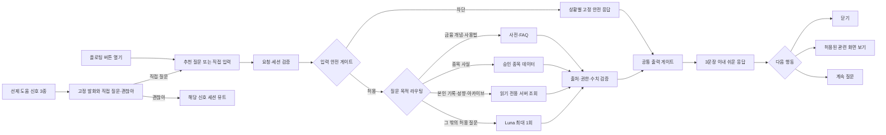

# F10 — 플로팅 AI 챗봇 “키웅이” 기능 명세

> **기능 단일 원본** · 2026-08-11 · 기준: `docs/영웅키움_기획_통합문서_v2.md` v2.6 §12·§13
>
> F10의 사용자 흐름, 콘텐츠, 데이터 수집·적재, API·안전 경계, 현재 구현과 완료 기준은 이 파일에서 관리한다. 제품 목표·법무·전역 레드라인은 통합문서를 따르며, 이 기능을 바꿀 때는 이 파일을 먼저 수정하고 전역 문서에는 요약과 링크만 둔다.

## 1. 제품 계약

키웅이는 “정답을 주는 투자 AI”가 아니라 **이해·기록·성찰을 돕는 개인 코치**다. 아이 눈높이로 금융 기초, 서비스 사용법, 승인된 종목 사실, 본인의 기록을 설명한다.

### 1.1 수행 기능 9종

| # | 기능 | 수행 내용 | 실행 방식 |
|---:|---|---|---|
| 1 | 대화 시작 | 부담 없는 인사와 질문 시작 | 플로팅 버튼 또는 선제 도움 뒤 사용자 선택 |
| 2 | 금융 개념 교육 | 수익률·손익·분산·수수료·세금·시장가·지정가 등 | 용어 사전 우선, 미스 시 Luna 최대 1회 |
| 3 | 서비스 사용 안내 | 검색·주문·포트폴리오·가족 비교·리그 규칙 | FAQ 우선, 미스 시 Luna 최대 1회 |
| 4 | 종목 유니버스 안내 | 51종의 사업·업종·제품·승인된 과거 사실 | 구조화된 종목 데이터 조회, 추천·예측 금지 |
| 5 | 투자 기록 되짚기 | 본인의 거래 이유·확신도·예상 보유기간 회고 | F2·F3 기록 읽기 전용 조회 |
| 6 | 성향 분석 설명 | 5축·근거 분포·확신도 패턴을 쉽게 설명 | 본인의 F9 엔진 JSON만 읽기 전용 조회 |
| 7 | 아카이브 탐색 | 본인의 과거 기록과 시즌 변화를 조회·요약 | 본인의 F9 시즌 기록만 읽기 전용 조회 |
| 8 | 사용법 헤맴 도움 | 확정 신호 3종에 짧은 도움 제안 | 고정 스크립트, LLM 미사용 |
| 9 | 안전 대응 | 추천·예측·개인정보·유해·오프토픽·위기 대응 | 입력 분류 후 상황별 고정 응답 |

### 1.2 참조 범위

키웅이는 다음만 읽을 수 있다.

- 현재 화면과 현재 종목
- 화면에 실제 표시된 수치
- 세션 사용자 본인의 F2 거래 로그와 F3 질문식 기록
- 세션 사용자 본인의 F9 엔진 JSON과 시즌 기록
- 승인된 51종 종목·13개 섹터 교육 데이터
- 승인된 용어 사전과 서비스 FAQ

가족 구성원의 원문 데이터는 조회하지 않는다. 수치와 사실은 엔진·API·승인 데이터 값만 인용하며 모델이 새 수치를 만들면 버그다.

### 1.3 전 경로 금지

- 종목 추천·비추천
- 매수·매도·보유 제안과 매매 시점
- 목표가·손절가·예상 수익률
- 향후 가격 상승·하락 전망
- 종목 간 우열 판단
- 실력 채점·훈계
- 출처 없는 최신 사실·실적·뉴스 생성
- 가족 구성원의 기록 조회 또는 부모에게 대화 원문 전달

## 2. 소유권과 파일 책임

| 위치 | 책임 |
|---|---|
| `web/features/f10-chatbot/F10ChatbotDemo.tsx` | 채팅 시트 UI, 추천 질문, SSE 수신·렌더링 |
| `web/features/f10-chatbot/lib/routing.ts` | 입력 분류, FAQ·맥락 응답, 고정 거절, 선제 신호 |
| `web/features/f10-chatbot/lib/openai.ts` | Luna Responses API 호출과 F10 시스템 지시문 |
| `web/app/api/chat/route.ts` | 요청 검증, 목적 라우팅 연결, 출력 게이트, SSE 전송 |
| `web/shared/data/` | 용어·FAQ·종목·섹터의 승인된 정적 데이터 |
| `web/shared/llm/client.ts` | 서버 전용 OpenAI 클라이언트와 모델 상수 |
| `web/shared/llm/filter.ts` | 금지 표현 차단과 문장 처리 |
| `web/shared/engine/` | 선제 도움 신호·발화 제한 순수 함수 |

- F10 UI와 프롬프트는 기능 폴더가 소유한다.
- API 라우트 변경은 `web/app/AGENTS.md`, 공용 데이터·LLM·엔진 변경은 `web/shared/AGENTS.md`를 함께 따른다.
- `app/api/chat`은 전송과 검증을 담당한다. 모델 프롬프트나 스코어 계산을 넣지 않는다.

## 3. 사용자 흐름



### 3.1 진입 UI

- 모든 화면 우하단에 키웅이 플로팅 버튼을 둔다.
- 탭하면 모바일 바텀시트 챗 UI를 연다.
- 자유 입력창과 현재 화면 맥락 기반 추천 질문 3개를 제공한다.
- 예: 종목 상세 “이 회사는 뭐 하는 회사야?”, “PER이 뭐야?” / 주문 “시장가가 뭐야?” / 홈 “매수 어떻게 해?”
- “키웅이는 AI 도우미야”라는 고지를 상시 표시한다.

### 3.2 응답 계약

```ts
type ChatResponse = {
  text: string;
  suggestedQuestions?: string[];
  guidedDialogue?: {
    topicId: `term:${string}` | `stock:${string}`;
    currentNodeId: string;
    options: Array<{
      id: "simpler" | "example" | "detail" | "offerings" | "touchpoint" | "sector" | "understood";
      label: string;
    }>;
  };
  uiAction?: {
    type: "open_screen";
    target: "home" | "stock" | "order" | "archive";
  };
};
```

- 답변은 반말·쉬운 말·비유·이모지를 사용하고 최대 3문장이다.
- `uiAction`은 서버 허용 목록의 화면만 제안한다.
- 모델이 URL을 만들거나 화면을 직접 이동시키지 않는다. 사용자가 버튼을 눌러야 실행한다.

### 3.3 DAPIE 단계형 설명 대화

- 적용 범위는 등록된 용어 사전의 모든 `glossary` 항목과 모의투자 종목 유니버스의 모든 종목이다.
- 용어 노드는 `핵심 설명 → 쉬운 설명·화면 예시·상세 설명 → 이해 완료`로, 종목 노드는 `회사 소개 → 제공 제품·서비스·일상 접점·업종 역할 → 이해 완료`로 연결한다.
- 각 턴은 현재 노드의 설명과 다음 선택지를 함께 반환하며, 자유 입력창은 항상 유지한다.
- 클라이언트가 보낸 `topicId`, `currentNodeId`, `optionId`는 신뢰하지 않고 서버가 그래프의 허용 전이인지 검증한다.
- 단계형 설명은 고정된 승인 문구를 사용하고, LLM은 그래프 선택이나 전이에 관여하지 않는다.
- 이해 여부를 시험하거나 점수화하지 않으며 사용자가 언제든 다른 질문으로 대화를 전환할 수 있다.
- 자연어 질문에서 종목명·종목코드·등록 별칭 또는 용어 트리거를 결정적으로 찾는다. 현재 종목 화면에서 “이 회사”처럼 지시한 질문은 현재 화면 종목으로만 해석하며, 둘 이상을 임의로 선택하지 않는다.

## 4. 질문 목적별 실행 경계

| 목적 | 우선 처리 | 허용 데이터 | 생성형 AI |
|---|---|---|---|
| 금융 개념 | 용어 사전 | 승인 교육 문서 | 미스 또는 쉬운 재설명이 필요할 때 1회 |
| 서비스 사용법 | FAQ + 허용 화면 액션 | 현재 화면·서비스 규칙 | FAQ 미스일 때 1회 |
| 종목 사실 | 구조화된 종목 데이터 | 51종 승인 사실 | 조회 결과를 쉽게 풀 때 1회 |
| 투자 기록 | 읽기 전용 서버 조회 | 본인의 F2·F3 기록 | 조회 결과 요약에만 1회 |
| 성향 설명 | 읽기 전용 서버 조회 | 본인의 F9 엔진 JSON | 엔진 값 설명에만 1회 |
| 아카이브 | 읽기 전용 서버 조회 | 본인의 시즌 기록 | 조회 결과 비교·요약에만 1회 |
| 안전 대응 | 입력 분류 후 고정 응답 | 조회 없음 | 호출 없음 |

- 사용자·가족 식별자는 서버 세션이 주입한다. 클라이언트와 모델은 조회 대상을 선택하지 못한다.
- 정적 FAQ·거절·선제 도움은 툴로 만들지 않는다.
- 동적·개인화 데이터만 허용 목록의 서버 전용 읽기 툴로 제공한다.
- 기초 용어는 사전이 우선이다. 승인 교육 문서가 커져 의미 검색이 필요할 때만 소규모 RAG를 추가한다.
- 공개 웹 검색과 출처 없는 모델 기억은 MVP 답변 근거로 사용하지 않는다.

## 5. 요청·스트리밍 계약

### 5.1 요청

```ts
type ChatRequest = {
  message: string;
  context: {
    screen: "home" | "stock" | "order" | "archive";
    stockId?: string;
    stockName?: string;
    quantity?: number;
    unitPrice?: number;
  };
  guidedDialogue?: {
    topicId: `term:${string}` | `stock:${string}`;
    currentNodeId: string;
    optionId: "simpler" | "example" | "detail" | "offerings" | "touchpoint" | "sector" | "understood";
  };
};
```

- 메시지는 문자열인지 검증하고 공백 정리 후 최대 500자로 제한한다.
- 화면과 선택 필드는 런타임 스키마로 검증한다.
- 본인 식별자는 요청 본문에서 받지 않고 서버 세션에서 확정한다.

### 5.2 SSE 이벤트

| 이벤트 | 용도 |
|---|---|
| `status` | 질문 분류·자료 조회·답변 준비·안전 점검 상태 |
| `text` | 모든 검증을 통과한 답변 텍스트 |
| `action` | 검증된 `uiAction`과 추천 질문 |
| `done` | 스트림 종료 |

처리 상태 문구는 수작성 고정 문구다. “안전 점검 통과” 전에는 원시 모델 답변을 화면에 표시하지 않는다.

### 5.3 OpenAI 호출

- SDK는 서버 전용 `openai`, API는 **Responses API**다.
- 키는 `OPENAI_API_KEY`만 사용하며 문서·클라이언트·`NEXT_PUBLIC_*`에 넣지 않는다.
- 모델은 `web/shared/llm/client.ts`의 단일 상수 `gpt-5.6-luna`다. 별칭 `gpt-5.6`은 사용하지 않는다.
- `reasoning.effort`는 `low`, `max_output_tokens`는 800이다.
- 스트림에서 `response.output_text.delta` 이벤트만 읽는다.
- 한 요청에서 모델 호출은 최대 1회다. 모델이 툴을 반복 선택하는 에이전트 루프는 만들지 않는다.

## 6. 안전 게이트

게이트는 아래 순서로 실행한다. 입력 차단은 모델 호출보다 먼저, 전체 출력 검증은 화면 전송보다 먼저다.

| 단계 | 판정 | 실패 처리 |
|---|---|---|
| T0 요청·세션 | 요청 스키마 유효·세션 사용자 확정 | `400` 또는 로그인 안내 |
| T1 입력 안전 | 위기 → 개인정보 → 유해 → 추천 → 오프토픽 순서 분류 | 상황별 고정 응답, 모델·툴 미호출 |
| T2 목적 라우팅 | 허용 목적 6종 또는 안전 대응 | 범위 안내 고정 응답 |
| T3 조회 권한 | 허용 툴·세션 본인 범위 | 조회 중단, 고정 응답 |
| T4 근거 검증 | 종목·기록·F9·아카이브 값이 승인 데이터에 존재 | 전체 답변 폐기 |
| T5 출력 안전 | 완성된 최대 3문장에 금지 표현 없음 | 고정 안전 응답 |
| T6 후속 행동 | `uiAction`이 허용 화면 목록에 존재 | 액션 제거, 텍스트만 표시 |
| T7 로깅 | 경로·차단·조회·필터 결과 기록 | 메트릭 장애가 권한을 넓히지 않음 |

- 클라이언트 라우팅은 빠른 즉답용이며 권한 판정이 아니다. 서버가 다시 검증한다.
- 원시 모델 델타와 원시 조회 결과를 화면에 직접 표시하지 않는다.
- 최대 3문장을 완성 버퍼에 모아 출처·권한·수치·금지 표현을 함께 검증한다.
- 출력 필터가 차단하면 전체 답변을 고정 안전 응답으로 대체하고 스트림을 종료한다.
- 비상 시 사전·FAQ 전용 모드로 강등할 수 있어야 한다.

### 6.1 고정 안전 응답 원칙

- 추천·예측 요구: “종목은 내가 골라줄 수 없어! 대신 고를 때 뭘 보면 좋은지 알려줄게 🐻”
- 오프토픽·유해·개인정보: “나는 투자 이야기만 할 수 있어!”를 기본으로 상황별 안내를 덧붙인다.
- 과몰입·정서 위기: 생성형 답변 없이 대화를 안전 종료하고 보호 안내를 제공한다.
- 데이터 부족: 조회하지 않고 “아직 관찰 초기야”라고 안내한다.

## 7. 선제 도움

선제 도움은 대화 생성 경로와 분리된 고정 규칙이다. **신호 유형은 아래 3종으로 확정**하며 팀 재결정 없이 추가하지 않는다.

| 코드 | 조건 | 고정 발화 |
|---|---|---|
| `switch` | 매수·매도 확인창 취소가 번갈아 3회 연속 | “매수와 매도가 헷갈려?” |
| `dwell` | 주문 또는 종목 상세 화면 5분 초과 체류 | “어디에서 막혔는지 같이 볼까?” |
| `lossRevisit` | -10% 이하 손실 실현 후 5분 안에 같은 종목 상세 4회 이상 재진입 | “방금 본 종목이 계속 신경 쓰여?” |

- 횟수·시간·손실률 임계값은 [가정] 초기 운영값이며 자녀 테스트 30세션 후 조정한다.
- 반응 카드는 **직접 질문 / 괜찮아** 두 개다.
- 발화 간 최소 3분, 동일 신호 10분 내 재발화 금지, 세션 최대 2회다.
- “괜찮아”를 누르면 해당 신호는 세션 동안 뮤트한다.
- 30분 무활동이면 새 세션으로 본다.
- 선제 문구는 LLM이 생성하지 않고 부모에게 전달하지 않는다.

제외 신호: 주문 수량 반복 수정, 차트 기간 반복 변경, 여러 종목 빠른 조회, 순위·손실 확인 후 주문, 주문 오류 반복. 정상 탐색 또는 직접 오류 안내와 구분하기 어렵기 때문이다.

## 8. 종목·섹터 교육 콘텐츠

### 8.1 지원 질문

51종 각각에 다음 질문을 고정 데이터로 답할 수 있어야 한다.

1. “이 회사는 뭐 하는 회사야?”
2. “무엇을 만들어?”
3. “내가 어디에서 만날 수 있어?”
4. “이 회사는 산업에서 어떤 역할을 해?”

13개 섹터 각각에 “이 섹터는 어떤 일을 해?”를 답할 수 있어야 한다.

### 8.2 답변 카드

| 카드 | 내용 | 데이터 기준 |
|---|---|---|
| 회사 한 줄 소개 | 제공 제품·서비스 | `companySummary` |
| 산업 속 역할 | 같은 섹터에서 맡는 역할 | `companyRole`·`sector` |
| 일상 연결 | 사용자가 만나는 제품·서비스 장면 | `everydayTouchpoints` |
| 돈의 흐름 | 회사가 대가를 받는 기본 구조 | `offerings`·사업 흐름 |
| 화면 읽기 | 현재가·등락·수량·예상 금액의 의미 | 화면 컨텍스트·API 값 |

한 답변은 질문에 필요한 카드만 골라 최대 3문장으로 설명한다. 회사의 미래나 투자 가치를 연결하지 않는다.

### 8.3 연령별 깊이

| 대상 | 설명 방식 |
|---|---|
| 초등학생 | 친숙한 일상 장면, 쉬운 명사, 1~2문장 |
| 중학생 | 고객·제조·유통·산업 연결, 2~3문장 |

### 8.4 섹터별 필수 설명 주제

| 섹터 | 필수 주제 |
|---|---|
| 게임 | 제작·출시·운영·업데이트 |
| 물류 | 생산자에서 가게·집까지의 이동, 육상·택배·해상 역할 |
| 반도체 | 칩·메모리·부품과 전자기기 연결 |
| 방산 | 국방·항공 장비의 개발·제조·정비 |
| 식품 | 원재료·제조·포장·유통 |
| 에너지 | 발전·정유·유통과 가정·학교·공장 연결 |
| 엔터테인먼트 | 음악·영상·공연의 기획·제작·유통 |
| 유통 | 상품 선정·매장·온라인·제품 서비스 |
| 은행·금융 | 예금·송금·대출 기초와 증권사의 주문 중개 |
| 자동차 | 완성차·부품·타이어의 협업 구조 |
| 조선 | 선박 설계·건조·관리 |
| 항공 | 비행 준비·운항·서비스 역할 |
| 화장품 | 연구·기획·제조·판매, 효능 단정 금지 |

종목 목록과 섹터 배정은 `docs/모의투자_종목유니버스_데이터셋_설계.md`가 소유한다.

## 9. 교육 데이터 계약

주문, 시세, 종목 상세, 챗봇은 같은 `stockId`를 사용한다.

```ts
type FactSource = {
  field: "identity" | "business" | "offering" | "touchpoint" | "sector";
  title: string;
  url: string;
  publishedAt?: string;
  checkedAt: string;
};

type StockEducationContent = {
  stockId: string;
  companySummary: string;
  companyRole: string;
  offerings: string[];
  everydayTouchpoints: string[];
  elementaryExplanation: string;
  middleSchoolExplanation: string;
  approvedQuestions: string[];
  factSources: FactSource[];
  reviewedAt: string;
  status: "draft" | "reviewed";
};

type SectorEducationContent = {
  sector: string;
  label: string;
  elementarySummary: string;
  middleSchoolSummary: string;
  valueChain: string[];
  keyTerms: Array<{ term: string; definition: string }>;
  factSources: FactSource[];
};
```

- 종목·섹터 설명을 한 문장에 섞어 저장하지 않는다.
- 제품명 나열보다 오래 유지되는 제품·서비스 범주를 우선한다.
- 실적·주가·계약·점유율처럼 시점에 민감한 정보는 기본 데이터에서 제외한다.

## 10. 사실 수집·검수·적재

### 10.1 출처 우선순위

| 순위 | 원본 | 사용 정보 |
|---:|---|---|
| 1 | 거래소 상장정보 | 종목코드·공식명·시장구분 |
| 2 | 전자공시 회사 개황·사업 내용 | 주요 사업·사업 부문 |
| 3 | 회사 공식 홈페이지·IR | 제품·서비스 범주·산업 역할 |
| 4 | 공식 브랜드·서비스 페이지 | 일상 접점 |
| 5 | 공공기관·산업협회 교육 자료 | 섹터 구조·용어 |

뉴스·블로그·위키·검색 요약은 초안 탐색에만 사용할 수 있고 최종 사실의 단독 원본으로 쓰지 않는다.

### 10.2 작업 흐름

```text
51종·13섹터 작업 목록
  → 출처 카드 수집
  → 초등·중학생용 문장 편집
  → 자동 구조·금지 표현 검수
  → 사람의 사실·눈높이·안전 검수
  → reviewed 데이터만 TypeScript로 적재
  → F2 종목 상세와 F10이 stockId로 공유
```

- 작업 상태는 `todo → sourced → drafted → reviewed → loaded` 순서다.
- 자동 검수는 51개 `stockId` 1:1, 13개 섹터, 필수 필드·URL·확인일, 금지 표현을 검사한다.
- 사람 검수는 출처의 필드 근거, 연령 적합성, 최신성, 방산·금융·화장품의 중립성을 확인한다.
- 종목·제품 정보는 분기 1회와 공식 페이지 변경 시 재검수하며 `reviewedAt`과 `checkedAt`을 함께 갱신한다.

### 10.3 응답 우선순위

```text
고정 사실 데이터
  → 화면 컨텍스트 계산
  → 승인된 읽기 전용 조회
  → 필요한 경우 Luna 1회 설명
  → 전체 출력 게이트
```

회사·제품·일상 접점·섹터 역할 질문은 51종·13섹터 모두 OpenAI 호출 없이 기본 답변이 가능해야 한다.

## 11. 개인정보와 로그

- 입력 분류, 라우팅 경로, 조회 종류, 필터 결과, 선제 신호와 “괜찮아” 선택을 구조화 로그로 남긴다.
- 대화 원문과 행동 데이터는 부모에게 전달하지 않는다.
- F10 로그는 F9 성향 스코어링에 반영하지 않는다.
- 로깅 실패가 조회 권한이나 답변 범위를 넓혀서는 안 된다.
- 세션 사용자가 아닌 가족 구성원의 기록 접근 시도는 거부하고 테스트한다.

## 12. 현재 구현과 남은 작업

현재 구현은 다음을 제공한다.

- 클라이언트·서버의 규칙 라우팅
- 일부 FAQ·화면 맥락 답변과 고정 거절
- Luna Responses API 스트리밍
- 문장 단위 금지 표현 필터와 최대 3문장 제한
- `switch`, `dwell`, `lossRevisit` 3종 감지 함수와 데모 UI
- `PER`, `ETF`, `분산투자`의 DAPIE식 설명 그래프와 서버 검증 전이

남은 작업은 안전 게이트를 먼저, 기능 확장을 나중에 진행한다.

| 순서 | 항목 | 완료 조건 |
|---:|---|---|
| 1 | 요청·세션 스키마 | 선택 필드 검증·서버 세션 사용자 확정 |
| 2 | 용어 사전·FAQ | 용어 약 30개·FAQ 약 15개, 동의어와 테스트 |
| 3 | 입력 분류 보강 | 위기·추천·개인정보의 우회 표현 테스트 |
| 4 | 목적 라우터·읽기 전용 조회 | 종목·F2/F3·F9·아카이브 경로와 권한 테스트 |
| 5 | 전체 답변 검증 | 출처·권한·수치·금지 표현 통과 전 미전송 |
| 6 | 발화 제한 | 시간·횟수·세션 뮤트 순수 함수와 테스트 |
| 7 | 실제 이벤트 연결 | 주문·상세 이벤트로 3종 신호 발생 |
| 8 | 타임아웃·로그 | `AbortController` 8초 폴백·구조화 로그 |
| 9 | 구조화 액션·상태 UI | 허용 `uiAction`과 처리 단계 타임라인 |

F2·F3·F9 데이터가 없는 기능 5·6·7은 고정 초기 상태로 응답한다. F10 단독 구현으로 완료 처리하지 않는다.

## 13. 변경 절차

1. 고정 답변으로 충분한지 먼저 판단한다.
2. 화면 맥락이 필요하면 최소 필드만 요청·런타임 스키마에 함께 추가한다.
3. 동적 데이터가 필요하면 서버의 읽기 전용 허용 목록과 본인 권한 테스트를 먼저 만든다.
4. 생성형 응답이 꼭 필요한 허용 질문만 Luna 경로로 보낸다.
5. 새 금지 표현은 `web/shared/llm/filter.ts`와 테스트에 함께 추가한다.
6. API 계약을 바꾸면 클라이언트 SSE 처리와 Route Handler를 같이 검증한다.
7. 기능 변경은 이 `SPEC.md`에 먼저 반영한다.

## 14. 완료 기준

- 골든 패스 ②에서 종목 상세 추천 질문이 승인 데이터로 답한다.
- 골든 패스 ③에서 확정 선제 신호가 고정 발화와 두 카드로 동작한다.
- 골든 패스 ⑤에서 “뭐 사면 돼?”가 모델 호출 없이 고정 거절된다.
- 51종·13섹터의 필수 사실 데이터가 출처와 검수일을 가진다.
- 본인 F2·F3·F9·아카이브 조회가 세션 권한을 지키고 가족 데이터 접근을 차단한다.
- 원시 모델 델타·조회 결과가 화면에 노출되지 않는다.
- 모든 출력이 출처·권한·수치·금지 표현 검증을 통과하고 최대 3문장이다.
- F10 라우팅·필터·데이터 테스트와 `web/`의 `npm run build`가 통과한다.
